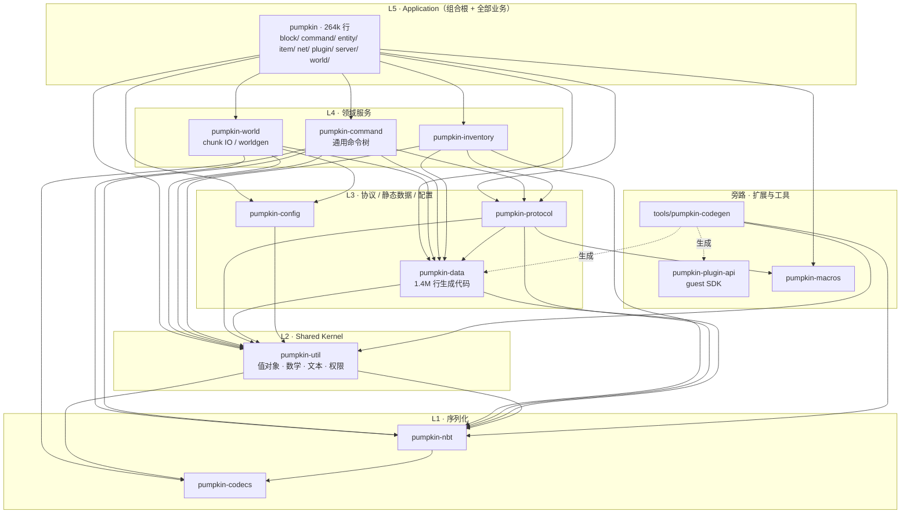

# 01 · Pumpkin-MC/Pumpkin 研究：大型 Rust Application 如何组织与演进

> 仓库：<https://github.com/Pumpkin-MC/Pumpkin> · 研究基线：commit `e413623`（2026-09-20）
> 证据来源：本人对 workspace 结构、依赖边、工具链文件的直接核对 + 一个 Opus 子 agent 的源码深读报告（原文见 `references/agent-report-pumpkin.md`，1077 行，含全部 `path:line`）。本文是面向模板设计的**提炼版**；如与附录冲突，以附录中的源码行号为准。
>
> 研究提纲的定位（`references/pumpkin-vs-pingora-source-study-focus.md` §1）：**核心目标是学习"大型 Rust Application 如何组织和演进"**。

## 1. 研究方向 → 源码落点 → 结论

提纲给出的 10 个研究方向，逐一对应到源码位置与一句话结论：

| 研究方向               | 提纲的"重点关注"                             | 源码落点                                                                                                   | 结论                                                               |
| ---------------------- | -------------------------------------------- | ---------------------------------------------------------------------------------------------------------- | ------------------------------------------------------------------ |
| Workspace / Crate 组织 | Workspace 如何拆分、Crate 职责边界、依赖方向 | 根 `Cargo.toml` `members`（20 个）；`crates/*/Cargo.toml`                                                  | 按**技术能力**拆 crate，业务全部留在 26 万行的 app crate；DAG 无环 |
| 领域模型设计           | Domain Type、Entity、组件、状态模型          | `pumpkin-data`（静态表）、`pumpkin-util`（值对象）、`crates/pumpkin/src/{entity,block,item}`               | "数据下沉、行为上浮"的三段式                                       |
| 模块边界               | 业务模块解耦、公共能力放哪                   | `crates/pumpkin/src/lib.rs:52-65` 的 `pub mod`；`pumpkin-util/src/lib.rs:17-36`                            | 同 crate 内直接调用；公共词汇进 Shared Kernel                      |
| Trait 设计             | 抽象业务行为、扩展点                         | `entity/mod.rs:143` `EntityBase`；`block/mod.rs:74` `BlockBehaviour`；`pumpkin-command/src/node/mod.rs:33` | 全 `&self` + 默认实现 + Args 结构体参数                            |
| ECS / 数据驱动         | ECS 组织、系统与数据关系                     | `entity/living.rs:76-88`；`block/registry.rs:496-503`                                                      | **不是 ECS**：基 struct 组合 + trait 继承链 + 显式 Registry        |
| 异步架构               | Tokio、Task、Channel 协作                    | `server/mod.rs:149,442-450`；`server/ticker.rs:20-107`；`anvil.rs:808-830`                                 | 三级 `TaskTracker`；tick 跑在独立 OS 线程；rayon 桥                |
| 事件 / 消息机制        | Event、Command、模块间通信                   | `plugin/api/events/mod.rs:19-49`；`plugin/mod.rs:1208-1239`                                                | 事件总线只用于插件边界；内部无 command bus                         |
| 配置与启动流程         | Bootstrap、配置加载、Runtime 初始化          | `main.rs:48-188`；`pumpkin-config/src/lib.rs:271-436`                                                      | 启动顺序清晰；配置加载**永不失败**（对服务是反例）                 |
| 错误处理               | Domain / Infrastructure 错误分层             | `error.rs:9-25`；各 crate `thiserror` 枚举                                                                 | 零 `anyhow`；app 层用"策略 trait"汇聚                              |
| 测试组织               | Unit / Integration / 辅助代码                | 288 处 `#[cfg(test)]`；`rust.yml`；`ci_packages.py`                                                        | 99% 内联单测；CI 有受影响包裁剪                                    |

## 2. 阅读路线（提纲路线 + 实际文件）

```text
Workspace              Cargo.toml（members / workspace.dependencies / workspace.lints / profiles）
    ↓
Crate / Package        crates/pumpkin-util → -config → -data → -protocol → -world → pumpkin
    ↓
Application Entry      crates/pumpkin/src/main.rs:48-188  → lib.rs（PumpkinServer::new / start）
    ↓
Core Domain            crates/pumpkin/src/server/mod.rs（Server 结构 + tick）
    ↓
Domain Model           crates/pumpkin/src/entity/mod.rs · block/mod.rs · world/mod.rs
    ↓
Trait / Component      EntityBase · BlockBehaviour · BlockRegistry · WorldPortalExt（pumpkin-world/src/world.rs:55-82）
    ↓
Event / System         crates/pumpkin/src/plugin/api/events/mod.rs · plugin/mod.rs:1208-1239
    ↓
Async Runtime          server/ticker.rs · pumpkin-world/src/chunk/format/anvil.rs:792-831
    ↓
完整业务流程            lib.rs:549-698 unified_listener_task → net/java/mod.rs:878 handle_play_packet
```

## 3. Workspace / Crate 组织

### 3.1 分层图（实测依赖边）



| 数字           | 值                                               | 含义                    |
| -------------- | ------------------------------------------------ | ----------------------- |
| workspace 成员 | 20（18 个 `crates/` + 2 个 `tools/`）            | 工具与库物理分开        |
| 主 crate 行数  | ≈ 264k                                           | 业务全部在此            |
| 最大 crate     | `pumpkin-data` ≈ 1.4M 行                         | 99% 是签入的生成代码    |
| 第三方依赖     | 115 个，全部 `default-features = false`          | 根 `Cargo.toml:132-246` |
| clippy deny    | `all` / `pedantic` / `nursery` / `cargo` + 30 条 | 根 `Cargo.toml:29-108`  |

### 3.2 Pumpkin 实际遵循的四条拆 crate 理由

| 理由             | 代表 crate                                                                                           | 判据                                                                      |
| ---------------- | ---------------------------------------------------------------------------------------------------- | ------------------------------------------------------------------------- |
| 编译期强制       | `pumpkin-macros`（proc-macro）                                                                       | Rust 语言要求                                                             |
| lint 隔离        | `pumpkin-data`                                                                                       | `src/lib.rs:1-12` 整 crate `#![allow(clippy::all, pedantic, nursery, …)]` |
| 领域无关、可复用 | `pumpkin-codecs`（只依赖 `serde_json` + `tracing`）、`pumpkin-command`（对 `S: CommandSource` 泛型） | 不引用任何游戏类型                                                        |
| 对外契约面       | `pumpkin-plugin-api`（编译进 WASM guest，服务端本身**不依赖**它）                                    | 契约与实现彻底分离                                                        |

反过来：`block/ entity/ item/ world/ net/` 这些业务模块**没有**拆成 crate。这不是疏忽——互相引用极密集的游戏对象放同一 crate，避免了为打破循环依赖而发明大量 trait；代价是 26 万行单 crate 的增量编译。

### 3.3 依赖治理（值得逐字照抄的部分）

```toml
# 根 Cargo.toml（节选）
[workspace.dependencies]
tokio  = { version = "1.53", default-features = false }
serde  = { version = "1.0",  default-features = false, features = ["derive", "std"] }
pumpkin-util = { path = "crates/pumpkin-util", default-features = false }   # 内部 crate 也在这里
# 成员里只写：tokio = { workspace = true, features = ["rt-multi-thread", "net", ...] }

[workspace.lints.clippy]
all = { level = "deny", priority = -1 }
pedantic = { level = "deny", priority = -1 }
unwrap_used = "deny"    expect_used = "deny"    panic = "deny"    print_stdout = "deny"
# 成员里只写：[lints] workspace = true

[profile.dev]        debug = false                 # 换编译速度
[profile.profiling]  inherits = "release"; debug = true; strip = false
```

`CONTRIBUTING.md:42` 明确把编码规范让渡给 clippy 配置——**lint 配置就是架构规范文档**。

## 4. 领域模型：三段式（数据下沉、行为上浮）

```text
L5 app crate    crates/pumpkin/src/block/         行为：trait BlockBehaviour + 275 个实现 + BlockRegistry
                                  ▲ 引用
L2 shared       pumpkin-util                       值对象：BlockPos / Vector3 / Identifier / GameMode / TextComponent
                                  ▲ 引用
L3 static       pumpkin-data（生成、签入）           数据表：Block / BlockState / Item / EntityType（纯 const，无行为）
```

三者由 `#[pumpkin_block("minecraft:anvil")]` 这类宏在编译期缝合（`pumpkin-macros/src/lib.rs:351-378`）。**判据：一个类型放在"所有需要它的 crate 都能看见"的最低层。**

不是 ECS，而是"基 struct 组合 + trait 继承链 + trait object"：

| 要点                                                                                         | 证据                                    |
| -------------------------------------------------------------------------------------------- | --------------------------------------- |
| 全部 `&self`，没有 `&mut self`；可变状态用 `AtomicCell` / `ArcSwap` 内部可变                 | `entity/mod.rs:143`、`:827-882`         |
| 默认实现模拟继承：`EntityBase::tick` 默认体先试 `get_living_entity()`                        | `entity/mod.rs:170-176`                 |
| 组合而非继承：`LivingEntity { entity: Entity, … }`，`Player` 再包一层                        | `entity/living.rs:76-88`                |
| Registry：`Vec<Arc<dyn BlockBehaviour>>` + 定长 id 索引数组，O(1) 查询，显式注册无链接器魔法 | `block/registry.rs:496-503`、`:827-837` |

`Level`（`pumpkin-world`，chunk 存储与生成）与 `World`（app crate，玩家/实体/规则）的分界，正是 Repository 与 Aggregate Root 的分界；`World.server: Weak<Server>` 打破 `Arc` 环（`world/mod.rs:274`）。

## 5. 模块边界与 Shared Kernel

`pumpkin-util/src/lib.rs:17-36` 的 19 个模块，按性质分类：

| 分类       | 模块                                                                | 是否该在这层               |
| ---------- | ------------------------------------------------------------------- | -------------------------- |
| 领域值对象 | `difficulty` `gamemode` `identifier` `text` `resource` `version`    | 是（共享词汇）             |
| 领域规则   | `biome`（气温/降雨）、`loot_table`、`math/experience`               | **否**，业务逻辑漏到了底层 |
| 运行时服务 | `permission`（`PermissionManager`，DashMap）                        | **否**，是 Service         |
| 真工具     | `noise` `random` `uuid` `serde_enum_as_integer` `MutableSplitSlice` | 是                         |

结论：`pumpkin-util` 实际是 **Shared Kernel**（扇入 11 个 crate）而不是 util，但边界守得不严。对模板的启示：共享 crate 要有明文的"准入规则"（`05` §1.1 R6）。

## 6. Trait 设计的可复用手法

| 手法                                                                  | 证据                                                | 价值                                      |
| --------------------------------------------------------------------- | --------------------------------------------------- | ----------------------------------------- |
| 全部方法带默认实现，实现者只覆盖关心的                                | `block/mod.rs:74` `BlockBehaviour`                  | 加 hook 不破坏既有实现                    |
| **Args 结构体代替长参数列表**：27 个 `XxxArgs<'a>`，全是引用或 `Copy` | `block/mod.rs:219-441`，如 `OnPlaceArgs` `:302-311` | 给 hook 加上下文字段不改 275 个实现的签名 |
| 对"来源"泛型化：`CommandExecutor<S = DummySource>`；闭包自动实现      | `pumpkin-command/src/node/mod.rs:33,38-45`          | 框架 crate 不认识业务类型                 |
| 在 trait object 上写方法：`impl dyn EntityBase + '_ { … }`            | `entity/mod.rs:133-141`                             | 绕过 `Self: Sized`                        |
| 子 trait 做能力标记：`Mob: EntityBase`、`Animal: Mob`                 | `entity/mob/mod.rs:769,1614`                        | 类型层面表达能力集合                      |

## 7. 依赖倒置端口：`WorldPortalExt`（最值得直接搬进模板的结构）

`pumpkin-world` 生成地形时需要"这个方块能否放在这里"的**行为**判断，但行为在上层 app crate。解法：下层定义 trait、持有空槽，上层在组合根注入。

```rust
// pumpkin-world/src/world.rs:55-82 —— 下层定义端口
pub trait WorldPortalExt: Send + Sync {
    fn can_place_at(&self, block: &Block, state: &BlockState, accessor: &dyn BlockAccessor, pos: &BlockPos) -> bool;
    fn spawn_structure_entities(&self, _entities: Vec<NbtCompound>) {}   // 带默认实现
}
// pumpkin-world/src/level.rs:80 —— 下层持有空槽
pub world_portal: ArcSwap<Option<Arc<dyn WorldPortalExt>>>,
// crates/pumpkin/src/server/mod.rs:404-405 —— 上层在组合根注入
let portal: Arc<dyn WorldPortalExt> = Arc::new(WorldPortal(world.clone()));
level.world_portal.store(Arc::new(Some(portal)));
```

`ArcSwap` 版本还额外支持运行时热替换；bench 与命令各有一个轻量实现（`benches/chunk_gen.rs:20`、`command/commands/place.rs:82`）。本模板的 domain port + infra adapter + `bootstrap.rs` 注入（`05` §5）就是它的直接对应；需要热替换时可换成 `ArcSwap`。

## 8. 异步架构

### 8.1 Task 追踪：三级 `TaskTracker`

| 层级           | 字段                                                                  | 等待点                          |
| -------------- | --------------------------------------------------------------------- | ------------------------------- |
| Server         | `tasks: TaskTracker`（`server/mod.rs:149`）；`spawn_task()` 38 处调用 | `Server::shutdown()` `:748-750` |
| 连接监听       | 局部 `Arc<TaskTracker>`（`lib.rs:468`）                               | `lib.rs:530-531`                |
| Level / Client | `level.rs:106`、`net/java/mod.rs:97`                                  | `world.shutdown()`              |

`spawn_task` 的文档写明契约（`server/mod.rs:442-443`）："所有任务在停机时被等待，因此任务必须在合理时间内结束（不要死循环）"；需要长循环的任务在 `select!` 里监听 `STOP_INTERRUPT`。

### 8.2 停机信号：原子布尔 + `CancellationToken` 双通道

```rust
// crates/pumpkin/src/lib.rs:208-225
pub static SHOULD_STOP: AtomicBool = …;                    // 同步循环轮询
pub static STOP_INTERRUPT: LazyLock<CancellationToken> = …; // async select! 立即唤醒
pub fn stop_or_exit_server() {
    if SERVER_IS_STOPPING.load(Acquire) { exit(...) }       // 二次 Ctrl-C = 强杀
    stop_server();
}
```

### 8.3 Tokio / Rayon 边界（仓库里唯一成文的架构规则）

```rust
// pumpkin-world/src/chunk/format/anvil.rs:808-826
let (tx, mut rx) = tokio::sync::mpsc::channel(n);
rayon::spawn(move || {
    chunk_items.into_par_iter().for_each(|item| { let r = cpu_heavy(item); let _ = tx.blocking_send(r); });
});
while let Some(item) = rx.recv().await { … }
```

`CONTRIBUTING.md:63-64`：CPU 密集用 rayon，绝不在 tokio 上阻塞等 rayon，用 `mpsc` 传数据。全仓 15 处 `rayon::spawn` 都是这个形状。

### 8.4 共享状态原语（全仓计数）

| 原语                 | 命中 | 用途                                                    |
| -------------------- | ---- | ------------------------------------------------------- |
| `AtomicCell<T>`      | 270  | 小 `Copy` 状态                                          |
| `std::sync::Mutex`   | 255  | 短临界区（**默认选择**）                                |
| `ArcSwap`            | 81   | 读多写极少的整体替换（`worlds`、`players`、`handlers`） |
| `DashMap`            | 45   | 分片并发 map                                            |
| `tokio::sync::Mutex` | 21   | **仅**跨 `.await` 持有                                  |
| `parking_lot`        | 0    | 未使用                                                  |

纪律：**默认 `std::sync::Mutex`，只有跨 `.await` 才用 `tokio::sync::Mutex`；`ArcSwap` 表达"整体替换 + 无锁读"**。副作用：`deny(unwrap_used)` 导致大量 `unwrap_or_else(PoisonError::into_inner)`（锁中毒被静默忽略）。

### 8.5 Tick 循环跑在独立 OS 线程

`server/ticker.rs:20-107`：主循环不是 tokio task，而是专用线程，用 `runtime.enter()` 获得上下文、`block_on` 等待；`has_handlers::<E>()` 前置探测（`plugin/mod.rs:1200-1205`）避免无订阅者时进入 runtime；落后时把 `next_tick` 拉到 `now` 而非补跑（死亡螺旋钳制，`:103-106`）。游戏专有，服务用 `tokio::time::interval` 即可，但两个细节值得留。

## 9. 事件 / 消息机制

```text
// 注册（RCU）plugin/mod.rs:1189-1196
handlers.rcu(|h| { let mut new = (**h).clone(); new.entry(E::name()).or_default().push(handler); Arc::new(new) })

// 分发 plugin/mod.rs:1208-1239
fire<E>(server, event: &mut E):
    map := handlers.load()                       // ArcSwap 无锁读
    if map.is_empty() → return；handlers := map.get(E::get_name_static()) else return
    for h in handlers where h.is_blocking():  h.handle_blocking_dyn(server, event).await   // 拿 &mut E
    for h in handlers where !h.is_blocking(): h.handle_dyn(server, event).await            // 拿 &E
```

Handler 侧是"泛型 trait + 类型擦除适配器"（`EventHandler<E>` → `TypedEventHandler<E, H>` → `dyn DynEventHandler`），用 `BoxFuture` 保持对象安全；`#[derive(Event)]` / `#[cancellable]` 两个宏消除样板；279 个事件类型。

**三个"声明了但没实现"的缺陷（模板不能照抄）**：

| 缺陷                                                                                       | 证据                                                           |
| ------------------------------------------------------------------------------------------ | -------------------------------------------------------------- |
| `EventPriority` 贯穿 API 与 WIT，但 `get_priority()` **无任何调用点**；执行顺序 = 注册顺序 | `plugin/mod.rs:75,162-164`                                     |
| 取消不短路：`fire()` 从不检查 `cancelled()`，所有 handler 跑完后宏才读取                   | `plugin/mod.rs:1226-1238`；`pumpkin-macros/src/lib.rs:174-177` |
| `is_blocking` 名不副实：两趟都是 inline `.await`，区别只是 `&mut E` 与 `&E`                | 同上                                                           |

另外：字符串做事件类型标识（为跨 dylib 边界）+ `unsafe` transmute（`events/mod.rs:86-93`），进程内事件应直接用 `TypeId`。

结论：**同 crate 内直接方法调用；跨层向下持 `Arc`；跨层向上用 trait 注入或 `Weak`；只有跨信任边界（插件）才用事件总线。** 没有内部 command bus，没有 actor 框架。

## 10. 配置与启动流程

### 10.1 启动序列（`main.rs:48-188`）

```text
#[tokio::main] main():
    记录主线程 id → 安装 crypto provider → 建全局 rayon 池（线程命名）→ 安装 panic hook
    config  = PumpkinConfig::load(&cwd)          // 绝不失败
    vanilla = VanillaData::load()                 // 运行时可写数据（JSON）
    init_logger(&config.advanced)                 // 日志在配置之后
    spawn(setup_sighandler())                     // SIGINT / SIGHUP / SIGTERM
    server = PumpkinServer::new(config …).await   // Server::new → Arc<Server>；setrlimit；bind；Ticker 线程
    init_plugins() → start().await
        └ while !SHOULD_STOP: unified_listener_task()   // 单个 select! 多路复用监听
        └ 停机：SERVER_IS_STOPPING=true → 保存玩家 → 踢人 → tasks.close()+wait() → 卸插件 → server.shutdown()
    exit(SERVER_EXIT_CODE)
```

### 10.2 配置 crate 的设计

| 项         | 做法                                                                                             | 证据                                                    | 对模板                                  |
| ---------- | ------------------------------------------------------------------------------------------------ | ------------------------------------------------------- | --------------------------------------- |
| 结构       | `PumpkinConfig { basic(flatten), advanced(flatten), telemetry }`，13 个子 section 靠 struct 组合 | `pumpkin-config/src/lib.rs:74-87,144-179`               | 采纳 struct 组合                        |
| 文档       | crate 顶部 `#![deny(missing_docs)]`，每个字段有注释                                              | `lib.rs:2`                                              | **采纳**：配置 crate 强制文档           |
| 加载       | `LoadConfiguration` trait：`load()` 读 TOML → 与默认值递归合并 → **回写文件** → `validate()`     | `lib.rs:271-436`                                        | 合并思想采纳；回写不采纳（容器只读 FS） |
| 失败       | 解析失败只 `error!` 并**返回默认值、跳过 validate**                                              | `lib.rs:306-315`                                        | **不采纳**：服务必须 fail-fast          |
| 校验       | `assert!` 做跨字段检查                                                                           | `lib.rs:94-141`                                         | 改为 `Result<(), Vec<ConfigError>>`     |
| 重命名兼容 | `#[serde(alias = "…")]` + round-trip 测试                                                        | `lib.rs:220`；`networking/java.rs:25-29,75-100`         | 采纳                                    |
| 环境变量   | 配置 crate 内零 `env::var`；仅 `RUST_LOG` 覆盖日志级别                                           | `crates/pumpkin/src/lib.rs:85-88`                       | 不够：服务需要 `APP__A__B` 嵌套覆盖     |
| 分发       | 无全局单例；`Server` 按值持有；下层只收切片 `&LevelConfig`                                       | `server/mod.rs:71-73`；`pumpkin-world/src/level.rs:152` | 采纳"显式传切片"                        |
| 姊妹机制   | 启动配置（TOML，只读）与运行时数据（JSON，可写可热更）二分                                       | `crates/pumpkin/src/data/mod.rs:40-125`                 | 边界清晰，值得记住                      |

## 11. 错误处理

- **零 `anyhow`**：`grep anyhow --include=Cargo.toml` 全仓无命中；每 crate 自己的 `thiserror` 枚举（app 15 个、world 9 个、protocol 6 个）。
- app 层用一个**策略 trait** 汇聚：

```rust
// crates/pumpkin/src/error.rs:9-25
pub trait PumpkinError: Send + std::error::Error + Display {
    fn is_kick(&self) -> bool;                       // 该错误是否应断开客户端
    fn log(&self) { log_at_level!(self.severity(), "{self}"); }
    fn severity(&self) -> Level;                     // 日志级别
    fn client_kick_reason(&self) -> Option<String>;  // 给用户看的文案
}
impl<E: PumpkinError + 'static> From<E> for Box<dyn PumpkinError> { … }
```

这个 trait 回答的不是"错误是什么"，而是"**应用层该拿它怎么办**"——比 `anyhow` 多保留了决策信息。本模板的 `core::Classify { kind(); source(); retryable() }`（`05` §6.2）就是同一形状，方法换成 HTTP 服务需要的三问。

- 不许 panic 是编译期强制的（`todo/unreachable/unimplemented/unwrap_used/expect_used/panic = deny`），逃生口只在测试（`#![cfg_attr(test, allow(...))]`）与工具 crate。

## 12. 测试、CI 与仓库卫生

| 项                 | Pumpkin 的做法                                                                                                                      | 对模板                                                                                    |
| ------------------ | ----------------------------------------------------------------------------------------------------------------------------------- | ----------------------------------------------------------------------------------------- |
| 单测               | 288 处内联 `#[cfg(test)]`，924 个 `#[test]`，60 个 `#[tokio::test]`；整个 workspace 只有 1 个 `tests/` 文件                         | 内联为主，集成测试只留给跨进程/网络场景                                                   |
| 测试辅助           | 无 mock 框架；golden 文件在顶层 `assets/tests/`                                                                                     | 模板用进程内 `TestApp`（`05` §10）                                                        |
| `pumpkin-gametest` | 不是 Rust 测试框架，是游戏内 GameTest 运行时；CI 不跑                                                                               | 不采纳                                                                                    |
| bench / fuzz       | Criterion 10 个 bench；cargo-fuzz target 藏在被排除出 workspace 的 `crates/*/fuzz/`；CI 都不跑                                      | 模板不带 bench；需要时按 Pumpkin 的 `[[bench]] harness = false` 形式加                    |
| CI 主流程          | `rust.yml`：`RUSTFLAGS=-Dwarnings`；fmt → machete → clippy（受影响包）→ nextest + `cargo test --doc` → 5 OS 构建 → nightly 草稿发布 | 采纳 `-Dwarnings`、machete、nextest + doc 分两趟；不采纳受影响包脚本（8 个 crate 不需要） |
| 受影响包裁剪       | `.github/scripts/ci_packages.py`：`cargo metadata` → 反向依赖闭包；未知文件则全量                                                   | 记录为"长大后的选项"                                                                      |
| 工具链             | `rust-toolchain.toml` 浮动 `stable`；`rustfmt.toml` 只有 edition；`typos.toml`                                                      | 采纳文件集；MSRV 另加 `clippy.toml`                                                       |
| 容器               | 单阶段 alpine，下载 CI 产物，非 root uid 2613，`HEALTHCHECK nc -z`；compose 带 `cap_drop: [ALL]`、`read_only`                       | 采纳非 root + healthcheck + compose 安全基线；构建改多阶段                                |
| dependabot         | 只有 devcontainers / actions / docker，**没有 cargo**                                                                               | 模板加 cargo ecosystem + cargo-deny                                                       |
| 代码生成           | 1.4M 行签入 + 文件头标记 + 幂等写入；但 CI 不校验签入产物与生成器一致                                                               | 若模板日后有 codegen，补"重跑生成器后 `git diff --exit-code`"                             |
| 发布               | 5 OS + musl；Windows 产物 SignPath 签名                                                                                             | 模板 release.yml 取精简版                                                                 |

## 13. 最值得带走的能力（提纲 §1 的链条，逐级落点）

```text
大型 Rust Application
        ↓  Pumpkin 证明：app crate 会天然吞掉一切（264k 行）
领域拆分            → 05 §12 拆分触发条件；数据/值对象/行为三段式
        ↓
Crate 拆分          → 05 §1 八个 crate；四条拆分理由（§3.2）
        ↓
模块边界            → 05 §2 模块闭包；Shared Kernel 准入规则（R6）
        ↓
依赖控制            → 05 §1.1 R1–R8；workspace.dependencies / lints 治理；WorldPortalExt 式端口
        ↓
业务流程组织        → 05 §11 请求走一遍；同 crate 直接调用、跨边界才用事件
```

## 14. 回答提纲的五个问题

| 问题                                   | 回答                                                                                                                                               |
| -------------------------------------- | -------------------------------------------------------------------------------------------------------------------------------------------------- |
| 一个大型 Rust Application 应该如何拆？ | 按技术能力/变化原因拆，只有四类理由（编译期强制、lint 隔离、领域无关复用、对外契约）配拥有独立 crate；业务互引密集时留在一个 crate，但要让组合根薄 |
| 一个 Domain 应该放在哪里？             | 数据下沉（生成的静态表）、值对象放共享内核、行为上浮到应用层；放在"所有消费者都能看见的最低层"。下层需要上层行为 → 端口 trait + 组合根注入         |
| 一个功能应该属于哪个 Crate？           | 看它依赖什么，不看它属于哪个业务；放进某 crate 会引入反向依赖 → 一定不属于那里。这条规则 Pumpkin 没写成文字，只存在于依赖边里——模板要写下来        |
| Crate 之间应该如何控制依赖？           | 无环 DAG + workspace 统一版本/feature/lint + CI `-Dwarnings` + machete；缺的一环是机械检查分层方向——模板用架构守卫测试补上                         |
| 业务模块之间应该如何通信？             | 同 crate 直接调用；跨层向下 `Arc`、向上 `Weak` 或端口；async↔CPU 用 rayon+mpsc 桥；只有跨信任边界才用事件总线                                      |

## 15. 对模板的启示

**直接采纳（Adopt）**

| 模式                                                                                    | 证据                                                        | 落点                                      |
| --------------------------------------------------------------------------------------- | ----------------------------------------------------------- | ----------------------------------------- |
| `[workspace.dependencies]` 全量 pin + `default-features = false`，内部 crate 也在此声明 | `Cargo.toml:132-246`                                        | `06` §2.1                                 |
| `[workspace.lints]` 作为架构规范；成员 `[lints] workspace = true`                       | `Cargo.toml:29-108`；`crates/pumpkin/Cargo.toml:141-142`    | `06` §2.1；`00` D7                        |
| 四段 profile（release / dev debug=false / profiling / bench）                           | `Cargo.toml:116-130`                                        | `06` §2.1                                 |
| 端口 trait + 组合根注入（`WorldPortalExt`）                                             | `pumpkin-world/src/world.rs:55-82`；`server/mod.rs:404-405` | `05` §5 port                              |
| `TaskTracker` + 文档化的任务契约；二次信号强杀                                          | `server/mod.rs:442-450`；`lib.rs:219-225`                   | `05` §4.2                                 |
| 策略型错误 trait（`PumpkinError`）+ 零 `anyhow`（生产路径）                             | `error.rs:9-25`                                             | `05` §6.2 `Classify`                      |
| `std::sync::Mutex` 默认、`tokio::sync::Mutex` 仅跨 await、`ArcSwap` 整体替换            | 使用计数 255 : 21 : 81                                      | 写进生成项目的 `CONTRIBUTING.md`          |
| Tokio/Rayon 桥规则成文                                                                  | `CONTRIBUTING.md:63-64`；`anvil.rs:808-826`                 | `CONTRIBUTING.md` + `spawn_blocking` 指引 |
| 配置 crate `#![deny(missing_docs)]`；`#[serde(alias)]` + round-trip 测试                | `pumpkin-config/src/lib.rs:2,220`                           | `05` §7；`00` D18 例外                    |
| Args 结构体做 hook 参数                                                                 | `block/mod.rs:219-441`                                      | `04` §5 检查清单                          |
| CI：`-Dwarnings`、machete、nextest + 单独 doctest、typos                                | `rust.yml:23,68-78,154-165`                                 | `06` §2.10                                |
| 非 root 容器 + HEALTHCHECK + compose 安全基线                                           | `Dockerfile:17-30`；`docker-compose.yml`                    | `06` §2.11                                |

**改造后采纳（Adapt）**

| 模式                               | 改什么                                                                           | 原因                                       |
| ---------------------------------- | -------------------------------------------------------------------------------- | ------------------------------------------ |
| 配置加载永不失败、回写文件         | 改为 `Result`，fail-fast；不回写，用 `--print-config` 输出有效配置               | 生产服务不能静默降级；容器文件系统常为只读 |
| `validate()` 用 `assert!`          | 返回聚合的 `Vec<ConfigError>`                                                    | 与 `deny(clippy::panic)` 自洽              |
| 配置目录 = CWD、无 CLI             | `--config` + `APP__A__B` 环境变量 + 默认路径                                     | 服务需要三段优先级                         |
| `Arc<Server>` 上帝对象（40+ 字段） | 拆为窄的 `AppState`（只放基础设施句柄），领域服务构造注入                        | 否则测试要构造整个世界                     |
| 事件总线                           | 保留 RCU 注册 + 类型擦除，补上优先级/短路或干脆去掉这两个概念；进程内用 `TypeId` | 三个"声明未实现"的坑                       |
| 主 crate 26 万行                   | bin 只留 `main/cli/bootstrap`，业务进 L1–L3 crate                                | 增量编译与边界表达                         |
| `pumpkin-util` Shared Kernel       | 保留概念，改名并写准入规则                                                       | 防止业务规则漏到底层                       |
| 手写 275 行 `default_registry()`   | 显式注册保留，但用宏/列表生成                                                    | 可维护性                                   |
| 受影响包 CI 脚本                   | 记录，不内置                                                                     | 8 个 crate 不需要                          |

**不采纳（Avoid）**

| 模式                                                                         | 原因                                                     |
| ---------------------------------------------------------------------------- | -------------------------------------------------------- |
| WASM/WIT 插件运行时（47 个 `.wit`、全局 `Semaphore::new(1)` 串行化）         | 沙箱成本极高；服务先用进程内 trait 扩展点                |
| `pumpkin-api-macros` 跨宏全局状态（`static PLUGIN_METHODS: Mutex<HashMap>`） | 依赖 proc-macro 展开顺序；且已是死代码                   |
| `unwrap_or_else(PoisonError::into_inner)` 遍布                               | 锁中毒被静默；服务应显式处理                             |
| `pumpkin-gametest`、`tools/pumpkin-fuzzer`                                   | 游戏专有 / 非 cargo-fuzz 的压测客户端                    |
| 浮动 `stable` 且无 MSRV job；dependabot 无 cargo                             | 模板：`clippy.toml msrv` + MSRV CI 腿 + dependabot cargo |
| 手写 `Mutex + Condvar` 通道                                                  | 统一用 `tokio::sync` / `crossbeam`                       |

## 16. 关键词（提纲 §1）

`Workspace` · `Domain` · `Crate` · `Module` · `ECS`（实际为 trait object + 组合）· `Trait` · `Event` · `Async`
