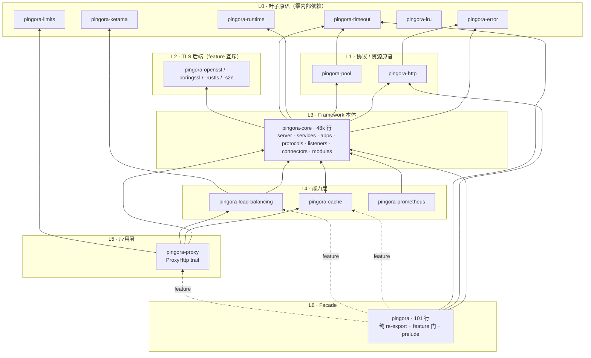
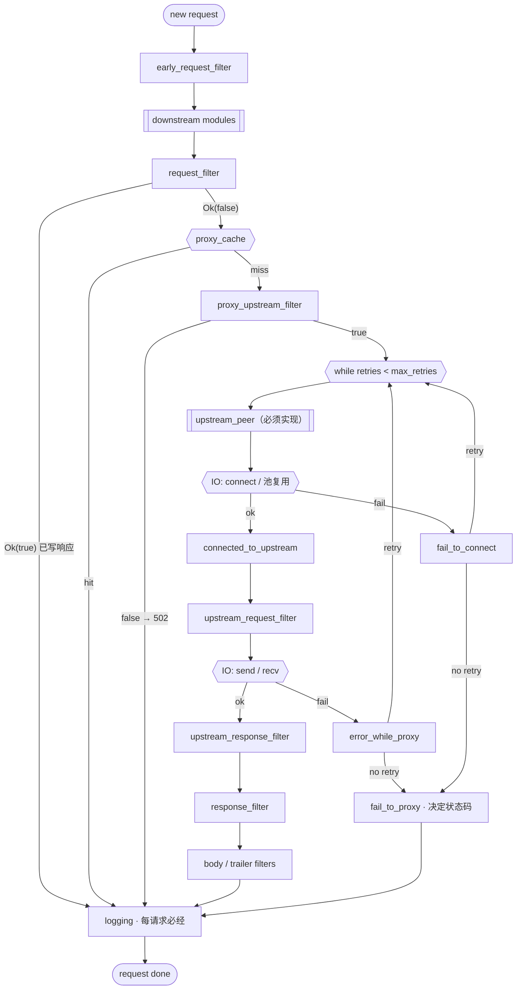

# 02 · cloudflare/pingora 研究：生产级 Rust Infrastructure / Framework 如何设计

> 仓库：<https://github.com/cloudflare/pingora> · 研究基线：commit `4487f7b`（2026-09-03）
> 证据来源：本人对 workspace、依赖边、facade、核心 trait 签名、`docs/user_guide` 的直接核对 + 一个 Opus 子 agent 的源码深读报告（原文见 `references/agent-report-pingora.md`，1585 行，含全部 `path:line`）。本文是面向模板设计的**提炼版**；如与附录冲突，以附录中的源码行号为准。
>
> 研究提纲的定位（`references/pumpkin-vs-pingora-source-study-focus.md` §2）：**核心目标是学习"生产级 Rust Infrastructure / Framework 如何设计"**。

## 1. 研究方向 → 源码落点 → 结论

| 研究方向                | 提纲的"重点关注"                          | 源码落点                                                                    | 结论                                                                               |
| ----------------------- | ----------------------------------------- | --------------------------------------------------------------------------- | ---------------------------------------------------------------------------------- |
| Workspace / Crate 组织  | Core、Proxy、Network 等能力如何拆分       | 根 `Cargo.toml`（23 个成员，扁平）                                          | 按基础设施层拆；叶子零内部依赖；facade 101 行零逻辑                                |
| Framework 分层          | Core 与 Application 解耦                  | `server/mod.rs:74`；`apps/mod.rs:273`；`pingora-proxy/src/lib.rs:1727-1751` | Server 只认 `Service`；四层 trait 靠 blanket impl 串接；工厂函数降解               |
| Trait / Extension Point | 可扩展 API、Hook、生命周期接口            | `proxy_trait.rs:48-773`；`modules/http/mod.rs:37-199`                       | 七条公约；中间件管线正交                                                           |
| 依赖方向                | Framework → Infrastructure → Runtime      | 各 crate `Cargo.toml`                                                       | error/http/runtime/timeout 是叶子；core 依赖它们；proxy 依赖 core；facade 依赖全部 |
| Runtime 架构            | Tokio、Task、Future、Runtime 生命周期     | `pingora-runtime/src/lib.rs:239-246,575-586`；`server/mod.rs:390-450`       | 每 Service 一个 runtime；`current_handle()` 一个函数抽象 runtime                   |
| Network Abstraction     | TCP、Connection、Listener                 | `protocols/mod.rs:42-136`；`listeners/`；`connectors/`                      | 小 trait 组合 + 超 trait + `Box<dyn IO>`                                           |
| HTTP 抽象               | Request、Response、Session、Protocol      | `protocols/http/server.rs:56`；`protocols/http/mod.rs:38-51`                | `enum ServerSession { H1, H2, … }` + 统一 `HttpTask` 事件流                        |
| Connection 管理         | Pool、Reuse、Timeout、Shutdown            | `pingora-pool`；`connectors/mod.rs:312-366`；`upstreams/peer.rs:91-116`     | `reuse_hash` 做池 key；`idle_poll` task 守护空闲连接                               |
| Proxy Pipeline          | Request → Proxy → Upstream → Response     | `pingora-proxy/src/lib.rs:1188-1405`；`docs/user_guide/phase_chart.md`      | 有官方阶段图；重试循环 + `fail_to_proxy` 终结                                      |
| 错误 / Retry / Timeout  | 基础设施的可靠性                          | `pingora-error/src/lib.rs:27-64`；`proxy_trait.rs:609-691`                  | 单一富结构体：`etype` × `esource` × `retry` 正交                                   |
| 生命周期管理            | Graceful Shutdown、连接生命周期、资源释放 | `server/mod.rs:131-177,626-857`；`services/mod.rs:62-90`                    | 一个 `watch` 贯穿四层；`ExecutionPhase` 可观测；就绪通知 Drop 兜底                 |
| 可扩展性设计            | 上层业务如何定制                          | §6.4 六条通道                                                               | 实现 trait / 注册模块 / 加后台服务 / 扩展错误类型 / 注入行为对象 / 扩展配置        |

## 2. 阅读路线与必追踪主链路

```text
Workspace        Cargo.toml（members / workspace.dependencies）；pingora/src/lib.rs（facade）
    ↓
Core             pingora-core/src/lib.rs（模块清单、TLS 后端选择、prelude）
    ↓
Runtime          pingora-runtime/src/lib.rs · server/mod.rs:390-450（每 Service 建 runtime）
    ↓
Network          protocols/mod.rs（IO 超 trait）· listeners/ · connectors/
    ↓
Connection       services/listening.rs:233-355（accept loop）· pingora-pool
    ↓
HTTP             apps/mod.rs:279-388（协议判定）· protocols/http/server.rs
    ↓
Proxy            pingora-proxy/src/lib.rs:1188-1405（process_request）
    ↓
Trait / Extension Point   pingora-proxy/src/proxy_trait.rs · modules/http/mod.rs
    ↓
完整 Request Pipeline      docs/user_guide/phase_chart.md
```

提纲要求重点追踪的链路，标注每一步的类型与函数：

```text
Incoming Connection   ListenerEndpoint::listen(fds)             listeners/l4.rs:334-376   fd 可继承自旧进程
        ↓
Accept                Service::<A>::run_endpoint()              services/listening.rs:233-305
                        select! { stack.accept(), shutdown.changed() }；EMFILE 退避 1s；每连接 spawn
        ↓
Connection            timeout(60s, UninitializedStream::handshake()) → Stream = Box<dyn IO>
                                                                  listening.rs:265；protocols/mod.rs:136
        ↓
HTTP                  ServerApp::process_new(self: &Arc<Self>, Stream, &ShutdownWatch)   apps/mod.rs:279-388
                        ALPN / peek H2 preface → H1 | H2 | Custom；shutdown 已触发则关 keepalive
        ↓
Request               HttpProxy::process_new_http → handle_new_request → ctx = new_ctx()   proxy/lib.rs:1617-1650
        ↓
Proxy                 process_request：early_request_filter → modules → request_filter → cache → proxy_upstream_filter
                                                                  proxy/lib.rs:1188-1313
        ↓
Upstream              while retries < max_retries：upstream_peer → Connector::get_http_session（池复用）
                        → connected_to_upstream → upstream_request_filter → 发送/接收
                        失败：fail_to_connect / error_while_proxy 决定 retry               proxy/lib.rs:1320-1356
        ↓
Response              upstream_response_filter → response_filter → body/trailer filters → logging（必经）
                        失败：fail_to_proxy 决定状态码                                    proxy_trait.rs:653-691
        ↓
Connection Reuse      下游：HttpPersistentSettings + ReusedHttpStream → 回到 process_new 的 while 循环
                      上游：release_stream(reuse_hash) → ConnectionPool::put → spawn idle_poll
                                                                  apps/mod.rs:127-218；connectors/mod.rs:312-347
```

## 3. Workspace / Crate 组织

### 3.1 分层图



| 数字             | 值                                                          | 含义                      |
| ---------------- | ----------------------------------------------------------- | ------------------------- |
| 成员             | 23，全部平铺在仓库根                                        | 扁平布局                  |
| `pingora-core`   | ≈ 48k 行                                                    | 框架本体                  |
| `pingora` facade | 101 行                                                      | 零逻辑，只 `pub use`      |
| `pingora-error`  | 746 行                                                      | 全 workspace 唯一错误类型 |
| 叶子 crate       | error / runtime / timeout / limits / lru / ketama / tinyufo | 不 `use` 任何兄弟 crate   |

三条可直接照搬的规则：① 叶子零内部依赖；② 只有 core 依赖 TLS 后端，上层用 `dep?/feature` 转发；③ facade 是唯一同时依赖多个上层的聚合点。**越靠近用户的 crate 越薄。**

### 3.2 Facade 与 prelude 惯例

```rust
// pingora/src/lib.rs（节选）
pub use pingora_core::*;                                   // 无条件全量 re-export
pub mod http { pub use pingora_http::*; }
#[cfg(feature = "cache")] #[cfg_attr(docsrs, doc(cfg(feature = "cache")))]
pub mod cache { pub use pingora_cache::*; }               // lb / proxy / time 同构
pub mod prelude { pub use pingora_core::prelude::*; pub use pingora_http::prelude::*; /* 按 feature 聚合 */ }
```

| 规则                                                                                                                        | 证据                                                         |
| --------------------------------------------------------------------------------------------------------------------------- | ------------------------------------------------------------ |
| facade 的 diff 里出现 `fn` / `struct` / `impl` 就是归属错误                                                                 | `pingora/src/lib.rs` 全文                                    |
| 每个子 crate 都有 `prelude`，哪怕是空的（`pingora-cache/src/lib.rs:60`），facade 聚合时不需要 `#[cfg]` 特判                 | 各 crate `lib.rs`                                            |
| `document-features` 自动把 feature 注释变成文档；用双层 `cfg_attr` 避免无该可选依赖时编译失败                               | `pingora/src/lib.rs:40-43`；`pingora/Cargo.toml:20-22`       |
| 弱依赖 feature `pingora-proxy?/openssl`：只有 proxy 已启用时才给它开 openssl，不会反向拉入 proxy                            | `pingora/Cargo.toml:67-77`                                   |
| 互斥 TLS 后端用 `any_tls` / `openssl_derived` 中间 feature，`not(any_tls)` 时用同形 noop 桩顶替，把 `#[cfg]` 压到每模块三行 | `pingora-core/Cargo.toml:115-129`；`protocols/tls/noop_tls/` |

一个反例：`pingora-core/src/lib.rs:107-118` 注释说"同时开 openssl 与 boringssl 时优先 boringssl"，但 openssl 分支没有 `not(feature = "boringssl")` 守卫，同时开启会得到 `E0252` 而非友好诊断。**互斥性应写成 `compile_error!`。**

## 4. Framework 分层：四层 trait 栈与降解函数

```text
用户实现  ProxyHttp（~40 个 hook，2 个必须）              pingora-proxy/src/proxy_trait.rs:48
   ↓ 被包装   HttpProxy<SV>（框架内部类型，"用户不需要直接接触"）  proxy/lib.rs:186
   ↓ 自动满足 HttpServerApp（H1/H2 流处理）                  pingora-core/src/apps/mod.rs:227
   ↓ blanket  impl<T: HttpServerApp> ServerApp for T          apps/mod.rs:273-278
   ↓ 被持有   Service<A: ServerApp>（按 listener 分发）        services/listening.rs:49
   ↓ 实现     trait Service（Server 唯一认识的东西）            services/mod.rs:403
```

**降解函数**把业务 trait 变成 core 的 `Service`：

```rust
// pingora-proxy/src/lib.rs:1727-1751
pub fn http_proxy_service<SV: ProxyHttp>(conf: &Arc<ServerConf>, inner: SV) -> Service<HttpProxy<SV, ()>> {
    let mut proxy = HttpProxy::new(inner, conf.clone());
    proxy.handle_init_modules();                 // 调用用户的 init_downstream_modules
    Service::new("Pingora HTTP Proxy Service".into(), proxy)
}
```

`Server` 只持有 `Box<dyn ServiceWithDependents>`（`server/mod.rs:74`）；`docs/user_guide/internals.md:106-108` 明说 *"the Server itself has no particular notion of a Proxy. Instead, it only thinks in terms of Services."*

为什么 `ProxyHttp` 不在 core：① 它的签名引用 `pingora-cache` 类型（`proxy_trait.rs:16-20`），放进 core 会造成 core → cache → core 循环；② core 的 `ServerApp` 只有 2 个方法且十年不变，`ProxyHttp` 有 40 个且多处标 `Experimental`——**演进速率不同的 API 分 crate，等于把语义版本号分开**；③ facade 默认不开 `proxy` feature 时完全不编译它。

> **模板规则**（`04` P4）：core 只定义"运行什么"的 trait，业务 trait 放在它所依赖的最高层 crate，用一个 `xxx_service()` 工厂函数降解成 `Service`。

## 5. Server 生命周期

### 5.1 `run_forever` 伪代码（`server/mod.rs:626-857`）

```text
Server::run(self, run_args):
    if conf.daemon: fast_timeout::pause_for_fork(); daemonize(); unpause()     // daemonize 必须早于建 runtime
    runtime_opts ← conf.runtime_opts()
    bootstrap.set_expected_listen_addrs(collect_listen_addresses())          // 任一 Service 返回 None ⇒ 关闭 fd 清理
    startup_order ← dependencies.topological_sort()                          // 失败 ⇒ exit(1)
    for (id, svc) in startup_order:
        rt ← RuntimeBuilder::new(svc.threads() or conf.threads, svc.name()) …   // 每 Service 一个 runtime
        rt.spawn(async {
            for w in dependency_watches: w.wait_for(|r| r).await             // 等依赖 ready
            svc.start_service(fds, shutdown.clone(), listeners_per_fd, ready_notifier).await
        })
        runtimes.push(rt)                                                     // Runtime 必须留在同步栈上
    server_runtime ← create_runtime("Server", 1 thread)
    shutdown_type ← server_runtime.block_on(main_loop(run_args))             // 等信号
    phase ← ShutdownStarted
    if Graceful: phase ← ShutdownGracePeriod; sleep(grace_period_seconds or 300s)
    shutdown_timeout ← Quick ? 0 : graceful_shutdown_timeout_seconds or 5s
    phase ← ShutdownRuntimes; 每个 runtime 一个线程并行 shutdown_timeout；超时打 warn
    phase ← Terminated
```

### 5.2 信号语义与信号源抽象

| 信号      | `ShutdownSignal`    | 行为                                         |
| --------- | ------------------- | -------------------------------------------- |
| `SIGQUIT` | `GracefulUpgrade`   | 把监听 fd 发给新进程 → 等 5s → 广播 shutdown |
| `SIGTERM` | `GracefulTerminate` | 广播 shutdown → 等 `grace_period_seconds`    |
| `SIGINT`  | `FastShutdown`      | 立即退出                                     |

信号源做成 trait `ShutdownSignalWatch { async fn recv(&self) -> ShutdownSignal }`（`server/mod.rs:145-148`），通过 `RunArgs` 注入——**把不可测的 OS 交互挡在 trait 后面**，测试不必真的 `kill`。

### 5.3 一个 `watch` 通道贯穿四层

```text
Server.shutdown_watch: watch::Sender<bool>
  └─ ShutdownWatch = watch::Receiver<bool>  .clone() → Service::start_service      server/mod.rs:766
       └─ .clone() → run_endpoint：select!{ accept(), shutdown.changed() }        listening.rs:240-258
            └─ .clone() → ServerApp::process_new(.., &ShutdownWatch)               apps/mod.rs:55
                 *shutdown.borrow() ⇒ set_keepalive(None)                          apps/mod.rs:365-371
```

没有任何一层自己造 channel。本模板用 `CancellationToken` 的 `child_token()` 做同样的事（`05` §4.2）。

### 5.4 就绪通知：按值消费 + `Drop` 兜底

```rust
// pingora-core/src/services/mod.rs:62-90
pub struct ServiceReadyNotifier { sender: watch::Sender<bool> }
impl Drop for ServiceReadyNotifier { fn drop(&mut self) { let _ = self.sender.send(true); } }  // 提前返回/panic 也 ready
impl ServiceReadyNotifier { pub fn notify_ready(self) { drop(self); } }                          // 只能通知一次
```

宁可误报 ready，也不把依赖方永久挂死。本模板的 `Readiness` 完全照抄这个形状。

### 5.5 依赖 DAG 与 `ExecutionPhase`

- `ServiceHandle::add_dependency(&other)`（`services/mod.rs:176-186`）；`daggy` 拓扑排序决定启动顺序；**DAG 只做排序 + `watch::wait_for`，不做调度**——A 依赖 B 不会阻塞 C 启动。
- 一次性初始化（bootstrap、密钥加载）也包装成 `BackgroundService` 以复用依赖图（`server/mod.rs:612-618`；`bootstrap_services.rs:278-288`，仅 8 行）。
- `ExecutionPhase`：11 个阶段的 `#[non_exhaustive]` 枚举经 `broadcast` 发布（`server/mod.rs:82-121`）；集成测试用 `watch_execution_phase()` 同步而不是 `sleep`（`pingora-core/tests/bootstrap_as_a_service.rs:58`）。**本模板采纳为 `Server::phase_watch()`**（`05` §4.4）。

### 5.6 `Opt`（CLI）与 `ServerConf`（YAML）

|      | `Opt`                                                  | `ServerConf`                                                                                                       |
| ---- | ------------------------------------------------------ | ------------------------------------------------------------------------------------------------------------------ |
| 定义 | clap，**5 个** flag：`-c` `-t` `-d` `-u` `--nocapture` | `serde_yaml` + `#[serde(default)]`，约 40 个字段                                                                   |
| 语义 | 这次进程怎么起                                         | 这个服务怎么跑                                                                                                     |
| 校验 | —                                                      | `validate(self) -> Result<Self>`：**消费式**，未校验的 conf 在类型上流不出来（`configuration/mod.rs:357,364-392`） |
| 扩展 | —                                                      | 未知 key 一律忽略，用户可把自己的段写进同一文件（`docs/user_guide/conf.md:136-137`）                               |

`-t` 只做 bootstrap 校验后 `exit(0)`，用于"先验证新二进制能起来再关旧进程"。本模板的 `--check-config` 由此而来。

## 6. Extension Point 设计（本仓库最核心的可迁移资产）

### 6.1 七条公约（`proxy_trait.rs`）

| #   | 公约                                                                                        | 证据                                |
| --- | ------------------------------------------------------------------------------------------- | ----------------------------------- |
| 1   | 关联类型 `CTX` + 工厂 `new_ctx()`，每请求一份，请求结束即 drop                              | `:52-56`；`docs/user_guide/ctx.md`  |
| 2   | 统一签名 `(&self, &mut Session, &mut Self::CTX)`：app 不可变可 `Arc` 共享，会话与上下文可变 | 全部 hook                           |
| 3   | 除 `new_ctx` 与 `upstream_peer` 外全部有默认实现，默认 = 放行                               | `:109` `Ok(false)`、`:129` `Ok(())` |
| 4   | `Result<bool>` 短路：`Ok(true)` = 我已写响应，退出                                          | `:101-102`；`lib.rs:1229-1248`      |
| 5   | `Err` = 终止请求，统一进入终结 hook `fail_to_proxy`                                         | `:46`；`lib.rs:1249-1253`           |
| 6   | **改写型 hook 返回 `Box<Error>` 而非 `Result`**：职责是给错误打标（可否重试）               | `error_while_proxy` `:609-625`      |
| 7   | `where Self::CTX: Send + Sync` 写在**方法**上不写在 trait 上：同步 hook 不被污染            | `:106-107,126-127`                  |

### 6.2 请求阶段流水线（据 `docs/user_guide/phase_chart.md` 重绘并补入 `proxy_upstream_filter`）



### 6.3 第二类扩展点：`HttpModules` 中间件管线

```rust
// pingora-core/src/modules/http/mod.rs:37-97（节选）
pub trait HttpModule { async fn request_header_filter(&mut self, _: &mut RequestHeader) -> Result<()> { Ok(()) } /* … */ fn as_any(&self) -> &dyn Any; }
pub trait HttpModuleBuilder { fn order(&self) -> i16 { 0 } fn init(&self) -> Module; }   // 值越大越先跑
// :121-154  add_module：建 ctx 后再注册 → panic；同类型注册两次 → panic（都在启动期）
// :180-199  ctx.get::<T>() 用 TypeId → index 定位，不用字符串 key
```

与 `ProxyHttp` 正交：前者"多个可组合的小模块"，后者"单一用户实现的全量 hook"。**配置/注册错误在启动期 panic，不在请求期。** 对应到 axum 世界就是 tower `Layer` 的组合顺序。

### 6.4 其余扩展通道

| 通道                                                    | 形式                                                                                                           | 证据                                                            |
| ------------------------------------------------------- | -------------------------------------------------------------------------------------------------------------- | --------------------------------------------------------------- |
| `ConnectionFilter::should_accept(&SocketAddr)`          | trait，feature 关闭时整体变 no-op，零开销                                                                      | `listeners/mod.rs:59-63`；`services/listening.rs:132-139`       |
| `ShutdownSignalWatch`                                   | trait，注入信号源                                                                                              | `server/mod.rs:145-148`                                         |
| `BackgroundService`                                     | trait + `background_service(name, task)`；`task()` 返回 `Arc<A>`，同一对象既是后台服务又是请求路径上的共享状态 | `services/background.rs:36-120`                                 |
| `HealthCheck` / `ServiceDiscovery` / `BackendSelection` | trait                                                                                                          | `pingora-load-balancing/src/{health_check,discovery,selection}` |
| `PeerOptions` 里的闭包 hook                             | `Option<Arc<dyn Fn(&TcpSocket) -> Result<()>>>`                                                                | `upstreams/peer.rs:557-569`                                     |
| 扩展错误类型                                            | `const fn ErrorType::new("X")`，下游 crate 定义常量即可                                                        | `pingora-error/src/lib.rs:152-159`                              |
| 扩展配置                                                | 未知 YAML key 忽略                                                                                             | `docs/user_guide/conf.md:136-137`                               |

规则：**扩展点只有一个函数时用闭包，有一组函数时才用 trait**——避免逼用户定义空壳类型。

## 7. 错误设计

```rust
// pingora-error/src/lib.rs:27-64
pub type BError = Box<Error>;
pub type Result<T, E = BError> = StdResult<T, E>;
pub struct Error {
    pub etype:   ErrorType,      // 分类：~28 个网络变体 + Custom(&'static str) + CustomCode(&'static str, u16)
    pub esource: ErrorSource,    // 归因：Upstream | Downstream | Internal | Unset
    pub retry:   RetryType,      // Decided(bool) | ReusedOnly（未决策时 retry() 会 panic：强制先决策）
    pub cause:   Option<Box<dyn ErrorTrait + Send + Sync>>,
    pub context: Option<ImmutStr>,   // Static(&'static str) | Owned(Box<str>)：静态上下文零分配
}
```

| 维度                | 说明                                                                                                                                          | 证据                                         |
| ------------------- | --------------------------------------------------------------------------------------------------------------------------------------------- | -------------------------------------------- |
| 人体工学            | `because` / `explain` / `or_err(etype, "ctx")` / `or_err_with(…)` / `or_fail()` / `more_context` / `root_cause`                               | `:203-585`                                   |
| 状态码映射          | `fail_to_proxy` 默认：`HTTPStatus(n)` → n；`Upstream` → 502；`Downstream` 连接已死 → 0（不写响应）；其他 `Downstream` → 400；`Internal` → 500 | `proxy_trait.rs:653-691`                     |
| 重试决策            | core 打 `ReusedOnly` 标；`error_while_proxy` 默认：非幂等或请求体已截断 → 不重试，否则 `decide_reuse(reused)`；`max_retries` 默认 16 兜底     | `proxy_trait.rs:609-625`；`lib.rs:1320-1356` |
| 链式 `Display` 去重 | 只在 source/type 变化时打印，10 层链依然可读                                                                                                  | `:427-448`                                   |

**`esource`（归因）与 `etype`（分类）正交**，这是一个结构体能替代多个 enum 的根本原因。判据：错误需要携带"与分类正交的决策元数据"且穿越 ≥ 5 层 crate 时，富结构体胜；库、两层调用、调用方要 `match` 穷尽时，`thiserror` 胜。Pingora 自己也付出了代价：状态码映射必须手写 `match`，编译器不保证覆盖。本模板取中间路线（`05` §6）：分层 `thiserror` 枚举保留穷尽性，`Classify` trait 补上 `kind / source / retryable` 三个正交维度。

## 8. Runtime / Timeout 层

| 项                                     | 做法                                                                                              | 证据                                       | 对模板                                             |
| -------------------------------------- | ------------------------------------------------------------------------------------------------- | ------------------------------------------ | -------------------------------------------------- |
| 第三种 runtime 口味                    | 多线程但不 work-steal：N 个 current_thread runtime + 随机派发                                     | `pingora-runtime/src/lib.rs:15-24,592-650` | 不采纳（代理型负载专用）                           |
| runtime 抽象                           | **一个函数** `current_handle()`，框架内部一律用它 spawn，零 trait、零 vtable                      | `:575-586`；`listening.rs:263`             | 思路采纳：`core::runtime::spawn` 统一入口          |
| daemonize 与 runtime 顺序              | 线程池 `OnceCell` 懒初始化，必须在 fork 之后                                                      | `:597-599`                                 | 不做 daemon（容器时代）                            |
| `pingora-timeout`                      | 4ns vs tokio 107ns；惰性建 timer；>15min 回退 tokio；与 `tokio::time::timeout` **同签名** drop-in | `pingora-timeout/src/lib.rs:29-40`         | 采纳"同签名具体函数"的暴露方式，实现直接转发 tokio |
| `RuntimeOpts` 需 `tokio_unstable` 的项 | 配置不可用时降级为 warn                                                                           | `server/mod.rs:659-661`                    | 采纳"不可用配置降级为警告"的态度                   |

## 9. Network / Connection / HTTP 分层

```text
L5 应用       ProxyHttp / ServeHttp                                  proxy_trait.rs:48 · apps/http_app.rs:32
L4 HTTP 会话  enum ServerSession { H1 | H2 | Subrequest | Custom }    protocols/http/server.rs:56
              统一事件流 HttpTask::{Header, Body, Trailer, Done, Failed}  protocols/http/mod.rs:38-51
L3 协议选择   ServerApp blanket impl：peek H2 preface / ALPN           apps/mod.rs:279-388
L2 TLS        UninitializedStream::handshake() → Box<dyn IO>          listeners/mod.rs:315-329
L1 L4 流      type Stream = Box<dyn IO>；IO: AsyncRead + AsyncWrite + Shutdown + UniqueID + Ssl + Peek + …  protocols/mod.rs:88-136
L0 端点       Listeners → TransportStack；TransportConnector + ConnectionPool
```

| 手法                                                                                                           | 证据                                                      | 价值                                                             |
| -------------------------------------------------------------------------------------------------------------- | --------------------------------------------------------- | ---------------------------------------------------------------- |
| 每个能力一个小 trait，`IO` 超 trait 聚合，blanket impl 自动满足，`Box<dyn IO>` 类型擦除                        | `protocols/mod.rs:42-136`                                 | TCP / TLS / mock 流实现小 trait 即自动可用；`Ssl`、`Peek` 全默认 |
| `Peer` trait：一个必须的 `get_peer_options()` + 十几个派生默认方法                                             | `upstreams/peer.rs:91-116`                                | 实现者只提供数据，trait 提供视图                                 |
| 连接池 key = `reuse_hash`（IP:port、scheme、SNI、证书、代理设置全部相同才复用）；`idle_poll` task 守护空闲连接 | `connectors/mod.rs:312-366`；`docs/user_guide/pooling.md` | "资源生命周期交给一个 task"范式                                  |
| 连接复用只是 `while let Some(reuse) = app.process_new(..)`                                                     | `listening.rs:222-231`                                    | core 不需要知道 keepalive 是什么                                 |

## 10. 可靠性机制总表（节选）

| 关注点                    | 机制                                                                              | 文件                                                |
| ------------------------- | --------------------------------------------------------------------------------- | --------------------------------------------------- |
| 连接 / 读 / 写 / 空闲超时 | `PeerOptions::{connection_timeout, read_timeout, write_timeout, idle_timeout}`    | `upstreams/peer.rs:501-505`                         |
| 下游握手超时              | 硬编码 60s                                                                        | `services/listening.rs:265`                         |
| 重试                      | `RetryType` + `error_while_proxy` + `max_retries`（默认 16，fail-safe）           | `proxy_trait.rs:609-643`；`configuration/mod.rs:35` |
| 非幂等保护                | 非幂等方法 / 请求体截断 → 不重试                                                  | `proxy_trait.rs:618-620`                            |
| 限流                      | `pingora-limits`：`Rate` / `Estimator` / `Inflight`                               | `pingora-limits/src/`                               |
| EMFILE 退避               | accept 返回 errno 24 → sleep 1s                                                   | `services/listening.rs:292-298`                     |
| panic 隔离                | 每请求一个 task，panic 只杀该任务                                                 | `docs/user_guide/panic.md`                          |
| 指标                      | Prometheus 端点**就是一个普通 `Service`**，自动获得独立 runtime / 端口 / 优雅关停 | `pingora-prometheus/src/lib.rs:82-131`              |
| 日志降噪                  | `suppress_error_log` / `suppress_proxy_warn_log`                                  | `proxy_trait.rs:571-597`                            |

## 11. 测试与 CI

| 项                   | 做法                                                                                                                                                           | 对模板                                                                 |
| -------------------- | -------------------------------------------------------------------------------------------------------------------------------------------------------------- | ---------------------------------------------------------------------- |
| 规模                 | 722 个 `#[tokio::test]`、495 个 `#[test]`；集成测试只给跨进程/网络场景                                                                                         | 同                                                                     |
| 集成测试范式         | `thread::spawn(run_forever)` + `Lazy` 单例；**TCP connect 轮询 + 截止时间**做就绪探测（不用 `sleep(n)`）；请求头驱动测试分支                                   | 采纳探测方式；改用 `:0` 临时端口（Pingora 用固定端口且源码有 `FIXME`） |
| `pingora-test-utils` | `HttpOrigin::bind(handler)` 绑 `127.0.0.1:0`，`Drop` 自动 abort，panic 可重抛                                                                                  | 模板 `test-utils::TestApp` 的原型                                      |
| CI 矩阵              | nightly / MSRV 1.85 / stable 三条腿；MSRV 腿 `cargo check --exclude` 高 MSRV crate；doctest 单独一步；clippy `--deny=warnings`；`cargo audit`；`cargo machete` | 采纳 MSRV 腿、doctest 分步、audit/deny、machete                        |
| 缺口                 | CI 从不开任何 TLS feature，`#[cfg(feature = "any_tls")]` 测试是死代码                                                                                          | 模板 CI 跑 `--all-features`                                            |
| 卫生                 | `clippy.toml msrv`；`cliff.toml` 保留手写 Highlights；`exclude = ["tests/*"]` 裁剪发布产物；无 `publish = false`；license header 11/234 缺失且无检查           | 采纳 cliff、msrv；`test-utils` 加 `publish = false`                    |

## 12. 最值得带走的能力（提纲 §2 的链条，逐级落点）

```text
Infrastructure      → 叶子 crate 零内部依赖；`[workspace.dependencies]`；feature 转发
      ↓
Core                → Server 只认 Service；配置决定 runtime；一个 watch 贯穿四层        （05 §3–§4）
      ↓
Trait API           → 四层 trait 栈 + blanket impl；降解函数；小 trait 组合 + 超 trait  （04 P4）
      ↓
Extension Point     → 七条公约；CTX；中间件管线；启动期 fail-fast；闭包 vs trait       （04 P5，05 §5）
      ↓
Application         → 用户只实现最上层；bootstrap 装配；可观测性是普通 Service         （06 §2.3）
```

## 13. 回答提纲的六个问题

| 问题                                       | 回答                                                                                                                                                                  |
| ------------------------------------------ | --------------------------------------------------------------------------------------------------------------------------------------------------------------------- |
| 一个 Rust Framework 应该如何设计？         | 依赖方向单调的分层，每层向上只暴露一个 trait；越靠近用户越薄（core 48k 行 vs facade 101 行）；core 里不出现任何业务词汇                                               |
| Core 与 Application 如何解耦？             | 一个窄接口（`Service`：`name` + `start_service`）+ 一个降解函数（`http_proxy_service`）；中间层 blanket impl 自动适配；core 从不 `use` proxy                          |
| Trait 应该在哪里定义？                     | 定义在"签名所需类型全部可见的最低层"，且演进速率相近的 trait 放一起；`ProxyHttp` 因引用 cache 类型必须在 proxy                                                        |
| Extension Point 应该如何设计？             | 七条公约（`CTX`、统一签名、全默认、`Result<bool>` 短路、`Err` 终结、改写型返回 `Box<Error>`、约束写在方法上）+ 正交的中间件管线（order + TypeId 定位 + 启动期 panic） |
| Runtime / Network / HTTP 如何分层？        | runtime 用具体类型 + 一个全局函数；网络用小 trait + 超 trait + `Box<dyn IO>`；HTTP 用 `enum Session` + 统一事件流；协议判定集中一处                                   |
| 如何让上层业务在不修改 Core 的情况下扩展？ | 六条通道：实现 trait、注册模块、加后台服务、`const fn` 扩展错误类型、注入行为对象（闭包或 trait）、扩展配置；共同点是"用户提供实现，框架决定何时调用"                 |

## 14. 对模板的启示

**直接采纳（Adopt）**

| 模式                                                                                                | 证据                                                | 落点                                             |
| --------------------------------------------------------------------------------------------------- | --------------------------------------------------- | ------------------------------------------------ |
| 叶子 crate 零内部依赖；`domain` / `config` / `util` 永不反向依赖 core                               | 各叶子 `Cargo.toml`                                 | `05` §1.1 R1、R3                                 |
| `Service` trait：只有 `name()` 必须，其余全默认                                                     | `services/mod.rs:403-470`                           | `05` §5                                          |
| 一个关停通道贯穿全层                                                                                | `server/mod.rs:125` → `apps/mod.rs:55`              | `05` §4.2 `child_token()`                        |
| 就绪通知按值消费 + `Drop` 兜底                                                                      | `services/mod.rs:62-90`                             | `core::Readiness`                                |
| `ExecutionPhase` 广播的生命周期状态机；测试靠它同步                                                 | `server/mod.rs:82-121`                              | `05` §4.4 `phase_watch()`                        |
| 信号源做成 trait 便于注入                                                                           | `server/mod.rs:145-148`                             | `Server::run_with(signals)`                      |
| CLI（进程怎么起）与配置（服务怎么跑）职责切分；消费式 `validate(self) -> Result<Self>`；`-t` 只校验 | `configuration/mod.rs:268-310,357`                  | `05` §7；`--check-config`                        |
| 扩展点七条公约；`CTX` 每请求一份                                                                    | `proxy_trait.rs:48-56,106-107`                      | `04` P5；`api::RequestContext`                   |
| 中间件启动期 fail-fast；`order` 排序                                                                | `modules/http/mod.rs:121-154`                       | `04` P5 检查清单                                 |
| 工厂函数把业务 trait 降解为 `Service`                                                               | `pingora-proxy/src/lib.rs:1727-1751`                | `api::HttpService::new(cfg, router)`             |
| 可观测性是普通 `Service`                                                                            | `pingora-prometheus/src/lib.rs:82-131`              | `/metrics` 挂在 `HttpService` 路由上，同样不特殊 |
| 每 crate `prelude`（可为空）；facade 零逻辑                                                         | `pingora/src/lib.rs`；`pingora-cache/src/lib.rs:60` | 各 crate `prelude.rs`                            |
| 集成测试：真实服务 + TCP 探测就绪 + `:0` 端口 + `Drop` 清理                                         | `pingora-test-utils/src/http_origin.rs:39-186`      | `test-utils::TestApp`                            |
| CI：MSRV 腿、doctest 分步、audit、machete；`cliff.toml`                                             | `.github/workflows/build.yml`                       | `06` §2.10                                       |

**改造后采纳（Adapt）**

| 模式                                 | 改什么                                                      | 原因                                             |
| ------------------------------------ | ----------------------------------------------------------- | ------------------------------------------------ |
| 每 Service 一个 runtime              | 单 runtime，保留 `Service` 上加 `threads()` 钩子的可能      | 小服务多 runtime 浪费线程                        |
| `daggy` 依赖 DAG                     | v1 只按注册顺序 + readiness；接口留 `after(&handle)` 的位置 | 3–5 个服务不需要图                               |
| 40 个 hook 的 `ProxyHttp`            | 服务骨架只留 5 类扩展点；HTTP 阶段交给 tower 中间件         | 形状保留、数量不保留                             |
| 单一富错误结构体                     | 分层枚举 + `Classify` 三元组                                | 保住穷尽性，补上正交元数据                       |
| `pingora-timeout` / `NoStealRuntime` | 同签名转发 tokio；不做自定义 runtime                        | 文档自述 <100 timeout/s 不划算                   |
| fd 传递热升级、daemonize             | 不做；`SIGQUIT` 不处理，systemd `Type=notify` 或滚动发布    | Unix 专有、unsafe 重；容器时代无用               |
| 固定端口集成测试                     | `:0` + 回读地址                                             | 消除端口竞争                                     |
| crate 级 6 行 lint 块                | `[workspace.lints]` 一处定义                                | Pingora 自己只有 4/23 crate 用了 workspace lints |

**不采纳（Avoid）**

| 模式                                                       | 原因                                                    |
| ---------------------------------------------------------- | ------------------------------------------------------- |
| `NoStealRuntime`、`tokio_unstable` 相关配置、dial9 遥测    | 代理专用 / 需要不稳定 flag / Cloudflare 内部            |
| proxy 专有 hook（cache_key、purge、serve_stale、range）    | 无对应概念                                              |
| `ShardedNotify` + `#[repr(align(128))]`                    | 数百核微优化                                            |
| TLS lattice 在 4 个 manifest 逐字重复、靠 `E0252` 兜底互斥 | 模板若需多后端，一处定义 + `compile_error!`             |
| CI 只跑 default features                                   | 模板跑 `--all-features`                                 |
| 无 `publish = false`、license header 无检查                | 模板显式 `publish = false`；header 不强制但有检查脚本位 |

## 15. 关键词（提纲 §2）

`Framework` · `Trait` · `Extension` · `Runtime` · `Network` · `Connection` · `Proxy` · `Async` · `Reliability`
