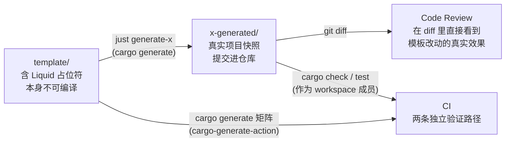

# 03 · ratatui/templates 研究：模板工程链

> 仓库：<https://github.com/ratatui/templates> · 研究基线：commit `5903368`（2026-09-06）
> 本机工具：cargo-generate **0.24.0**；能力参考取自 cargo-generate 仓库 `guide/src`（版本 0.25.0）并对关键行为做了源码核实。
>
> **范围声明**：只研究模板工程链（仓库组织、`cargo-generate.toml`、Rhai hooks、Justfile、生成快照、CI 验证）。
> 不引入任何终端 UI 业务代码；不照搬其"六个子模板并列"的根目录结构（本模板只有一个多 crate 服务骨架）。

## 1. 研究问题

| #   | 问题                                                                                      | 结论落点    |
| --- | ----------------------------------------------------------------------------------------- | ----------- |
| 1   | 模板仓库如何组织，才能既可维护，又能让 `cargo generate owner/repo` 一步到位、不多问一句？ | §3、§12     |
| 2   | 模板作者如何在提交前"看到"模板改动对生成结果的真实影响？                                  | §3、§6      |
| 3   | CI 如何证明模板生成出来的项目真的能编译？                                                 | §7          |
| 4   | 占位符（placeholders）、条件（conditional）、hooks 各自适合做什么、不适合做什么？         | §4、§5、§10 |
| 5   | 生成项目里哪些脚手架模式与 TUI 无关，可以直接迁移到服务模板？                             | §9          |

## 2. 仓库总览

```text
templates/                              根目录没有任何可编译的 Rust 源码
├── cargo-generate.toml                 [template] sub_templates = [hello-world, simple, ..., component]
├── Cargo.toml                          [workspace] members = ["*-generated"]   ← 只把"快照"当 workspace 成员
├── Cargo.lock
├── justfile                            generate-all / generate-<name>：重新生成全部快照
├── .github/workflows/ci.yml            矩阵：每个模板 generate → mv 到 $RUNNER_TEMP → cargo check --tests
├── .markdownlint.toml
│
├── hello-world/                        ┐
│   ├── README.md                       │  每个子模板 = "给人看的 README" + "给 cargo-generate 用的 template/"
│   └── template/                       │
│       ├── cargo-generate.toml         │    本子模板自己的 placeholders / hooks
│       ├── Cargo.toml                  │    含 Liquid 占位符，模板本身不可编译
│       ├── LICENSE  README.md          │
│       └── src/main.rs                 ┘
├── hello-world-generated/              由 justfile 生成并提交的快照：真实、可编译、可 diff
│
├── simple/            simple-generated/
├── simple-async/      simple-async-generated/
├── event-driven/      event-driven-generated/
├── event-driven-async/ event-driven-async-generated/
└── component/         component-generated/
    ├── .justfile                       子模板自己的开发任务（fmt / check / generate-and-run）
    ├── .pre-commit-config.yaml
    └── template/hooks/pre-get-repository.rhai
```

## 3. 三件套：`README.md` + `template/` + `*-generated/`

这是整个仓库最值得学的一个组织原则：**模板源、人类文档、生成快照三者物理分离，各自只对一种读者负责。**



| 角色                | 谁读                             | 能否编译                 | 变更时机                                       |
| ------------------- | -------------------------------- | ------------------------ | ---------------------------------------------- |
| `<name>/README.md`  | 使用者                           | 不适用                   | 设计变化时手改                                 |
| `<name>/template/`  | cargo-generate                   | **不能**（占位符未展开） | 模板作者手改                                   |
| `<name>-generated/` | Reviewer / CI / 想先看效果的用户 | **能**                   | 只由 `just generate-<name>` 重新生成，永不手改 |

快照带来的三个收益：

1. **可编译的真相**：`template/` 永远编译不过，只有快照能被 `cargo check` 真正验证。
2. **可审查的差异**：改一个占位符或一行模板代码，PR diff 里同时出现"模板改动"和"生成结果改动"，Reviewer 不需要在脑子里展开 Liquid。
3. **可浏览的样例**：不装 cargo-generate 也能直接看到生成后的项目长什么样。

代价只有一个：模板每次改动都必须重新生成快照，否则快照会"漂移"。ratatui 没有在 CI 里检查漂移；本模板会补上（见 §11）。

## 4. `cargo-generate.toml` 逐项解读

### 4.1 根配置：只负责"列出子模板"

```toml
# templates/cargo-generate.toml
[template]
cargo_generate_version = ">=0.20.0"
sub_templates = ["hello-world", "simple", "simple-async", "event-driven", "event-driven-async", "component"]
```

- `sub_templates` 同时决定交互提示里的**排列顺序**，第一项为默认值。
- 源码核实（`cargo-generate/src/fetch.rs:271-300`）：只要配置了 `sub_templates`，**无论几项都会弹出 "Which sub-template should be expanded?"**；`--silent` 下取第一项。这直接影响本模板的根目录布局决策（§12）。

### 4.2 子模板配置：占位符声明 或 hooks 二选一

```toml
# simple/template/cargo-generate.toml —— 声明式：一切靠 placeholders
[template]
cargo_generate_version = ">=0.10.0"

[placeholders]
project-description = { type = "string", prompt = "Short description of the project", default = "An example generated using the simple template" }
```

```toml
# component/template/cargo-generate.toml —— 命令式：一切靠 pre hook 里的 variable::prompt
[hooks]
pre = ["./hooks/pre-get-repository.rhai"]

[template]
cargo_generate_version = ">=0.10.0"
```

| 方式                       | 优点                                                                                                            | 缺点                                                                             | ratatui 的用法             |
| -------------------------- | --------------------------------------------------------------------------------------------------------------- | -------------------------------------------------------------------------------- | -------------------------- |
| `[placeholders]` 声明      | 可被 `--define`/`--values-file`/环境变量覆盖；`--silent` 可用；类型与校验（`regex`/`choices`/`bool`）由工具保证 | 无法表达"根据前一个答案决定后续问题"以外的复杂逻辑（这部分交给 `[conditional]`） | `simple`、`hello-world` 等 |
| hook 里 `variable::prompt` | 可做任意逻辑（解析 URL、二次确认）                                                                              | 每个 prompt 必须自己用 `variable::is_set` 守卫，否则无法静默生成                 | `component`                |

## 5. Rhai hook 逐行解读与教训

`component/template/hooks/pre-get-repository.rhai` 的逻辑（伪代码）：

```text
pre-get-repository.rhai
├─ if !variable::is_set("project-description")      ← 有守卫：CI 用 --define 传入即可跳过
│     project-description := prompt("Short description of the project")
├─ use_gitserver := is_set ? get("use-gitserver") : prompt(choices ["true","false"])   ← 字符串伪布尔
├─ if use_gitserver == "true":
│     gs_username := prompt("Username")                          ← 无守卫：静默模式下会卡住
│     origin := prompt("Repository URL", default "https://github.com/<user>/<project>")
│     去掉 http:// | https:// | git@ 前缀，按 "/" 切成 3 段，否则 abort(...)
│     若 URL 里的项目名 ≠ project-name → 打印警告并再问一次用哪个
│     variable::set("repository", "https://" + repository); variable::set("project-name", ...)
│  else:
│     variable::set("repository", "")
├─ crate_name := project-name 把 "-"/" " 替换为 "_"；variable::set("crate_name", ...)   ← 与内置 crate_name 重复
└─ file::delete("./hooks")                                       ← 关键：hooks 目录不进入生成结果
```

从中提炼的规则（正反两面都有）：

| 教训                                                                 | 证据                                                                                                      | 本模板的做法                                                          |
| -------------------------------------------------------------------- | --------------------------------------------------------------------------------------------------------- | --------------------------------------------------------------------- |
| hook 自己的目录必须在 hook 里删掉                                    | `file::delete("./hooks")`（脚本末行）                                                                     | 沿用                                                                  |
| hook 里每个 prompt 都要 `is_set` 守卫，否则 `--silent`/CI 生成会挂起 | `gs_username`、`Repository URL` 两处无守卫；CI 只能靠 `--define use-gitserver=false` 绕开                 | 所有输入一律声明在 `[placeholders]`；hook 只做**派生值**，不做 prompt |
| 伪布尔字符串 `"true"/"false"` 需要两种比较 `== "true" \|\| == true`  | 脚本第 12 行                                                                                              | 用 `type = "bool"`                                                    |
| 未定义占位符会**静默渲染为空串**                                     | `component/template/README.md:3` 同时用了 `{{gs-username}}`（从未设置）和 `{{gs_username}}`，前者渲染为空 | CI 增加"生成结果中不得残留 `{{`"和"badge 链接非空"检查                |
| 内置变量不要重复计算                                                 | 脚本重算 `crate_name`，而 cargo-generate 内置已提供                                                       | 直接用内置 `crate_name`；派生值只算内置没有的（如 `env_prefix`）      |

## 6. Justfile：把"生成"变成一条命令

```just
default:
    @just --list

generate-all:
    just generate-component
    just generate-hello-world
    ...

# 参数前的 $ 表示导出为环境变量：cargo-generate 的内置 authors 读取 CARGO_NAME / CARGO_EMAIL，
# 这样任何机器上重新生成的快照 authors 字段都一致，diff 才干净。
generate-component $CARGO_NAME="your name" $CARGO_EMAIL="author@example.com":
    rm -rv component-generated
    cargo generate --path ./component \
        --name component-generated \
        --define project-description="An example generated using the component template" \
        --define use-gitserver=false
```

| 细节                                    | 为什么重要                                                                    |
| --------------------------------------- | ----------------------------------------------------------------------------- |
| `rm -rv <snapshot>` 先删再生成          | cargo-generate 拒绝写入已存在目录（除非 `--overwrite`）                       |
| `$CARGO_NAME` / `$CARGO_EMAIL` 固定作者 | 让快照在不同机器上可复现；cargo-generate ≥ 0.24 也支持 `--define authors=...` |
| 每个 `--define` 都对应一个占位符        | 生成过程零交互，才能进 CI                                                     |
| `default: @just --list`                 | 新人 `just` 一敲就看到全部任务                                                |

`component/.justfile` 还演示了子模板级别的 `generate-and-run`：生成 → `cd` 进去 `cargo run` → 清理，这是"手动冒烟测试"的最短路径。

## 7. CI：矩阵生成 + 移出模板目录 + 编译

```yaml
# .github/workflows/ci.yml（节选）
strategy:
  matrix:
    include:
      - template: simple
        project_name: ratatui-github-example
        arguments: "--define=project-description=example"
      - template: component
        project_name: ratatui-github-example
        arguments: "--define=gh-username=ratatui --define=project-description=example --define=use-gitserver=false"
steps:
  - uses: cargo-generate/cargo-generate-action@v0.20.0
    with: { name: ${{ matrix.project_name }}, template: ${{ matrix.template }}, arguments: ${{ matrix.arguments }} }
  - uses: dtolnay/rust-toolchain@stable
  - run: |
      mv ${{ env.PROJECT_NAME }} ${{ runner.temp }}/     # 见 rust-lang/cargo#9922
      cd ${{ runner.temp }}/${{ env.PROJECT_NAME }}
      cargo check --tests
```

| 做法                          | 原因                                                                                    | 本模板的取舍                                                                                                   |
| ----------------------------- | --------------------------------------------------------------------------------------- | -------------------------------------------------------------------------------------------------------------- |
| 官方 `cargo-generate-action`  | 不必手动 `cargo install cargo-generate`（省 2–3 分钟）                                  | 沿用                                                                                                           |
| 生成后 `mv` 到 `$RUNNER_TEMP` | 生成目录若留在模板仓库内，会被父级 `Cargo.toml` 当成 workspace 成员而报错（cargo#9922） | 沿用；本模板根目录不放 `Cargo.toml`，风险更低                                                                  |
| 只跑 `cargo check --tests`    | 追求快                                                                                  | **不够**：改为 fmt + clippy(-D warnings) + nextest + doc + 快照漂移检查                                        |
| 快照作为 workspace 成员被编译 | 第二条验证路径                                                                          | 本模板的生成物自身就是 workspace，不能再嵌套进父 workspace（Cargo 禁止嵌套），改为 `cd generated && cargo ...` |

## 8. Liquid 在模板文件里的用法

| 文件                                 | 片段                                                               | 说明                                       |
| ------------------------------------ | ------------------------------------------------------------------ | ------------------------------------------ |
| `component/template/Cargo.toml:2`    | `name = "{{project-name \| kebab_case}}"`                          | 过滤器保证包名合法                         |
| `component/template/Cargo.toml:8-10` | `` … ``                      | `-%}` / `{%-` 吃掉空白行，生成结果不留空行 |
| `component/template/.envrc`          | `export {{crate_name \| shouty_snake_case}}_CONFIG=...`            | 用同一个 `crate_name` 派生环境变量前缀     |
| `component/template/README.md:3`     | `[]` | 反例：`gs-username` 从未定义               |

cargo-generate 附加的过滤器：`kebab_case` `snake_case` `shouty_snake_case` `shouty_kebab_case` `pascal_case`/`upper_camel_case` `lower_camel_case` `title_case`，以及 `rhai`（把字符串当脚本执行）。

## 9. 可迁移的脚手架模式（与 TUI 无关）

`component/template/src/` 里有一半文件其实是"任何长期运行的 Rust 程序都需要的基础设施"。逐个评估：

| 文件                                        | 模式                                                                                                                                                                                                   | 迁移到服务模板                                                                                                            |
| ------------------------------------------- | ------------------------------------------------------------------------------------------------------------------------------------------------------------------------------------------------------ | ------------------------------------------------------------------------------------------------------------------------- |
| `main.rs`                                   | 固定启动顺序：`errors::init()` → `logging::init()` → `Cli::parse()` → `App::new()` → `app.run().await`                                                                                                 | 采纳顺序原则，但服务的日志级别/格式来自配置，所以顺序调整为：panic hook → CLI → 配置 → telemetry → 构建 → 运行            |
| `errors.rs`                                 | `color-eyre` hook + 自定义 panic hook（release 用 `human-panic`，debug 用 `better-panic`）+ `trace_dbg!` 宏                                                                                            | 采纳"panic hook 先于一切安装"；服务不需要 human-panic/better-panic，改为"panic → `tracing::error!` 结构化输出 → 非零退出" |
| `logging.rs`                                | `EnvFilter`：`RUST_LOG` 优先，否则 `<CRATE>_LOG_LEVEL`；写文件；`ErrorLayer`                                                                                                                           | 采纳环境变量命名（`<PREFIX>_LOG`），输出改为 stdout（容器友好），格式 pretty/json 由配置决定                              |
| `config.rs`                                 | `config` crate builder：代码默认值 → 配置目录下多格式文件（json5/json/yaml/toml/ini，皆 `required(false)`）→ `try_deserialize`；`directories::ProjectDirs` 决定目录；`<CRATE>_CONFIG` 环境变量覆盖目录 | 采纳"分层加载 + 全部可选"的思想；服务只保留 TOML 一种格式，增加环境变量覆盖单个字段                                       |
| `cli.rs`                                    | `clap` derive；`version = version()` 拼接 `VERGEN_GIT_DESCRIBE`、构建日期、配置目录                                                                                                                    | 采纳；服务再加 `--config <path>`、`--check-config`（借 Pingora 的 `-t`）、`--print-config`                                |
| `build.rs`                                  | `vergen-gix` 注入 git describe / build date / cargo 信息                                                                                                                                               | 采纳：用于 `--version`、启动日志、`/version` 端点                                                                         |
| `.envrc`                                    | direnv 导出 `<CRATE>_CONFIG/_DATA/_LOG_LEVEL`                                                                                                                                                          | 改为提交 `.env.example`，不强依赖 direnv                                                                                  |
| `tui.rs` `components/` `action.rs` `app.rs` | 终端 UI 事件循环                                                                                                                                                                                       | **不迁移**                                                                                                                |

## 10. cargo-generate 能力边界参考

以下内容来自 cargo-generate 0.25.0 的 `guide/src/`，关键行为已在源码中核实；本机安装的是 0.24.0，所列特性均可用。

### 10.1 占位符

| 类别     | 名称 / 语法                                          | 说明                                                               |
| -------- | ---------------------------------------------------- | ------------------------------------------------------------------ |
| 内置     | `project-name`                                       | `--name` 或交互输入；非 snake/kebab 时转 kebab；`--force` 保留原样 |
| 内置     | `crate_name`                                         | `project-name` 的 snake_case                                       |
| 内置     | `crate_type`                                         | `--bin`（默认）或 `--lib`                                          |
| 内置     | `authors` / `username`                               | 借用 Cargo 逻辑，读 `CARGO_NAME`/`CARGO_EMAIL`/git config          |
| 内置     | `os-arch`                                            | 如 `linux-x86_64`                                                  |
| 内置     | `within_cargo_project`                               | 父目录任意层存在 `Cargo.toml` 即 `true`                            |
| 内置     | `is_init`                                            | 是否 `--init`                                                      |
| 内置覆盖 | `--define authors=...`                               | 0.24 起可覆盖内置值，用于固定快照作者                              |
| 模板定义 | `[placeholders.x] type/prompt/default/choices/regex` | `type` ∈ `string` `text` `editor` `bool` `array`                   |
| 模板定义 | `choices = [{ value = "…", label = "…" }, "plain"]`  | 带显示标签的选项，模板里只看到 `value`                             |

取值优先级（高 → 低）：`--define` > `--values-file` > 环境变量 `CARGO_GENERATE_VALUE_<KEY>` > `$CARGO_HOME/cargo-generate` 里的 `[values]`/favorites > 交互 prompt / `default`。
**占位符名建议全小写**：Windows 环境变量不区分大小写，工具内部会统一转小写。

### 10.2 条件（`[conditional]`）

```toml
[placeholders]
license = { type = "string", prompt = "License?", choices = ["MIT", "Apache-2.0"], default = "MIT" }
include_docker = { type = "bool", prompt = "Include Dockerfile & compose?", default = true }

[conditional.'license == "MIT"']
ignore = ["LICENSE-APACHE"]

[conditional.'include_docker == false']
ignore = ["Dockerfile", "docker-compose.yml", ".dockerignore", ".github/workflows/docker.yml"]

[conditional.'crate_type != "lib"'.placeholders]
port = { type = "string", prompt = "HTTP port", default = "8080", regex = "^[0-9]+$" }
```

| 规则                                                           | 含义                                                |
| -------------------------------------------------------------- | --------------------------------------------------- |
| 表达式是 Rhai                                                  | `==`、`!=`、数组的 `.contains()` 等都可用           |
| 顶层 `[placeholders]` 先于任何条件求值                         | 条件里用到的变量必须在顶层定义（内置变量除外）      |
| 条件块内可放 `ignore` / `include` / `exclude` / `placeholders` | `ignore` 直接不输出；`exclude` 只是不做 Liquid 处理 |
| 条件占位符的值**不能**再触发其他条件                           | 但可以在模板文件里使用                              |
| `include` 与 `exclude` 互斥                                    | 即使分散在不同条件块也互斥                          |

### 10.3 文件处理规则

| 规则                         | 说明                                                  | 用途                                                            |
| ---------------------------- | ----------------------------------------------------- | --------------------------------------------------------------- |
| `.liquid` 后缀               | 渲染后去掉后缀；若同名文件已存在则**覆盖**            | 模板仓库自己的 `README.md` 与生成项目的 `README.md.liquid` 共存 |
| `[template] ignore = [...]`  | 不输出（不支持通配符；对去掉 `.liquid` 后的名字匹配） | 排除模板仓库的元文件                                            |
| `[template] exclude = [...]` | 输出但不做 Liquid 处理（glob 语法同 Cargo）           | 保护含 `{{` 的文件（如 GitHub Actions、Tera/Handlebars 模板）   |
| `[template] include = [...]` | 只对列出的文件做 Liquid 处理                          | 与 `exclude` 互斥，二者同在时取 `include`                       |
| 默认不输出                   | `cargo-generate.toml`、`.genignore`、`.cargo-ok`      | 源码 `src/ignore_me.rs:52`                                      |
| 文件/目录名也做替换          | `crates/{{project-name}}-core/` → `crates/acme-core/` | 多 crate 目录命名                                               |

### 10.4 Hooks

| 类型   | 运行时机                                        | 可用变量                                                                                 | 典型用途                                                   |
| ------ | ----------------------------------------------- | ---------------------------------------------------------------------------------------- | ---------------------------------------------------------- |
| `init` | 最早，占位符解析之前                            | `crate_type` `authors` `username` `os-arch` `is_init`（`project-name` 仅 `--init` 时有） | 预设 `project-name` 免提示                                 |
| `pre`  | 所有 `[placeholders]` 解析完成后、Liquid 渲染前 | 全部占位符                                                                               | 派生变量（`variable::set`）、`file::rename`/`file::delete` |
| `post` | 渲染完成后、移动到目标目录前                    | 全部                                                                                     | 最后整理；失败不会污染用户目录                             |

Rhai 扩展 API：

| 模块       | 函数                                                                                                                                                                              |
| ---------- | --------------------------------------------------------------------------------------------------------------------------------------------------------------------------------- |
| `variable` | `is_set(name)` `get(name)` `set(name, value)` `prompt(text)` `prompt(text, default)` `prompt(text, default, regex)` `prompt(text, default, choices)` `prompt(text, bool_default)` |
| `file`     | `exists(path)` `rename(from, to)` `delete(path)` `write(path, string\|array)` `listdir(path=".")`（仅限模板目录内）                                                               |
| `system`   | `command(cmd, args=[])`（**每次需用户同意**，除非 `--allow-commands`；`--silent` 下无 `--allow-commands` 直接失败）、`date()`                                                     |
| `env`      | `working_directory` `destination_directory`                                                                                                                                       |
| 其他       | `abort(reason)` `print` `debug` `to_kebab_case` `to_snake_case` `to_shouty_snake_case` `to_pascal_case` `to_lower_camel_case` `to_title_case` …                                   |

**设计规则**：hooks 里禁止 `system::command`。原因：它会弹出安全确认、破坏 `--silent`，并且参数不会被转义。需要 `cargo fmt` 之类的后处理，放进生成项目的 `justfile` 让用户自己跑。

### 10.5 子模板解析规则（源码核实）

```text
locate_template_configs(base)                                     src/config.rs:105-127
  从 base 出发广度遍历；某目录含 cargo-generate.toml 则记录该目录并不再深入
auto_locate_template_dir(base)                                    src/fetch.rs:228-268
  0 个 config  → base 本身就是模板
  1 个 config  → resolve_configured_sub_templates(该目录)         src/fetch.rs:271-300
                   ├─ 配置了 sub_templates → 一定弹出选择提示（默认第一项；--silent 取默认）
                   └─ 未配置             → 直接使用该目录，不提示
  ≥2 个 config → 弹出 "Which template should be expanded?"，选中后递归
```

推论：**根目录不放 `cargo-generate.toml`、仅 `template/` 下放一个**，则 `cargo generate owner/repo` 会静默定位到 `template/`。已提交的 `generated/` 快照里不会有 `cargo-generate.toml`（它默认被排除），不会干扰定位。

### 10.6 与本模板相关的 CLI 参数

| 参数                              | 用途                                                                                                           |
| --------------------------------- | -------------------------------------------------------------------------------------------------------------- |
| `--name <n>` / `-n`               | 项目名（目录名）                                                                                               |
| `--define k=v` / `-d`             | 覆盖占位符（含内置）                                                                                           |
| `--values-file <f>`               | 从 `[values]` 文件批量提供                                                                                     |
| `--silent` / `-s`                 | 零交互；缺值即失败                                                                                             |
| `--init` / `--destination <p>`    | 生成到当前目录 / 指定目录                                                                                      |
| `--no-workspace`                  | 在已有 Cargo 项目内生成时，不自动把生成物加进父 workspace 的 `members`（0.25 行为，`src/workspace_member.rs`） |
| `--test`                          | 把 `$CWD` 当模板展开后运行 `cargo test`（`CARGO_GENERATE_TEST_CMD` 可换命令）：模板作者的本地自检              |
| `--vcs none` / `--force-git-init` | 控制是否 `git init`                                                                                            |
| `--branch/--tag/--revision`       | 固定模板版本，用于可复现生成                                                                                   |
| `--path <p>`                      | 本地模板（justfile 与 CI 用）                                                                                  |

### 10.7 已知坑

| 坑                                        | 表现                                    | 规避                                                                                                                                        |
| ----------------------------------------- | --------------------------------------- | ------------------------------------------------------------------------------------------------------------------------------------------- |
| GitHub Actions 的 `${{ }}` 与 Liquid 冲突 | 渲染报错或值被吃掉                      | 整个 workflow 文件外层包 `…`，或把 `.github/workflows/*.yml` 列入 `[template] exclude`（仅当文件里完全不需要占位符时） |
| 未定义占位符静默变空串                    | 生成结果里出现空名字、坏链接            | CI 断言：生成目录 `grep -rn '{{'` 为空，且关键字段非空                                                                                      |
| 生成目录留在模板仓库内                    | 被父 `Cargo.toml` 当成员、或双 lockfile | 根目录不放 `Cargo.toml`；CI 中 `mv` 到临时目录                                                                                              |
| `ignore` 不支持通配符                     | 想忽略一类文件时要逐个列                | 目录级 ignore（整个目录名）                                                                                                                 |

## 11. 对本模板的启示

**直接采纳（Adopt）**

| 模式                                 | 证据                                                    | 在本模板中的落点                                                              |
| ------------------------------------ | ------------------------------------------------------- | ----------------------------------------------------------------------------- |
| `template/` 与人类文档物理分离       | 每个子模板的 `README.md` + `template/`                  | 仓库根：`README.md`（面向使用者）、`template/`（模板源）、`docs/`（设计文档） |
| 提交生成快照并由 CI 编译             | `*-generated/` + `Cargo.toml members = ["*-generated"]` | `generated/` 独立 workspace；CI `cd generated && just ci`                     |
| justfile 作为"生成即验证"入口        | 根 `justfile` 的 `generate-*`                           | `just regen`、`just verify`、`just smoke`                                     |
| CI 矩阵 + `mv` 到临时目录            | `.github/workflows/ci.yml`                              | 沿用，并扩展检查项                                                            |
| Liquid 过滤器派生命名                | `kebab_case` / `shouty_snake_case`                      | 包名、环境变量前缀、类型前缀                                                  |
| hook 末尾 `file::delete("./hooks")`  | `pre-get-repository.rhai` 末行                          | 沿用                                                                          |
| 用 `--define`/`$CARGO_NAME` 固定作者 | `justfile` 参数                                         | 快照可复现                                                                    |
| `vergen` 注入版本信息                | `build.rs` + `cli.rs`                                   | `--version`、启动日志、`/version`                                             |

**改造后采纳（Adapt）**

| 模式                        | 需要改什么                                                 | 原因                                       |
| --------------------------- | ---------------------------------------------------------- | ------------------------------------------ |
| 多子模板 + `sub_templates`  | 改为单模板：根目录不放 `cargo-generate.toml`               | 单项 `sub_templates` 仍会弹提示（§10.5）   |
| hook 内交互 prompt          | 全部改为 `[placeholders]` 声明；hook 只做派生值            | 让 `--silent`/CI 生成零交互                |
| 快照作为父 workspace 成员   | 快照是独立 workspace                                       | Cargo 不允许 workspace 嵌套                |
| CI 只 `cargo check --tests` | fmt + clippy + nextest + doc + 漂移检查 + 未渲染占位符检查 | 模板的 lint 策略很严，必须在 CI 里真正执行 |
| `config.rs` 多格式加载      | 只保留 TOML + 环境变量                                     | 服务配置以少而明确为优                     |
| `.envrc`                    | `.env.example`                                             | 不强依赖 direnv                            |
| `.pre-commit-config.yaml`   | 可选（默认不生成）                                         | 不给新用户增加工具链负担                   |

**不采纳（Avoid）**

| 模式                                            | 原因                                                    |
| ----------------------------------------------- | ------------------------------------------------------- |
| `tui.rs` / `components/` / `action.rs`          | 终端 UI 业务，与服务无关                                |
| hook 里解析 Git URL 并二次确认                  | 逻辑脆弱、无法静默；仓库 URL 用一个可选字符串占位符即可 |
| 伪布尔字符串 `"true"/"false"`                   | 用 `type = "bool"`                                      |
| 同一变量两种拼写（`gs-username`/`gs_username`） | 已在 ratatui 里造成空链接                               |
| `human-panic` / `better-panic`                  | 面向 CLI 终端用户的体验，服务只需结构化日志             |

## 12. 对模板仓库布局的直接结论

```text
rs-starter-template/                      ← GitHub 仓库根：没有 Cargo.toml、没有 cargo-generate.toml
├── README.md                             使用者文档：一条命令 + 生成后长什么样
├── docs/design/                          本设计文档
├── justfile                              regen / verify / smoke（模板作者用）
├── .github/workflows/template-ci.yml     生成矩阵 + 快照漂移检查
├── template/                             ← 唯一的模板：cargo generate 自动定位到这里
│   ├── cargo-generate.toml               placeholders / conditional / hooks
│   ├── hooks/pre.rhai                    仅派生变量 + 自删
│   ├── Cargo.toml                        workspace 根（含 Liquid）
│   ├── crates/{{project-name}}-*/        目录名占位符
│   └── ...
└── generated/                            ← 用默认答案生成的快照：独立 workspace，CI 在此编译
```

这一布局同时满足：`cargo generate riotian/rs-starter-template` 零多余提示（§10.5）；模板作者 `just regen && git diff` 即可审查；CI 两条路径互相印证。具体占位符与 CI 设计见 `07-template-engineering.md`。
