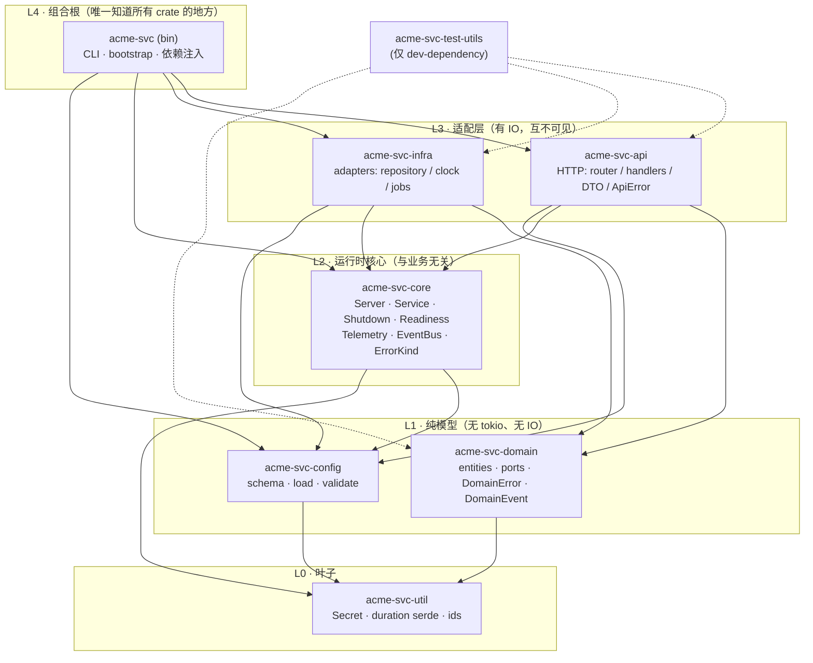
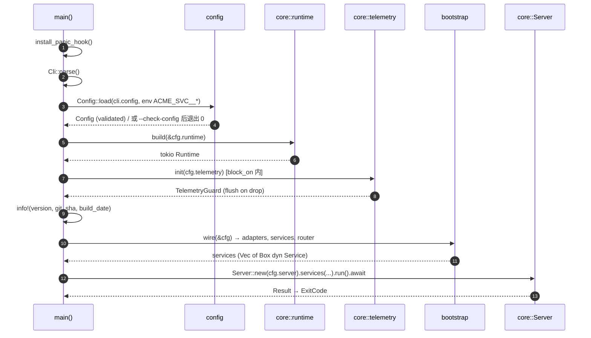
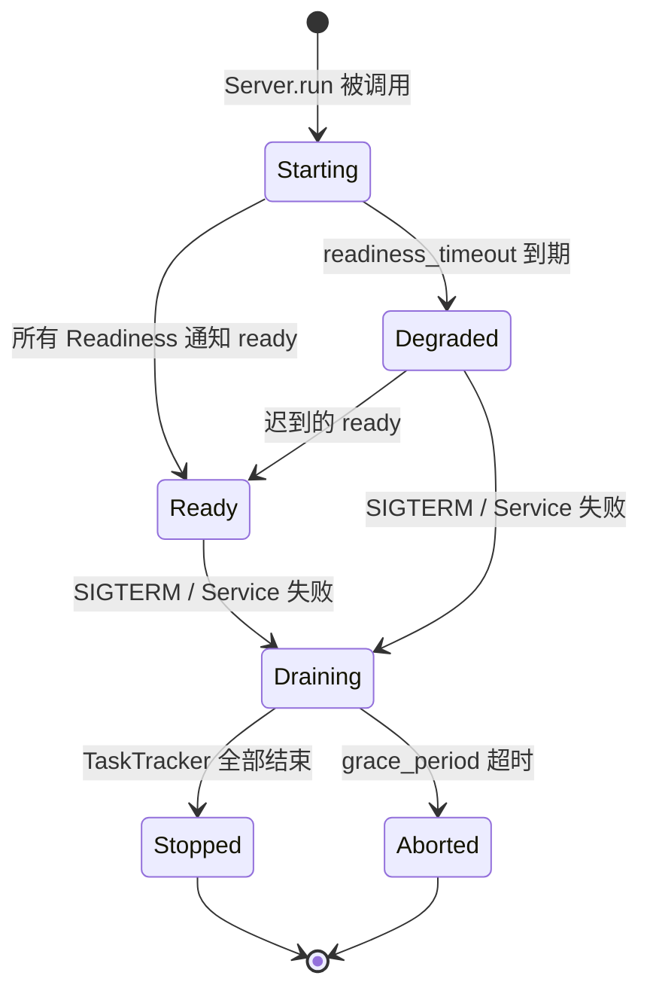
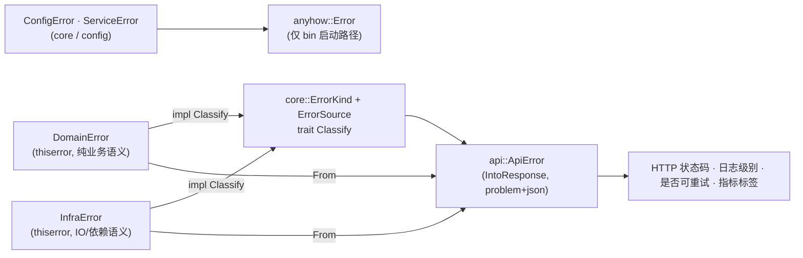
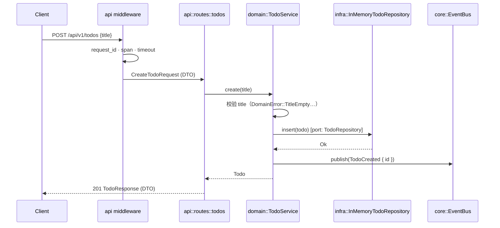

# 05 · 生成项目的架构设计

> 本文描述 `cargo generate` 之后用户拿到的项目。全文以 `acme-svc` 作为示例项目名（`crate_name = acme_svc`，环境变量前缀 `ACME_SVC`）。
> 设计原则来自 `04-principles.md`；每处借鉴都标注来源：**[Pumpkin]** 应用组织、**[Pingora]** 框架与生命周期、**[ratatui]** 脚手架细节。

## 1. 一张图：crate 分层与依赖方向



同一张图的 ASCII 版本（便于在终端/README 中引用）：

```text
            ┌─────────────────────────────┐
   L4       │        acme-svc (bin)       │   组合根：CLI / bootstrap / 注入
            └──────┬──────────┬───────────┘
                   │          │
            ┌──────▼─────┐ ┌──▼──────────┐
   L3       │ acme-svc-  │ │ acme-svc-   │   适配层：api ↔ infra 互不可见
            │    api     │ │   infra     │
            └──────┬─────┘ └──┬──────────┘
                   │          │
            ┌──────▼──────────▼───────────┐
   L2       │        acme-svc-core        │   运行时核心：不认识任何业务类型
            └──────┬──────────┬───────────┘
                   │          │
            ┌──────▼─────┐ ┌──▼──────────┐
   L1       │ acme-svc-  │ │ acme-svc-   │   纯模型：domain 不依赖 config
            │   domain   │ │   config    │
            └──────┬─────┘ └──┬──────────┘
                   │          │
            ┌──────▼──────────▼───────────┐
   L0       │        acme-svc-util        │   叶子：纯函数、零依赖倾向
            └─────────────────────────────┘
```

### 1.1 依赖规则（写进 `docs/architecture.md`，并由测试守卫）

| #   | 规则                                     | 说明                                                                                           | 来源                                                                    |
| --- | ---------------------------------------- | ---------------------------------------------------------------------------------------------- | ----------------------------------------------------------------------- |
| R1  | 只向下依赖                               | L(n) 只能依赖 L(<n)                                                                            | [Pumpkin] `pumpkin-util` → `config` → `world` → `pumpkin` 的单向链      |
| R2  | 同层互不可见                             | `api` 与 `infra` 只在 `bin` 汇合                                                               | 六边形架构                                                              |
| R3  | `domain` 零 IO                           | 不依赖 tokio / axum / config；允许 `serde(derive)`、`thiserror`、`uuid`、`time`、`async-trait` | [Pingora] `pingora-error`、`pingora-http` 都是无 runtime 依赖的叶子     |
| R4  | `core` 不认识业务                        | `core` 不依赖 `domain`；`EventBus<E>`、`HealthRegistry` 等全部泛型 / trait 化                  | [Pingora] `pingora-core` 不依赖 `pingora-proxy`                         |
| R5  | `test-utils` 只作 `dev-dependencies`     | 测试辅助不进生产二进制                                                                         | [Pingora] `pingora-test-utils`                                          |
| R6  | `util` 只收留"≥ 2 个 crate 需要的纯函数" | 否则留在使用方；防止 util 变垃圾桶                                                             | [Pumpkin] `pumpkin-util` 的实际内容是被多 crate 共享的数学/文本/ID 工具 |
| R7  | 版本只在 `[workspace.dependencies]` 声明 | 成员一律 `xxx.workspace = true`；第三方依赖默认 `default-features = false` 按需开 feature      | [Pumpkin] 根 `Cargo.toml` 的依赖表                                      |
| R9  | 每个 crate 都有 `prelude`，哪怕为空      | 组合根与测试统一 `use xxx::prelude::*`；以后加门面 crate 时不需要 `#[cfg]` 特判                | [Pingora] `pingora-cache/src/lib.rs:60` 的空 prelude                    |
| R8  | lint 只在 `[workspace.lints]` 声明       | 成员一律 `[lints] workspace = true`                                                            | [Pumpkin]                                                               |

守卫方式：`crates/acme-svc/tests/layering.rs` 读取 `cargo metadata`，按允许边表断言（类似 ArchUnit）。伪代码：

```text
ALLOWED = {
  "acme-svc":        {"acme-svc-api","acme-svc-infra","acme-svc-core","acme-svc-config","acme-svc-domain","acme-svc-util"},
  "acme-svc-api":    {"acme-svc-domain","acme-svc-core","acme-svc-config","acme-svc-util"},
  "acme-svc-infra":  {"acme-svc-domain","acme-svc-core","acme-svc-config","acme-svc-util"},
  "acme-svc-core":   {"acme-svc-config","acme-svc-util"},
  "acme-svc-domain": {"acme-svc-util"},
  "acme-svc-config": {"acme-svc-util"},
  "acme-svc-util":   {},
}
for pkg in metadata.workspace_members:
    for dep in pkg.dependencies where dep.is_workspace_member and dep.kind != dev:
        assert dep.name in ALLOWED[pkg.name], "layering violation: {pkg} -> {dep}"
```

## 2. 每个 crate 的职责卡片

| crate                 | 一句话职责                                                                                                                       | 允许依赖                                     | 禁止                | 何时拆分                                                 |
| --------------------- | -------------------------------------------------------------------------------------------------------------------------------- | -------------------------------------------- | ------------------- | -------------------------------------------------------- |
| `acme-svc` (bin)      | 解析 CLI、加载配置、建 runtime、装配依赖、启动 `Server`                                                                          | 全部                                         | 业务逻辑、HTTP 细节 | 永不：它就该薄                                           |
| `acme-svc-core`       | 运行时与生命周期：`Server`、`Service`、`ShutdownToken`、`Readiness`、`HealthRegistry`、`EventBus`、`ErrorKind`、telemetry 初始化 | `config`、`util`、tokio、tracing、metrics    | 任何业务类型        | 当 telemetry 依赖变重（otel）→ `acme-svc-telemetry`      |
| `acme-svc-config`     | 配置 schema（全部分节）、分层加载、校验、脱敏打印                                                                                | `util`、serde、`config`                      | tokio、业务类型     | 永不                                                     |
| `acme-svc-domain`     | 实体、值对象、领域服务、port trait、`DomainError`、`DomainEvent`                                                                 | `util`、serde、thiserror、uuid、time         | IO、框架            | 领域 ≥ 2 个且互相独立 → `acme-svc-domain-<x>`            |
| `acme-svc-infra`      | port 的实现：内存仓储、系统时钟、后台任务                                                                                        | `domain`、`core`、`config`                   | 被 `api` 引用       | 某 adapter 依赖很重（sqlx、kafka）→ `acme-svc-infra-<x>` |
| `acme-svc-api`        | HTTP 传输：`HttpService`、router、middleware、DTO、`ApiError`、探针端点                                                          | `domain`、`core`、`config`、axum、tower-http | 直接 new adapter    | 新协议（gRPC）→ `acme-svc-grpc` 并列                     |
| `acme-svc-util`       | `Secret<T>`、`humantime` duration serde、ID 工具                                                                                 | 尽量零依赖                                   | 任何上层类型        | 永不                                                     |
| `acme-svc-test-utils` | `TestApp` 进程内启动、`FakeClock`、断言助手                                                                                      | `api`、`infra`、`domain`                     | 被非 dev 依赖       | 永不                                                     |

### 2.1 `core` 的模块图

```text
acme-svc-core/src
├── lib.rs           pub mod + pub use prelude
├── prelude.rs       Result, Error, ErrorKind, Service, ShutdownToken, Readiness
├── runtime.rs       build(&RuntimeConfig) -> tokio::runtime::Runtime        [Pingora] 配置先于 runtime
├── server.rs        Server { services, opts } · run()                       [Pingora] Server::run_forever
├── service.rs       trait Service · ServiceError                            [Pingora] Service / ServerApp
├── shutdown.rs      ShutdownToken(CancellationToken) · signal listener      [Pingora] ShutdownWatch
├── readiness.rs     Readiness(watch::Sender<bool>) · Drop ⇒ ready            [Pingora] ServiceReadyNotifier
├── health.rs        trait HealthCheck · HealthRegistry · HealthReport
├── event.rs         EventBus<E> · Publisher<E> · Subscription<E>           [Pumpkin] 事件系统的最小子集
├── error.rs         ErrorKind · ErrorSource · trait Classify                [Pingora] etype / esource / retry
└── telemetry/
    ├── mod.rs       init(&TelemetryConfig) -> TelemetryGuard
    ├── tracing.rs   EnvFilter(ACME_SVC_LOG | RUST_LOG) · fmt pretty|json    [ratatui] logging.rs
    ├── metrics.rs   PrometheusHandle · 进程/runtime 指标
    └── panic.rs     install_panic_hook(): panic → tracing::error!           [ratatui] errors.rs
```

## 3. 运行时视角：进程里跑着什么

```text
 OS 进程 acme-svc
 └── tokio multi-thread runtime（worker_threads 来自 config.runtime）
     ├── Server::run()   ── 协调者 ──────────────────────────────────────────┐
     │     ├── signal listener  SIGTERM / SIGINT ─► root.cancel()             │
     │     │                    第二次信号     ─► process::exit(130)          │
     │     ├── TaskTracker      跟踪所有 Service 任务                          │
     │     └── grace timer      超过 config.server.grace_period ─► 强制退出    │
     ├── [Service] HttpService        axum::serve · with_graceful_shutdown     │
     │     └── 每连接一个 task；handler 通过 AppState 访问领域服务             │
     ├── [Service] CleanupJob         周期任务示例（tokio::time::interval）     │
     ├── [Service] EventLogSubscriber 订阅 DomainEvent 并打日志（示例订阅者）   │
     └── 就绪聚合  HealthRegistry ◄── 各 adapter 的 HealthCheck ──► /readyz     ┘
```

## 4. 生命周期

### 4.1 启动顺序



`main` 保持同步直到 runtime 建好，这是 [Pingora] `Server::new(opt)` → `bootstrap()` → `run_forever()` 的精神：**配置决定 runtime，而不是 runtime 决定配置**。`#[tokio::main]` 因此不用。

```rust
// crates/acme-svc/src/main.rs（伪代码）
fn main() -> ExitCode {
    acme_svc_core::telemetry::install_panic_hook();
    let cli = Cli::parse();
    let cfg = match Config::load(cli.config.as_deref()) { Ok(c) => c, Err(e) => return fail(e) };
    if cli.check_config { println!("{}", cfg.redacted()); return ExitCode::SUCCESS; }
    let rt = match acme_svc_core::runtime::build(&cfg.runtime) { Ok(rt) => rt, Err(e) => return fail(e) };
    match rt.block_on(bootstrap::run(cfg)) { Ok(()) => ExitCode::SUCCESS, Err(e) => fail(e) }
}
```

### 4.2 `Server::run` 伪代码

```text
Server::run(self):
    root    := ShutdownToken::new()                      // CancellationToken
    tracker := TaskTracker::new()
    ready   := Vec<watch::Receiver<bool>>

    for svc in self.services:                            // 注册顺序启动
        (notifier, rx) := Readiness::new()
        ready.push(rx)
        child := root.child_token()
        tracker.spawn(named(svc.name(), async move {
            match svc.run(child, notifier).await {
                Ok(())  => info!(service = name, "stopped"),
                Err(e)  => { error!(service = name, %e, "failed"); root.cancel() }   // 任一 Service 失败 ⇒ 全局关停
            }
        }))

    spawn(signal_listener(root.clone()))                 // SIGTERM / SIGINT ⇒ root.cancel()；第二次 ⇒ exit(130)

    match timeout(opts.readiness_timeout, wait_all(ready)).await:
        Ok(_)  => info!("all services ready")
        Err(_) => warn!("readiness timeout; continuing")  // 不致命：/readyz 会如实返回 503

    root.cancelled().await                               // 等待关停触发
    info!("shutdown requested; draining")
    tracker.close()
    match timeout(opts.grace_period, tracker.wait()).await:
        Ok(_)  => info!("clean shutdown")
        Err(_) => { warn!("grace period exceeded; aborting remaining tasks"); return Err(ServerError::GraceExceeded) }
```

### 4.3 信号语义

| 信号                      | 行为                                                | 与 Pingora 的差异                                    |
| ------------------------- | --------------------------------------------------- | ---------------------------------------------------- |
| `SIGTERM`                 | 优雅关停：停止 accept → 等在途请求 ≤ grace → 退出 0 | 相同                                                 |
| `SIGINT`（Ctrl-C）        | 与 `SIGTERM` 相同（开发体验优先）                   | Pingora 是立即退出                                   |
| 第二次 `SIGINT`/`SIGTERM` | 立即 `exit(130)`                                    | Pingora 无此约定                                     |
| `SIGQUIT`                 | 不处理                                              | Pingora 用于 fd 传递热升级（本模板不做，见 `00` N4） |
| Windows                   | 仅 `ctrl_c`                                         | —                                                    |

### 4.4 就绪状态机



`/healthz`（liveness）在 `Starting` 起即返回 200——进程活着；`/readyz`（readiness）只在 `Ready` 返回 200，`Draining` 立即返回 503 让负载均衡摘流量。这是 [Pingora] "先停 accept、再等在途" 的 HTTP 版。

状态机对外可观测（[Pingora] `ExecutionPhase` 经 `broadcast` 发布，`server/mod.rs:82-121`）：

```rust
#[non_exhaustive]                          // 以后加阶段不是 breaking change
pub enum Phase { Starting, Ready, Degraded, Draining, Stopped, Aborted }
impl Server { pub fn phase_watch(&self) -> watch::Receiver<Phase> { … } }
```

集成测试用 `phase_watch()` 等到 `Ready` 再发请求、等到 `Stopped` 再断言，**不用 `sleep(n)`**。信号源同样可注入（[Pingora] `ShutdownSignalWatch`，`server/mod.rs:145-148`）：`Server::run_with(signals: impl SignalSource)`，测试传一个 `oneshot` 触发器而不是真的 `kill`。

## 5. 扩展点：不改 `core` 就能接入的地方

| 扩展点        | 形式                                                               | 谁实现            | 谁调用                       | 借鉴                                                        |
| ------------- | ------------------------------------------------------------------ | ----------------- | ---------------------------- | ----------------------------------------------------------- |
| `Service`     | trait（`name`、`run(shutdown, readiness)`）                        | 任何长期运行组件  | `core::Server`               | [Pingora] `Service` + `ServerApp::process_new(…, shutdown)` |
| `HealthCheck` | trait（`async fn check() -> Health`）                              | infra adapter     | `HealthRegistry` → `/readyz` | [Pingora] `ServiceReadyNotifier`                            |
| Port          | `domain` 里的 trait（`TodoRepository`、`Clock`）                   | `infra`           | `domain` 服务                | 六边形架构                                                  |
| 事件订阅      | `EventBus::subscribe()` 返回流                                     | 任意 crate        | `core`                       | [Pumpkin] 插件事件系统（去掉优先级与取消）                  |
| HTTP 中间件   | tower `Layer`                                                      | `api`             | axum                         | [Pingora] `HttpModules` 流水线                              |
| 请求上下文    | `RequestContext { request_id, started_at, … }` 作为 axum extension | `api` middleware  | handlers                     | [Pingora] `ProxyHttp::CTX`（每请求一份，跨阶段共享）        |
| 配置分节      | `config` crate 里新增 struct + `#[serde(default)]`                 | 任何 crate 的作者 | 各 crate                     | [Pumpkin] `pumpkin-config`                                  |
| Cargo feature | `core` 的 `otel` 等                                                | —                 | —                            | [Pingora] facade 的 feature 门                              |

`Service` trait 的形状（对象安全，使用 `async_trait`，与 Pingora 一致）：

```rust
#[async_trait]
pub trait Service: Send + Sync + 'static {
    fn name(&self) -> &'static str;

    /// 一直运行到 `shutdown` 被取消。就绪后调用 `ready.ready()`；
    /// 返回 `Ok(())` 表示干净退出，`Err` 表示异常（会触发全局关停）。
    async fn run(self: Box<Self>, shutdown: ShutdownToken, ready: Readiness) -> Result<(), ServiceError>;
}
```

`HttpService` 作为最重要的 `Service` 实现：

```text
HttpService::run(self, shutdown, ready):
    listener := TcpListener::bind(cfg.bind).await?          // 失败即 Err ⇒ 全局关停
    info!(addr = listener.local_addr(), "http listening")
    ready.ready()
    axum::serve(listener, router.into_make_service_with_connect_info::<SocketAddr>())
        .with_graceful_shutdown(shutdown.cancelled_owned())  // 停 accept + 等在途
        .await
```

## 6. 错误模型

### 6.1 三层、一个分类、一次映射



| 层            | 类型                          | 形式                                                                       | 例子                                                                            |
| ------------- | ----------------------------- | -------------------------------------------------------------------------- | ------------------------------------------------------------------------------- |
| domain        | `DomainError`                 | `thiserror` 枚举，变体表达业务规则                                         | `TitleEmpty`、`TitleTooLong { max }`、`NotFound(TodoId)`、`AlreadyDone(TodoId)` |
| infra         | `InfraError`                  | `thiserror` 枚举，包裹外部错误并带上下文                                   | `Storage { op, source }`、`Timeout { op, after }`                               |
| core / config | `ServiceError`、`ConfigError` | `thiserror`                                                                | `Bind { addr, source }`、`Invalid { path, reason }`                             |
| api           | `ApiError`                    | 结构体：`kind`、`title`、`detail`、`instance(request_id)` + `IntoResponse` | RFC 9457 `application/problem+json`                                             |
| bin           | `anyhow::Error`               | 只在 `main`/`bootstrap` 汇总                                               | 启动失败一律打印链并退出非 0                                                    |

### 6.2 分类（借 [Pingora] `etype` / `esource` / `retry` 的三元组，简化）

```rust
pub enum ErrorKind { InvalidInput, NotFound, Conflict, Unauthorized, Forbidden, RateLimited, Unavailable, Timeout, Internal }
pub enum ErrorSource { Client, Dependency, Internal }          // 对应 Pingora 的 Downstream / Upstream / Internal
pub trait Classify { fn kind(&self) -> ErrorKind; fn source(&self) -> ErrorSource; fn retryable(&self) -> bool { … } }
```

| `ErrorKind`                  | HTTP      | `ErrorSource` | 可重试     | 日志级别 | 是否告警 |
| ---------------------------- | --------- | ------------- | ---------- | -------- | -------- |
| `InvalidInput`               | 400       | Client        | 否         | debug    | 否       |
| `PayloadTooLarge`            | 413       | Client        | 否         | debug    | 否       |
| `Unauthorized` / `Forbidden` | 401 / 403 | Client        | 否         | debug    | 否       |
| `NotFound`                   | 404       | Client        | 否         | debug    | 否       |
| `Conflict`                   | 409       | Client        | 否         | info     | 否       |
| `RateLimited`                | 429       | Client        | 是（退避） | info     | 阈值     |
| `Timeout`                    | 504       | Dependency    | 是         | warn     | 是       |
| `Unavailable`                | 503       | Dependency    | 是         | warn     | 是       |
| `Internal`                   | 500       | Internal      | 否         | error    | 是       |

规则：
- `unwrap_used` / `expect_used` / `panic` 在 workspace lint 中 `deny`（[Pumpkin]）。测试模块用 `#![allow(clippy::unwrap_used, clippy::expect_used)]` 局部放开。
- `ApiError` 对外**永不**泄露 `Internal` 的细节，只给 `request_id`；细节进日志。
- 不做 Pingora 式"单一富结构 `Error`"：那种设计适合"错误必须携带重试决策穿越十几个阶段"的代理；服务骨架的错误多在一层内消化，枚举更清晰（详见 `02` §7 的对比）。

## 7. 配置

### 7.1 分层与优先级

```text
   优先级低 ──────────────────────────────────────────────────► 高
   ┌───────────────┐  ┌────────────────┐  ┌──────────────────┐  ┌─────────┐
   │ 代码默认值     │→ │ config/*.toml  │→ │ 环境变量          │→ │ CLI 参数 │
   │ #[serde(default)] │ --config <path>│  │ ACME_SVC__HTTP__BIND│  │ --bind  │
   └───────────────┘  └────────────────┘  └──────────────────┘  └─────────┘
                                   ↓
                          Config::validate()
                                   ↓
                     Config::redacted() 供 --print-config / 启动日志
```

| 项     | 设计                                                                                                                   | 来源                                               |
| ------ | ---------------------------------------------------------------------------------------------------------------------- | -------------------------------------------------- |
| 格式   | 只用 TOML（一个 `config/default.toml` 列出全部键 + 注释）                                                              | [Pumpkin] 单一 TOML；[ratatui] 多格式过重          |
| 库     | `config` crate：`File(required=false)` + `Environment::with_prefix("ACME_SVC").prefix_separator("__").separator("__")` | [ratatui] `config.rs`                              |
| 默认值 | 每个分节 struct `impl Default` + `#[serde(default)]`；无文件也能启动                                                   | [Pumpkin] `pumpkin-config`                         |
| 密钥   | `util::Secret<String>`：`Debug`/`Display` 打 `***`，只能 `expose()` 取值                                               | 通用实践                                           |
| 时长   | `humantime_serde`：`"30s"`、`"5m"`                                                                                     | 通用实践                                           |
| 校验   | `validate()` 聚合全部错误一次报告（端口范围、grace ≥ 1s、路径存在…）                                                   | [Pingora] `ServerConf::validate`                   |
| 只检查 | `--check-config`：加载 + 校验 + 打印脱敏结果，退出 0/1                                                                 | [Pingora] `-t`                                     |
| 文档   | `config` crate 单独 `#![deny(missing_docs)]`：每个配置字段必须有注释（`config/default.toml` 的注释与之一致）           | [Pumpkin] `pumpkin-config/src/lib.rs:2`            |
| 不回写 | 缺失键只在内存里用默认值补齐，**不**把合并结果写回文件；想看有效配置用 `--print-config`                                | [Pumpkin] 回写机制的反向取舍：容器文件系统常为只读 |

### 7.2 分节（`config/default.toml` 的骨架）

```toml
[app]
name = "acme-svc"                 # 用于日志字段、指标前缀
environment = "development"       # development | staging | production

[runtime]
worker_threads = 0                # 0 = CPU 核数
blocking_threads = 512

[server]
grace_period = "30s"
readiness_timeout = "10s"

[http]
bind = "127.0.0.1:8080"
request_timeout = "30s"
body_limit = "1MiB"

[telemetry]
log_format = "pretty"             # pretty | json
log_filter = "info,acme_svc=debug"
metrics = true

[events]
capacity = 1024

[jobs.cleanup]
enabled = true
interval = "60s"
```

## 8. 可观测性（默认开启）

| 能力       | 实现                                                                                                                                              | 端点 / 输出                                                   |
| ---------- | ------------------------------------------------------------------------------------------------------------------------------------------------- | ------------------------------------------------------------- |
| 结构化日志 | `tracing-subscriber` fmt；`pretty` 给人看，`json` 给采集器；过滤器优先级 `ACME_SVC_LOG` > `RUST_LOG` > 配置                                       | stdout                                                        |
| 请求跟踪   | `tower-http` `TraceLayer` + `request-id`（入站 `x-request-id` 透传，缺失则生成 UUIDv7）                                                           | 每请求一个 span：method、path、status、latency_ms、request_id |
| 指标       | `metrics` facade + `metrics-exporter-prometheus`；`http_requests_total`、`http_request_duration_seconds`、`events_lagged_total`、tokio 运行时指标 | `GET /metrics`                                                |
| 探针       | `/healthz` 永远 200（活着）；`/readyz` 聚合 `HealthRegistry`                                                                                      | JSON `{ "status": "ready", "checks": { … } }`                 |
| 版本       | `vergen-gix` 注入 `git_sha`、`git_describe`、`build_date`、`rustc`                                                                                | `GET /version`；启动日志第一行                                |
| panic      | 进程级 hook → `tracing::error!` 带 backtrace；HTTP handler 内由 `CatchPanicLayer` 转 500                                                          | 不让单个请求拖垮进程                                          |

## 9. 事件总线（模块间通信的默认答案）

```text
domain::DomainEvent  (enum, 过去时：TodoCreated { id }, TodoCompleted { id })
        │ publish (由领域服务在事实发生后调用)
        ▼
core::EventBus<E>  ── tokio::sync::broadcast::channel(capacity)
        │ subscribe()  → Subscription<E> (Stream)
        ├──► api 层的 SSE 推送（可选）
        ├──► infra 的缓存失效 / 审计写入
        └──► EventLogSubscriber（示例：只打日志）
```

| 规则                 | 说明                                                              |
| -------------------- | ----------------------------------------------------------------- |
| 事件是事实，不是请求 | 需要返回值的交互用 trait 直接调用；事件只通知"已发生"             |
| 发布者不等待订阅者   | broadcast 语义；订阅者慢了会 `Lagged`，计入指标而不阻塞发布者     |
| 订阅者是 `Service`   | 用 `ShutdownToken` 退出，随进程优雅关停                           |
| 不做优先级、不做取消 | [Pumpkin] 的事件优先级 / cancellable 面向插件生态，服务骨架不需要 |

### 9.1 并发与共享状态约定（写进生成项目的 `CONTRIBUTING.md`）

| 场景                                               | 用什么                                        | 不用什么                                       | 来源                                                       |
| -------------------------------------------------- | --------------------------------------------- | ---------------------------------------------- | ---------------------------------------------------------- |
| 短临界区、不跨 `.await`                            | `std::sync::Mutex` / `RwLock`                 | `tokio::sync::Mutex`                           | [Pumpkin] 255 : 21 的使用比                                |
| 必须跨 `.await` 持锁                               | `tokio::sync::Mutex`                          | 在 `std::sync::Mutex` 上 `.await`              | 同上                                                       |
| 读多写极少的整体替换（路由表、配置快照、订阅者表） | `ArcSwap` + RCU                               | `RwLock`                                       | [Pumpkin] `server/mod.rs:93,99`                            |
| 分片并发 map                                       | `DashMap`                                     | `Mutex<HashMap>`                               | [Pumpkin]                                                  |
| 小 `Copy` 状态                                     | `Atomic*` / `AtomicCell`                      | 锁                                             | [Pumpkin]                                                  |
| CPU 密集工作                                       | `spawn_blocking` 或 rayon + `mpsc` 桥回 async | 在 worker 上直接算                             | [Pumpkin] `CONTRIBUTING.md:63-64`                          |
| 后台任务                                           | 实现 `Service`，由 `TaskTracker` 跟踪         | 裸 `tokio::spawn`                              | [Pumpkin] `spawn_task` 契约；[Pingora] `BackgroundService` |
| 锁中毒                                             | 显式 `expect` 语义化处理或改用不会中毒的锁    | `unwrap_or_else(PoisonError::into_inner)` 静默 | [Pumpkin] 的反例                                           |

## 10. 测试策略

```text
                 ┌──────────────────────────┐
                 │  模板仓库 CI：生成→编译→测试  │   （07-template-engineering）
                 └──────────────────────────┘
        ┌────────────────────────────────────────────┐
        │  lifecycle.rs   启动→ready→SIGTERM→退出≤grace  │   集成
        │  http_smoke.rs  /healthz /readyz /version /api │   集成（TestApp 进程内、随机端口）
        │  layering.rs    cargo metadata 依赖边守卫       │   架构
        └────────────────────────────────────────────┘
   ┌──────────────────────────────────────────────────────────┐
   │  api:   handler 单测（axum Router + tower::oneshot）        │
   │  infra: adapter 单测（InMemory 仓储、FakeClock）            │   单元
   │  domain: 纯规则单测（最多、最快）                            │
   │  config: 覆盖顺序、校验错误聚合                              │
   └──────────────────────────────────────────────────────────┘
```

| 层       | 工具                                                                                                                  | 说明                                               |
| -------- | --------------------------------------------------------------------------------------------------------------------- | -------------------------------------------------- |
| 单元     | 内联 `#[cfg(test)]`                                                                                                   | 与 [Pumpkin] / [Pingora] 一致                      |
| API      | `test-utils::TestApp::spawn(cfg)`：在进程内绑定 `127.0.0.1:0` 启动 `HttpService`，返回 `base_url` + `reqwest::Client` | [Pingora] `pingora-proxy/tests` 启动真实服务的思路 |
| 生命周期 | 直接构造 `Server`，注入 `ShutdownToken`，断言退出时间                                                                 | —                                                  |
| 架构守卫 | `cargo metadata` + 允许边表                                                                                           | 本模板新增                                         |
| 运行器   | `cargo nextest`（`.config/nextest.toml`：失败重试 0、超时 60s）；`cargo test --doc` 单独跑                            | [Pumpkin] CI                                       |

## 11. 第一个功能怎么加：走一遍 `POST /api/v1/todos`



步骤与触及文件（**不碰 `core`**）：

| 步  | 文件                                      | 动作                                                  |
| --- | ----------------------------------------- | ----------------------------------------------------- |
| 1   | `domain/src/todo/model.rs`                | 定义 `Todo`、`TodoId`（newtype）                      |
| 2   | `domain/src/todo/repository.rs`           | 定义 port `trait TodoRepository`                      |
| 3   | `domain/src/todo/service.rs`              | 领域服务 + 规则 + 发事件                              |
| 4   | `domain/src/error.rs` / `event.rs`        | 增加变体                                              |
| 5   | `infra/src/memory/todo_repository.rs`     | 实现 port（`DashMap`）                                |
| 6   | `api/src/dto/todo.rs` + `routes/todos.rs` | DTO、handler、`From<DomainError> for ApiError` 已通用 |
| 7   | `acme-svc/src/bootstrap.rs`               | 装配：repo → service → `AppState`                     |
| 8   | `acme-svc/tests/http_smoke.rs`            | 端到端断言                                            |

## 12. 演进规则：什么时候拆新 crate

```text
   功能刚出现                 功能长大                       功能独立
   ──────────►  domain 里一个 module  ──────────►  单独 crate  ──────────►  可发布 / 可复用
   (todo/)                  (≥2 个消费者 / 编译慢 /            (acme-svc-domain-billing,
                             依赖很重 / 团队分工)                acme-svc-infra-postgres)
```

| 触发条件                                       | 拆到哪一层 | 命名                   | 来源                                                             |
| ---------------------------------------------- | ---------- | ---------------------- | ---------------------------------------------------------------- |
| 被 ≥ 2 个 crate 使用的纯逻辑                   | L1         | `acme-svc-domain-<x>`  | [Pumpkin] `pumpkin-inventory`、`pumpkin-command` 从主 crate 拆出 |
| 依赖很重的 adapter（sqlx、kafka、gRPC 客户端） | L3         | `acme-svc-infra-<x>`   | [Pingora] TLS 后端各自成 crate（`pingora-openssl` / `-rustls`）  |
| 新传输协议                                     | L3         | `acme-svc-grpc`        | [Pingora] `pingora-proxy` 与 `pingora-core` 分离                 |
| 需要 proc-macro                                | L0         | `acme-svc-macros`      | [Pumpkin] `pumpkin-macros`                                       |
| 开发工具（代码生成、迁移脚本）                 | `tools/`   | `xtask`、`<x>-codegen` | [Pumpkin] `tools/pumpkin-codegen`                                |

## 13. 与两个参考仓库的对照总表

| 维度     | Pumpkin 的做法                                         | Pingora 的做法                                      | 本模板                                           |
| -------- | ------------------------------------------------------ | --------------------------------------------------- | ------------------------------------------------ |
| 拆分依据 | 按能力（protocol / world / inventory / config / util） | 按基础设施层（error / http / core / proxy / cache） | 按层 + 端口适配（core / domain / infra / api）   |
| 主 crate | 又是 lib 又是 bin，很厚                                | 用户自己写 bin                                      | bin 极薄，装配在 `bootstrap.rs`                  |
| 生命周期 | 自有 server + tick loop                                | `Server::run_forever` + 每 Service 独立 runtime     | 单 runtime + `Server` + `TaskTracker`            |
| 关停     | 信号 → 保存世界 → 退出                                 | `ShutdownWatch` + grace + fd 传递升级               | `CancellationToken` + grace，不做热升级          |
| 扩展点   | 插件 API + 事件                                        | `ProxyHttp` 40+ 钩子 + `CTX`                        | `Service` / `HealthCheck` / port / 中间件 / 事件 |
| 错误     | thiserror 分层枚举                                     | 单一富结构 + 分类三元组                             | thiserror 分层枚举 **+** 分类三元组              |
| 配置     | TOML + 默认值                                          | YAML + clap `Opt` + validate                        | TOML + env + clap + validate + `--check-config`  |
| lint     | 全量 deny                                              | `warn(clippy::all)` + msrv                          | 全量 deny（同 Pumpkin）                          |
| 依赖治理 | workspace.dependencies + `default-features = false`    | workspace.dependencies（部分）                      | 同 Pumpkin                                       |
