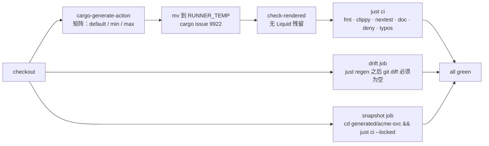

# 07 · 模板工程链设计：仓库布局、占位符、hooks、快照、Justfile、CI

> 本文描述 **模板仓库本身**（`RivTian/rs-starter-template`）如何组织与验证。生成物的架构见 `05`/`06`；cargo-generate 能力边界见 `03` §10。

## 1. 模板仓库布局

```text
rs-starter-template/                         GitHub 仓库根：无 Cargo.toml、无 cargo-generate.toml
├── README.md                                使用者文档：一条命令、三个问题、生成后长什么样
├── LICENSE                                  模板仓库自身 MIT
├── justfile                                 模板作者任务：regen / verify / smoke / matrix
├── .github/workflows/template-ci.yml        生成矩阵 + 快照漂移 + 未渲染占位符检查
├── .github/dependabot.yml                   只盯 github-actions（模板内的 Cargo 依赖由生成物自己盯）
├── docs/
│   ├── design/                              本设计文档集
│   └── prompts/                             （已有目录，保留）
├── template/                                ← cargo-generate 自动定位到这里（§2）
│   ├── cargo-generate.toml                  placeholders / conditional / hooks / ignore / exclude
│   ├── hooks/pre.rhai                       派生变量 + 自删
│   ├── Cargo.toml                           workspace 根（含 Liquid）
│   ├── README.md                            生成项目的 README（模板里可直接叫 README.md：template/ 下没有同名冲突）
│   ├── crates/
│   │   ├── {{project-name}}/                目录名占位符 → acme-svc/
│   │   ├── {{project-name}}-core/
│   │   ├── {{project-name}}-config/
│   │   ├── {{project-name}}-domain/
│   │   ├── {{project-name}}-infra/
│   │   ├── {{project-name}}-api/
│   │   ├── {{project-name}}-util/
│   │   └── {{project-name}}-test-utils/
│   ├── .github/workflows/*.yml              全文包在  …  中，只在少数字段用占位符
│   ├── Dockerfile · docker-compose.yml · .dockerignore    受 include_docker 条件控制
│   ├── LICENSE-MIT · LICENSE-APACHE         按 license 条件删除其一或保留双许可
│   └── …（其余见 06 §1）
└── generated/                               ← 默认答案生成的快照：独立 workspace，永不手改
    └── acme-svc/                            与 template/ 一一对应，CI 在此 cargo build/test
```

为什么根目录**不能**有 `Cargo.toml`：`generated/acme-svc` 自己是 workspace，Cargo 不允许 workspace 嵌套；模板源 `template/Cargo.toml` 含 Liquid 也不可编译。根目录保持"纯文档 + 脚本"。

## 2. 定位与零多余提示

```text
cargo generate RivTian/rs-starter-template --name acme-svc
  │
  ├─ locate_template_configs(repo root)        只找到 template/cargo-generate.toml（generated/ 里没有：默认被排除）
  ├─ auto_locate_template_dir → 1 个 config 且未配置 sub_templates → 直接使用 template/，不提示
  ├─ 解析 [placeholders]（3 个问题）→ 解析 [conditional] → 运行 hooks.pre → Liquid 渲染 → 写入 ./acme-svc
  └─ git init（除非 --vcs none）
```

依据：`03` §10.5（cargo-generate `src/config.rs:105-127`、`src/fetch.rs:228-300`、`src/ignore_me.rs:52`）。

## 3. `template/cargo-generate.toml`

```toml
[template]
cargo_generate_version = ">=0.22.0"
ignore = [
  "hooks",                       # hook 自删是双保险
]
# 这些文件里有大量 {{ 或 ${{ }}，整文件不做 Liquid（需要占位符的字段改用 raw 块方式，见 §5）
exclude = [
  ".github/workflows/release.yml",
  ".github/workflows/docker.yml",
]

[placeholders]
project-description = { type = "string", prompt = "One-line description of the service", default = "A Rust service built from rs-starter-template" }
license             = { type = "string", prompt = "License (None = no LICENSE file)", choices = ["MIT", "Apache-2.0", "None"], default = "MIT" }
include_docker      = { type = "bool",   prompt = "Include Dockerfile, docker-compose and docker.yml workflow?", default = true }
repository          = { type = "string", prompt = "Repository URL (leave empty to skip)", default = "", regex = "^(|https?://[^ ]+)$" }

[conditional.'license == "MIT"']
ignore = ["LICENSE-APACHE"]

[conditional.'license == "Apache-2.0"']
ignore = ["LICENSE-MIT"]

[conditional.'include_docker == false']
ignore = ["Dockerfile", "docker-compose.yml", ".dockerignore", ".github/workflows/docker.yml"]

[hooks]
pre = ["hooks/pre.rhai"]
```

| 占位符                 | 类型           | 默认     | 为什么只有这几个                                |
| ---------------------- | -------------- | -------- | ----------------------------------------------- |
| `project-name`（内置） | string         | `--name` | 决定目录、包名、`crate_name`、环境变量前缀      |
| `project-description`  | string         | 有默认   | 进 `Cargo.toml` / README / `--help`             |
| `license`              | choice         | MIT      | 决定 LICENSE 文件与 `workspace.package.license` |
| `include_docker`       | bool           | true     | 唯一的"体积开关"；其余文件生成后可删            |
| `repository`           | string（可空） | 空       | 空则不写 `repository =`（Liquid ``）    |

其余想加的开关（`http_port`、`include_ci`、`otel`）一律不加：**生成后改一行配置比回答一个问题便宜**。

## 4. `template/hooks/pre.rhai`

```rhai
// 只做派生值，不做任何 prompt，不调用 system::command
let project = variable::get("project-name");            // acme-svc
let crate_name = variable::get("crate_name");           // acme_svc（内置，勿重算）

variable::set("env_prefix",  to_shouty_snake_case(project));   // ACME_SVC
variable::set("type_prefix", to_pascal_case(project));          // AcmeSvc（备用：类型名前缀）
variable::set("year", `${system::date().year}`);               // LICENSE 年份

// 双许可时 LICENSE-MIT / LICENSE-APACHE 都保留；单许可时改名为 LICENSE
let license = variable::get("license");
if license == "MIT" { file::rename("LICENSE-MIT", "LICENSE"); }
if license == "Apache-2.0" { file::rename("LICENSE-APACHE", "LICENSE"); }

file::delete("hooks");
```

| 规则                                | 原因                                                                       |
| ----------------------------------- | -------------------------------------------------------------------------- |
| hook 不 prompt                      | 所有输入在 `[placeholders]`，`--silent` 与 CI 才能零交互（`03` §5 的教训） |
| hook 不跑 `system::command`         | 会弹安全确认、`--silent` 下失败、参数不转义（`03` §10.4）                  |
| 派生值只算内置没有的                | `crate_name` 已内置；`env_prefix` / `type_prefix` / `year` 内置没有        |
| 自删 `hooks` 目录 + `ignore` 双保险 | ratatui 只靠自删                                                           |

## 5. Liquid 使用规范

| 场景            | 写法                                                                                                       | 说明                                                                                          |
| --------------- | ---------------------------------------------------------------------------------------------------------- | --------------------------------------------------------------------------------------------- |
| 包名            | `name = "{{project-name}}-core"`                                                                           | `project-name` 已是 kebab                                                                     |
| 路径依赖        | `{{project-name}}-core = { path = "crates/{{project-name}}-core" }`                                        | 与目录占位符一致                                                                              |
| Rust 标识符     | `use {{crate_name}}_core::prelude::*;`                                                                     | 内置 snake_case                                                                               |
| 环境变量        | `{{env_prefix}}__HTTP__BIND`                                                                               | hook 派生                                                                                     |
| 可选字段        | `repository = "{{repository}}"`                                        | 空则整行消失（用 `` 吃换行）                                                         |
| GitHub Actions  | 文件首行 ``、末行 ``；需要占位符的字段用 `{{project-name}}` 包夹 | 避开 `${{ }}` 冲突（`03` §10.7）；`release.yml`/`docker.yml` 完全不需要占位符时直接 `exclude` |
| 目录名          | `crates/{{project-name}}-core/`                                                                            | cargo-generate 对路径做替换                                                                   |
| 必须保留的 `{{` | `{{ … }}`                                                                             | 例如 Prometheus 告警模板、Tera 模板                                                           |

CI 断言"生成结果里不残留 `{{`"时，允许列表只包含明确登记的 raw 文件。

**`justfile` 是一个特殊冲突点**：just 自己的插值语法也是 `{{var}}`。处理规则：

| 情况                                           | 做法                                                                                                                                                                                                                    |
| ---------------------------------------------- | ----------------------------------------------------------------------------------------------------------------------------------------------------------------------------------------------------------------------- |
| 生成项目的 `justfile` 不需要任何占位符（推荐） | 在 `[template] exclude` 中登记 `justfile`，整文件不做 Liquid；用 `[workspace] default-members = ["crates/{{project-name}}"]` 让 `cargo run` / `cargo build` 无需 `-p <name>`，镜像 tag 之类用 `$(basename "$PWD")` 推导 |
| 必须写入项目名                                 | 文件包在 ` … ` 中，只在需要处用 `{{project-name}}` 插入                                                                                                                       |
| 模板仓库自己的 `justfile`（`07` §7）           | 不经过 cargo-generate，无 Liquid 冲突；但 just 内要输出字面 `{{` 必须写 `{{{{`                                                                                                                                          |

## 6. 快照 `generated/`

| 项       | 规定                                                                                                                                                                                                                  |
| -------- | --------------------------------------------------------------------------------------------------------------------------------------------------------------------------------------------------------------------- |
| 生成命令 | `just regen`（见 §7），固定答案：`--name acme-svc -d license=MIT -d include_docker=true -d repository="" -d project-description="…"`，并固定 `authors`（`--define authors="Template Authors"`，0.24+）与 `--vcs none` |
| 内容     | 完整生成物 + `Cargo.lock`（快照的 CI 用 `--locked`）                                                                                                                                                                  |
| 修改方式 | 只允许通过重新生成；PR 中若 `generated/` 有手改，漂移检查会失败                                                                                                                                                       |
| 用途     | ① CI 编译真相 ② PR diff 审查 ③ 无需 cargo-generate 即可浏览的样例 ④ `docs/design` 引用的具体路径                                                                                                                      |

漂移检查伪代码：

```text
just regen                      # 重新生成到 generated/（先 rm -rf）
git status --porcelain generated/
  为空   → 通过
  不为空 → 失败并打印 diff：模板改了但快照没更新（或有人手改了快照）
```

## 7. 模板仓库 `justfile`

```just
set shell := ["bash", "-euo", "pipefail", "-c"]
snapshot := "generated/acme-svc"
common   := '--name acme-svc --vcs none --silent -d project-description="Example service generated from rs-starter-template" -d repository="" -d authors="Template Authors"'

default:
    @just --list

# 用默认答案重新生成快照
regen:
    rm -rf {{snapshot}}
    cargo generate --path template --destination generated {{common}} -d license=MIT -d include_docker=true
    just check-rendered {{snapshot}}

# 快照必须能过它自己的 ci
verify:
    cd {{snapshot}} && just ci

# 漂移检查：regen 后工作区不得有变化
drift: regen
    git diff --exit-code --stat -- generated/

# 三组答案矩阵，生成到临时目录并各跑一遍 ci（本地版 template-ci）
matrix:
    just _gen-one min  'license=Apache-2.0'          'include_docker=false'
    just _gen-one max  'license="MIT OR Apache-2.0"' 'include_docker=true'
_gen-one NAME LICENSE DOCKER:
    tmp=$(mktemp -d) && cargo generate --path template --destination "$tmp" {{common}} -d {{LICENSE}} -d {{DOCKER}} \
      && just check-rendered "$tmp/acme-svc" && (cd "$tmp/acme-svc" && just ci) && rm -rf "$tmp"

# 生成结果里不得残留未渲染的 Liquid 标记（允许列表见 .template-raw-allowlist）
check-rendered DIR:
    ! grep -rn --exclude-dir=target --exclude-from=.template-raw-allowlist '{{{{' "{{DIR}}"
    ! grep -rn --exclude-dir=target '{%' "{{DIR}}"

# 冒烟：生成 → 启动 → curl /healthz → SIGTERM → 退出码 0
smoke: regen
    cd {{snapshot}} && cargo build -p acme-svc && ( ./target/debug/acme-svc & pid=$!; sleep 2; curl -fsS localhost:8080/healthz; kill -TERM $pid; wait $pid )

# cargo-generate 自带的模板自测（把 template/ 当模板展开后跑 cargo test）
selftest:
    cd template && cargo generate --test {{common}} -d license=MIT -d include_docker=true
```

## 8. 模板仓库 CI：`template-ci.yml`



```yaml
name: template-ci
on: { push: { branches: [main] }, pull_request: {}, schedule: [{ cron: "17 3 * * 1" }] }   # 每周一：捕捉上游依赖漂移
jobs:
  generate:
    strategy:
      fail-fast: false
      matrix:
        include:
          - { name: default, args: "-d license=MIT -d include_docker=true" }
          - { name: min,     args: "-d license=Apache-2.0 -d include_docker=false" }
          - { name: max,     args: '-d license="MIT OR Apache-2.0" -d include_docker=true' }
    steps:
      - uses: actions/checkout@v4
      - uses: cargo-generate/cargo-generate-action@v0.20.0
        with: { name: acme-svc, template: template, arguments: "--silent -d project-description=ci -d repository= -d authors=CI ${{ matrix.args }}" }
      - uses: dtolnay/rust-toolchain@stable
        with: { components: "rustfmt, clippy" }
      - uses: taiki-e/install-action@v2
        with: { tool: "just, cargo-nextest, cargo-deny, typos-cli" }
      - run: |
          mv acme-svc "$RUNNER_TEMP/" && cd "$RUNNER_TEMP/acme-svc"
          ! grep -rn '{{' . --exclude-dir=.git
          just ci
  drift:
    steps: [checkout, install cargo-generate + just, "just drift"]
  snapshot:
    steps: [checkout, rust-toolchain, install-action(just nextest deny typos), "cd generated/acme-svc && just ci"]
```

| 检查             | 失败意味着                                                         |
| ---------------- | ------------------------------------------------------------------ |
| `generate` × 3   | 某组答案下模板渲染失败 / 编译不过 / lint 不过                      |
| `check-rendered` | 有占位符拼错或未定义（cargo-generate 会静默渲染为空）              |
| `drift`          | 模板改了忘了 `just regen`，或有人手改快照                          |
| `snapshot`       | 快照在当前 stable 工具链上不再编译（每周定时也会跑，捕捉依赖破坏） |

## 9. 版本与使用方式

| 场景               | 命令                                                                                                                                                  |
| ------------------ | ----------------------------------------------------------------------------------------------------------------------------------------------------- |
| 最新               | `cargo generate RivTian/rs-starter-template --name acme-svc`                                                                                          |
| 固定版本           | `cargo generate RivTian/rs-starter-template --tag v1.2.0 --name acme-svc`                                                                             |
| 零交互             | `cargo generate RivTian/rs-starter-template --name acme-svc --silent -d license=MIT -d include_docker=true -d repository= -d project-description="…"` |
| 从本地开发中的模板 | `cargo generate --path ./template --name acme-svc`                                                                                                    |
| 生成到当前空目录   | `cargo generate RivTian/rs-starter-template --init`                                                                                                   |

模板发版规则：`vX.Y.Z` tag；`CHANGELOG.md` 用 git-cliff；破坏性变更（crate 布局变化）升 major。

## 10. 模板作者的本地循环

```text
改 template/ ──► just regen ──► git diff generated/ ──► 满意？ ──否──► 继续改
                                                         │是
                                                         ▼
                                                     just verify ──► just matrix ──► 提交（template/ + generated/ 同一 PR）
```

## 11. 与 ratatui/templates 的差异清单

| 项                       | ratatui/templates                | 本模板                           | 原因                             |
| ------------------------ | -------------------------------- | -------------------------------- | -------------------------------- |
| 根 `cargo-generate.toml` | 有，列 6 个子模板                | 无                               | 单模板零提示（`03` §10.5）       |
| 根 `Cargo.toml`          | 有，members = `*-generated`      | 无                               | 生成物是 workspace，不能嵌套     |
| 输入方式                 | placeholders 与 hook prompt 混用 | 只有 placeholders                | 可静默                           |
| hook                     | 解析 Git URL、二次确认           | 派生值 + 改名 + 自删             | 简单可靠                         |
| CI 检查                  | `cargo check --tests`            | `just ci` 全量 + 漂移 + 渲染残留 | lint 策略严格                    |
| 快照                     | 6 个                             | 1 个                             | 单模板                           |
| 答案矩阵                 | 每模板一组                       | default / min / max 三组         | 覆盖条件分支                     |
| 依赖漂移                 | 无                               | 每周定时                         | 模板类项目最常见的坏法是上游破坏 |
