# 08 · 实施路线图（确认后执行）

> 本文只在决策清单（`00` §7）确认之后生效。所有阶段都遵守同一条工作循环：改 `template/` → `just regen` → 审查 `generated/` diff → `just verify` → 提交。

## 1. 阶段依赖

```mermaid
flowchart LR
    P0["P0 仓库初始化<br/>git init -b main · README · justfile · template-ci 骨架"]
    P1["P1 骨架编译<br/>workspace + 8 crates + lints<br/>core: Server/Service/Shutdown/Readiness/Telemetry/EventBus/ErrorKind"]
    P2["P2 样例功能<br/>domain todo · infra memory · api routes<br/>tests: unit / smoke / lifecycle / layering"]
    P3["P3 工程化<br/>Dockerfile · compose · ci/release/docker.yml<br/>deny · typos · cliff · docs/architecture.md · ADR"]
    P4["P4 模板化<br/>placeholders · conditional · hooks · raw 块<br/>regen / drift / matrix / smoke / selftest"]
    P5["P5 加固与打磨<br/>SIGTERM 集成测试 · 指标 · 日志字段 · lint 列表逐条评审"]
    P6["P6 v0.1.0<br/>tag · CHANGELOG · README 终稿"]
    P0 --> P1 --> P2 --> P3 --> P4 --> P5 --> P6
```



P1–P3 先在 `generated/acme-svc` 这个**真实项目**里开发（rust-analyzer 可用、编译快、反馈直接），P4 再把它"反向模板化"进 `template/`；此后 `generated/` 只由 `just regen` 产出。这比一开始就在含 Liquid 的目录里写代码高效得多。

## 2. 阶段明细

| 阶段 | 交付物                                                                                                                                                                                            | 验收                                                                                        | 估算   |
| ---- | ------------------------------------------------------------------------------------------------------------------------------------------------------------------------------------------------- | ------------------------------------------------------------------------------------------- | ------ |
| P0   | `git init -b main`；提交 `docs/design`；根 `README.md` 草稿；`justfile`（regen/verify/drift 空壳）；`template-ci.yml` 空壳                                                                        | CI 能跑（即使只 echo）                                                                      | 0.5 d  |
| P1   | `generated/acme-svc` 手写：workspace `Cargo.toml`、8 个 crate、`core` 全部模块、`config` 全部分节、`util`；`cargo clippy -D warnings` 通过                                                        | `just ci` 绿（无业务）；`just dev` 启动并能 Ctrl-C 干净退出                                 | 2 d    |
| P2   | `domain::todo`、`infra::memory`、`infra::jobs::cleanup`、`api` 全部路由与中间件、`ApiError`、`test-utils::TestApp`；`tests/{http_smoke,lifecycle,layering}.rs`                                    | `00` §6 前 4 条                                                                             | 2 d    |
| P3   | `Dockerfile`（chef + distroless + `--probe`）、compose、`.github/workflows/{ci,release,docker}.yml`、`deny.toml`、`typos.toml`、`cliff.toml`、`docs/architecture.md`、2 个 ADR、`CONTRIBUTING.md` | `docker build` 成功且 HEALTHCHECK 通过；生成项目 CI 绿                                      | 1.5 d  |
| P4   | `template/`：目录名占位符、`cargo-generate.toml`、`hooks/pre.rhai`、raw 块处理、`README.md`；模板 `justfile` 全部任务；`template-ci.yml` 三组矩阵 + drift + snapshot                              | `just regen` 产出与手写版零 diff（除占位符替换）；`just matrix` 三组全绿；`just drift` 通过 | 2 d    |
| P5   | SIGTERM 路径集成测试（grace 内退出 / 超时强制）；`/metrics` 指标核对；日志字段统一；lint allow 列表逐条注释理由；`--check-config` 错误聚合                                                        | `00` §6 全部勾选                                                                            | 1.5 d  |
| P6   | `v0.1.0` tag；`CHANGELOG.md`；README 终稿（含生成后 5 分钟体验、决策摘要、如何贡献）                                                                                                              | 从 GitHub 一条命令生成并 `just ci` 绿                                                       | 0.5 d  |
| 合计 |                                                                                                                                                                                                   |                                                                                             | ≈ 10 d |

## 3. 每阶段的"完成定义"检查表

```text
P1  [ ] cargo metadata 依赖边符合 05 §1.1 的 ALLOWED 表
    [ ] core 不依赖 domain；domain 不依赖 tokio
    [ ] Server::run：readiness_timeout / grace_period 两个超时都有测试
P2  [ ] POST /api/v1/todos → 201；重复 complete → 409 problem+json
    [ ] /readyz 在 HealthRegistry 全部 ok 前返回 503
    [ ] layering.rs 在人为加错误依赖时失败（反向验证一次）
P3  [ ] 镜像非 root（`docker run --rm IMG id` 输出非 0 uid）
    [ ] release.yml 在 tag 上产出 linux-x64/arm64 + macOS + Windows 产物
P4  [ ] cargo generate --silent 三组答案零交互成功
    [ ] 生成目录 grep '{{' 仅命中 .template-raw-allowlist 登记文件
    [ ] include_docker=false 时无任何 docker 相关文件与 workflow
P5  [ ] kill -TERM 后 ≤ grace 退出码 0；模拟慢请求超过 grace 时退出码非 0 且日志有 "grace period exceeded"
P6  [ ] 新克隆环境：cargo generate → just ci 全绿（≤ 10 分钟）
```

## 4. 风险与预案

| 风险                                                                                         | 影响                    | 预案                                                                                               |
| -------------------------------------------------------------------------------------------- | ----------------------- | -------------------------------------------------------------------------------------------------- |
| 全量 `deny` lint 在 axum/tower 泛型上产生大量噪音（如 `future_not_send`、`type_complexity`） | P1/P2 反复调 allow 列表 | 以 Pumpkin 的 allow 列表为起点（`01` §3.3），每条 allow 写一行理由；不允许 `#[allow]` 散落在代码里 |
| `missing_docs` + `-D warnings` 让用户第一天就被拦                                            | 体验差                  | `00` D18：默认 `allow`，模板自身代码全部有文档                                                     |
| cargo-generate 目录名占位符在 Windows 路径或某些 CI 上行为差异                               | P4                      | matrix 加 `windows-latest` 一次性验证；若有问题改用 hook `file::rename`                            |
| `justfile` 与 Liquid 的 `{{` 冲突                                                            | 渲染失败或残留          | `07` §5：`exclude` 整文件 + `default-members`；CI 渲染残留检查兜底                                 |
| 第三方 crate 版本在实施时已变化（`metrics-exporter-prometheus`、`tower-http`、`config`）     | 编译失败                | 设计文档只写 major；实施用 `cargo add` 解析；每周定时 CI 捕捉后续漂移                              |
| distroless 镜像内无 shell，排障不便                                                          | 运维                    | 提供 `Dockerfile.debug` 变体（debian-slim）作为注释掉的备选段；`--probe` 子命令内置                |
| 快照与模板双份代码让 PR 变大                                                                 | 审查负担                | PR 模板要求先看 `template/` diff，再确认 `generated/` diff 与之一致；drift job 保证一致性          |

## 5. 确认后第一条命令

```bash
cd /Users/riotian/Developer/personal/rs-starter-template && git init -b main && git add docs .gitignore && git commit -m "docs(design): initial template design (research + architecture + template engineering)"
```

## 6. 本次交付未做、留待后续版本

| 项                                                         | 版本 | 说明                                           |
| ---------------------------------------------------------- | ---- | ---------------------------------------------- |
| `sqlx`/Postgres adapter（`acme-svc-infra-postgres`）+ 迁移 | v0.2 | 需要 CI 起数据库；以 feature 或独立 crate 提供 |
| gRPC 传输（`acme-svc-grpc`）                               | v0.2 | 与 `api` 并列，复用 `core::Service`            |
| OpenTelemetry 导出（`core` feature `otel`）                | v0.2 | 留有 feature 缝                                |
| Service 依赖 DAG 与分阶段启动（Pingora `daggy` 做法）      | v0.3 | 现阶段注册顺序 + readiness 足够                |
| `cargo xtask`                                              | 按需 | 当 `justfile` 出现复杂逻辑时再引入             |
| Nix / devcontainer                                         | 按需 | 不影响架构                                     |
