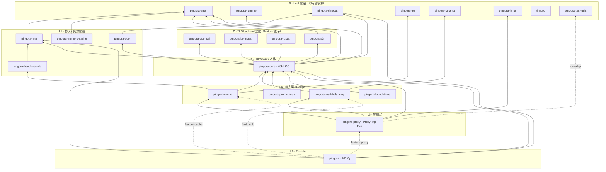
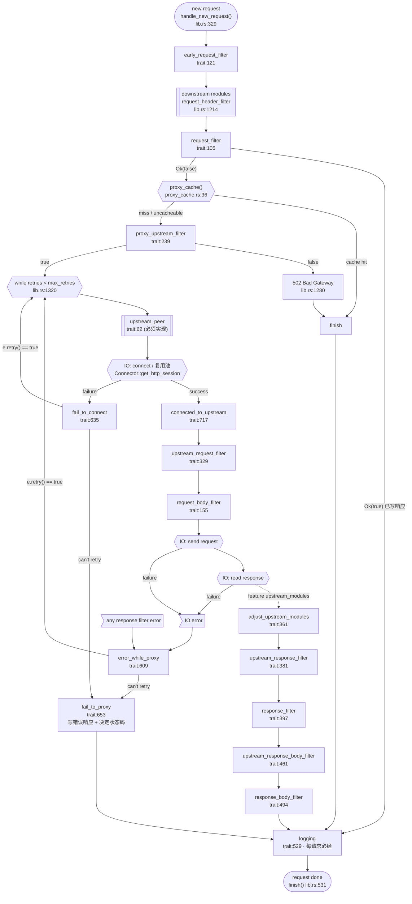

> **附录 · Opus 子 agent 源码深读报告（原文，未经删改）**
>
> 本文件由本设计任务中的一个 Opus 子 agent 在只读克隆上生成，作为 `01-research-pumpkin.md` / `02-research-pingora.md` 的证据附录。所有 `path:line` 指向研究基线 commit（Pumpkin `e413623`、Pingora `4487f7b`）。主文档与本附录冲突时，以本附录的源码行号为准。

# Pingora 源码架构研究报告

> 研究对象：`cloudflare/pingora`（commit `4487f7b`，2026-09-03，浅克隆于 `/tmp/rs-template-research/pingora`）
> 研究目的：为「多 crate Rust 网络服务骨架」的 cargo-generate 模板提炼可复用的 Framework 设计法则。
> 所有结论均以 `path:LINE` 形式标注证据；本报告为只读研究，未修改任何源文件。

**六条核心法则（详细论证见 §14）**：① Server 只认识 `Service`，不认识业务（`pingora-core/src/server/mod.rs:74`）；
② 每层向上只暴露一个 Trait，靠 blanket impl 串接（`Service → ServerApp → HttpServerApp → ProxyHttp`）；
③ Extension Point = Trait + 关联类型 `CTX` + 全默认实现（`pingora-proxy/src/proxy_trait.rs:48-773`）；
④ Core 只提供机制不做策略（重试/降级由 hook 返回值决定）；
⑤ 错误是一个富结构体而非 enum-per-crate（`pingora-error/src/lib.rs:33-44`）；
⑥ Facade crate 只做 re-export，零逻辑（`pingora/src/lib.rs` 全文 101 行）。

---

## 1. 全景：Crate 分层与依赖图

### 1.1 工作区形态

扁平 workspace（23 个成员全部位于仓库根目录），`resolver = "2"`（`Cargo.toml:2`），
`[workspace.dependencies]` 统一 pin 公共依赖版本（`Cargo.toml:33-48`），
`[workspace.lints.rust]` 仅登记 `check-cfg = ['cfg(tokio_unstable)']`（`Cargo.toml:47-48`）。
所有成员统一 `version = "0.9.0"` / `license = "Apache-2.0"` / `edition = "2021"`。

### 1.2 规模（`src/**/*.rs` 行数）

| Crate                                                               |                           LOC | 角色                                                                          |
| ------------------------------------------------------------------- | ----------------------------: | ----------------------------------------------------------------------------- |
| `pingora-core`                                                      |                        47,680 | Framework 本体：server / services / apps / protocols / listeners / connectors |
| `pingora-cache`                                                     |                        13,552 | HTTP 缓存（能力层）                                                           |
| `pingora-proxy`                                                     |                        12,049 | 反向代理应用层（`ProxyHttp` Trait 在此）                                      |
| `pingora-load-balancing`                                            |                         6,596 | 负载均衡 recipe                                                               |
| `pingora-lru` / `pingora-pool` / `tinyufo` / `pingora-memory-cache` | 4,303 / 1,484 / 1,204 / 1,185 | 数据结构与资源原语（leaf）                                                    |
| `pingora-http`                                                      |                         2,278 | 保留大小写的 HTTP header 类型                                                 |
| `pingora-runtime` / `pingora-timeout`                               |                     782 / 745 | 运行时与超时（leaf）                                                          |
| `pingora-error`                                                     |                           746 | **全工作区唯一错误类型**（leaf）                                              |
| `pingora-header-serde` / `pingora-limits` / `pingora-ketama`        |               673 / 633 / 609 | 压缩 / 限流 / 一致性哈希（leaf）                                              |
| `pingora-boringssl` / `-openssl` / `-rustls` / `-s2n`               |         509 / 294 / 191 / 130 | TLS backend 适配层                                                            |
| `pingora-foundations` / `-test-utils` / `-prometheus`               |               414 / 204 / 131 | 遥测 / 测试 origin / metrics 服务                                             |
| `pingora`                                                           |                       **101** | **Facade，零逻辑**                                                            |

**关键比例**：Framework 本体 ≈ 48k 行，Facade ≈ 100 行，错误层 < 800 行。
「越靠近用户的 crate 越薄」是 Pingora 分层最直观的度量。

### 1.3 依赖图（实测自各 `Cargo.toml`）



**三个可直接照搬的分层规则：**

1. **L0 全部零内部依赖**。`pingora-error`、`pingora-runtime`、`pingora-timeout`、`pingora-lru`、`pingora-ketama`、`pingora-limits`、`tinyufo` 都不 `use` 任何兄弟 crate。这保证了它们可以被独立发布、独立测试、被任何层引用而不产生环。
2. **只有 L3（Core）依赖 TLS backend**。上层（cache / lb / proxy / facade）通过 feature 转发，不直接依赖任何 `*ssl` crate（见 §8）。
3. **Facade 在最顶端、且只有它同时依赖多个上层**。`pingora → {core, http, timeout, cache?, lb?, proxy?}`，这是唯一一个"聚合点"。

### 1.4 四层 Trait 栈（Pingora 最核心的架构骨架）

`docs/user_guide/internals.md:137-157` 用一张表明确了每层职责：

```
HttpProxy (struct)     pingora-proxy/src/lib.rs:186   高层代理工作流，由 ProxyHttp trait 定制
   ↑ implements
HttpServerApp (trait)  pingora-core/src/apps/mod.rs:227  H1/H2 流处理选择，含 H2 握手
   ↑ blanket impl<T: HttpServerApp> ServerApp for T     (apps/mod.rs:273)
ServerApp (trait)      pingora-core/src/apps/mod.rs:39   按 **Session** 分发 App 实例
   ↑ 被 Service<A: ServerApp> 持有
Service<A> (struct)    pingora-core/src/services/listening.rs:49  按 **Listener** 分发 App 实例
   ↑ impl Service trait                                 (listening.rs:309)
Service (trait)        pingora-core/src/services/mod.rs:404  被 Server 拉起、被 shutdown 关闭的任何东西
```

这条链的精髓在于**每一级都用 blanket impl 自动向下适配**：
用户实现 `ProxyHttp` → 被 `HttpProxy<SV>` 包装 → 自动满足 `HttpServerApp`（`pingora-proxy/src/lib.rs:1609-1615`）
→ 自动满足 `ServerApp`（`pingora-core/src/apps/mod.rs:273-278`）→ 可以塞进 `Service<A>`。
用户只写最上面那一层，其余全部由类型系统补齐。

---

## 2. A · Server 生命周期

### 2.1 `Server` 结构

```rust
// pingora-core/src/server/mod.rs:206-227
pub struct Server {
    services: HashMap<NodeIndex, ServiceWrapper>,   // daggy 节点 → 服务
    shutdown_watch: watch::Sender<bool>,
    shutdown_recv: ShutdownWatch,                   // = watch::Receiver<bool>  (:125)
    execution_phase_watch: broadcast::Sender<ExecutionPhase>,
    dependencies: Arc<Mutex<DependencyGraph>>,      // daggy DAG
    bootstrap: Arc<Mutex<Bootstrap>>,
    pub configuration: Arc<ServerConf>,
    pub options: Option<Opt>,
}
```

`configuration` 与 `options` 是 **pub 字段** —— 上层 crate 直接读它
（`http_proxy_service(&server.configuration, ..)`，`pingora-proxy/src/lib.rs:1730`），而非通过 getter。

### 2.2 `Opt`（CLI）与 `ServerConf`（YAML）的职责切分

|        | `Opt`                                                                                     | `ServerConf`                                                                                                           |
| ------ | ----------------------------------------------------------------------------------------- | ---------------------------------------------------------------------------------------------------------------------- |
| 定义   | `pingora-core/src/server/configuration/mod.rs:268-310`                                    | 同文件 `:46-217`                                                                                                       |
| 来源   | clap `#[derive(Parser)]`                                                                  | `serde_yaml` + `#[serde(default)]`（`:47`）                                                                            |
| 字段数 | **5 个**：`-u/--upgrade`、`-d/--daemon`、`--nocapture`(hidden)、`-t/--test`、`-c/--conf`  | ~40 个：`threads`、`pid_file`、`upgrade_sock`、`user`/`group`、`work_stealing`、`grace_period_seconds`、`max_retries`… |
| 语义   | **"这次进程怎么起"**                                                                      | **"这个服务怎么跑"**                                                                                                   |
| 合并   | `ServerConf::merge_with_opt(&mut self, opt)`，只把 `opt.daemon` 覆盖进 conf（`:433-437`） | —                                                                                                                      |

三条装配路径（`Server::new`，`:492-542`）：

```
Opt 有 conf 路径  → ServerConf::load_yaml_with_opt_override(opt)   (:325-333)
Opt 无 conf 路径  → ServerConf::new_with_opt_override(opt)          (:339-348)
完全无 Opt        → ServerConf::new()  = from_yaml("---\nversion: 1")  (:335-337)
```

**可直接照搬的两个细节：**
- `#[serde(default)]` + 「未知 key 一律忽略」→ 用户可以把自己的配置段写进同一个 YAML 再自行解析（`docs/user_guide/conf.md:136-137`）。
- `ServerConf::validate(self) -> Result<Self>`（`:364-392`）：**消费式校验**，返回 `Self`，在 `from_yaml` 尾部调用（`:357`），所以"未校验的 conf"在类型上不可能流出来。

### 2.3 信号 → 关停语义

`pingora-core/src/server/mod.rs:131-140` 把「信号」抽象成三种**意图**，再用 Trait 抽象「信号源」：

```rust
pub enum ShutdownSignal { GracefulUpgrade, GracefulTerminate, FastShutdown }   // :131-140

#[async_trait]
pub trait ShutdownSignalWatch {                                               // :145-148
    async fn recv(&self) -> ShutdownSignal;
}
pub struct UnixShutdownSignalWatch;                                           // :156
```

| 信号      | `ShutdownSignal`    | `ShutdownType` | 行为                                                                                    |
| --------- | ------------------- | -------------- | --------------------------------------------------------------------------------------- |
| `SIGQUIT` | `GracefulUpgrade`   | `Graceful`     | 先把监听 fd 发到 upgrade sock，`sleep(CLOSE_TIMEOUT=5s)`，再广播 shutdown（`:275-322`） |
| `SIGTERM` | `GracefulTerminate` | `Graceful`     | 直接广播 shutdown；等 `grace_period_seconds`（默认 `EXIT_TIMEOUT=300s`）（`:253-273`）  |
| `SIGINT`  | `FastShutdown`      | `Quick`        | 立即退出，`shutdown_timeout = 0`（`:248-251`, `:815-822`）                              |

映射关系在 `UnixShutdownSignalWatch::recv` 的 `tokio::select!` 里（`:165-177`），
常量在 `:63` / `:66`。Windows 分支只支持 `ctrl_c()` → Graceful（`:328-360`）。

**把信号源做成 Trait** 的意义：`RunArgs { shutdown_signal: Box<dyn ShutdownSignalWatch> }`（`:181-187`）
让测试和嵌入式场景注入假信号源，不必真的 `kill(2)` —— 「把不可测的 OS 交互挡在 Trait 后面」。

### 2.4 `ShutdownWatch` 的传播路径

```
Server.shutdown_watch: watch::Sender<bool>  ──.send(true)──►
Server.shutdown_recv : ShutdownWatch = watch::Receiver<bool>          server/mod.rs:125
  └─ .clone() per service        → Service::start_service(.., shutdown, ..)   server/mod.rs:766
       └─ .clone() per endpoint × listeners_per_fd → run_endpoint()    listening.rs:338-350
            tokio::select!{ accept() , shutdown.changed() }            listening.rs:240-258
            └─ .clone() per connection → ServerApp::process_new(.., &ShutdownWatch)  apps/mod.rs:55
                 *shutdown.borrow() ⇒ set_keepalive(None)              apps/mod.rs:365-371
                 HttpProxy::process_new_http 同样据此关 keepalive       proxy/lib.rs:1639-1642
```

一个 `watch` channel 贯穿 4 层，**没有任何一层需要自己造 channel**。这是本报告里最值得模板直接复制的机制。

### 2.5 `ExecutionPhase`：可观测的生命周期状态机

`pingora-core/src/server/mod.rs:83-121` 定义了 11 个阶段，通过 `broadcast::Sender<ExecutionPhase>`（容量 100，`:466` / `:496`）对外发布，
用户用 `server.watch_execution_phase()`（`:235-237`）订阅：

```
Setup → Bootstrap → BootstrapComplete → Running
                                          ├─ SIGQUIT → GracefulUpgradeTransferringFds → GracefulUpgradeCloseTimeout ─┐
                                          ├─ SIGTERM → GracefulTerminate ──────────────────────────────────────────┤
                                          └─ SIGINT  ──────────────────────────────────────────────────────────────┤
                                                                                                                    ▼
                                            ShutdownStarted → [ShutdownGracePeriod] → ShutdownRuntimes → Terminated
```

`#[non_exhaustive]`（`:82`）让未来加阶段不是 breaking change；集成测试直接靠它同步
（`pingora-core/tests/bootstrap_as_a_service.rs:58` 用 `watch_execution_phase()` + `blocking_recv()` 断言依赖顺序）。

### 2.6 `run_forever` 伪代码

```text
Server::run_forever(self) -> !                          // server/mod.rs:626-634
  └─ self.run(RunArgs::default())                       // 默认 = UnixShutdownSignalWatch
  └─ std::process::exit(0)

Server::run(mut self, run_args)                         // server/mod.rs:642-857
  1. if conf.daemon {                                   // :646-659
        fast_timeout::pause_for_fork()                  // 暂停全局 timer 线程，fork 后线程会丢
        daemonize(&conf)                                //   → server/daemon.rs:200
        fast_timeout::unpause()
        if let Some(pid) = result.notify_parent_pid { bootstrap.set_notify_parent_pid(pid) }
     }
  2. blocking_opts ← conf.{max_blocking_threads, blocking_threads_ttl_seconds}   // :665-669
     runtime_opts  ← conf.runtime_opts()                                        // :670
     fast_timeout::set_fast_timeout_to_tokio_threshold(conf.fast_timeout_..)     // :675
  3. #[cfg(feature="sentry")] bootstrap.start_sentry()                          // :687
  4. bootstrap.set_expected_listen_addrs(collect_listen_addresses())            // :693-695
        └─ 任一 Service 的 listen_addresses()==None ⇒ 整体 None ⇒ 关闭"未认领 fd 清理" (:380-388)
  5. startup_order ← dependencies.topological_sort()    // :699-706；失败 ⇒ exit(1)
  6. for (id, svc) in startup_order {                   // :708-776
        threads   ← svc.threads().unwrap_or(conf.threads)
        rt_opts   ← svc.runtime_opts_override(&global).unwrap_or(global)
        deps      ← dependencies.get_dependencies(id).map(|d| d.ready_watch)
        runtimes.push(Server::run_service(svc, fds, shutdown_recv.clone(), threads,
                      conf.work_stealing, conf.listener_tasks_per_fd,
                      ready_notifier.take(), deps, blocking_opts, rt_opts))
     }
  7. server_runtime ← create_runtime("Server", threads=1, work_steal=true, ..)  // :780-786
     shutdown_type  ← server_runtime.block_on(self.main_loop(run_args))         // :788-794
        // ↑ 唯一 block_on：注释说明只有 work-steal runtime 能 block_on (:778-779)
  8. phase ← ShutdownStarted                                                    // :796-798
  9. if Graceful { phase ← ShutdownGracePeriod;
                   thread::sleep(conf.grace_period_seconds.unwrap_or(300s)) }   // :800-812
 10. shutdown_timeout ← Quick ? 0s : conf.graceful_shutdown_timeout_seconds.unwrap_or(5s)  // :815-822
 11. phase ← ShutdownRuntimes
     for (rt, name) in runtimes {                        // :829-850
        thread::spawn(move || rt.shutdown_timeout(shutdown_timeout))   // 并行关闭
     }
     join 全部；超时的 runtime 打 warn
 12. phase ← Terminated                                  // :853-856

Server::run_service(svc, fds, shutdown, threads, .., ready_notifier, dependency_watches, ..)
                                                          // server/mod.rs:390-450
  rt ← RuntimeBuilder::new(threads, svc.name())
         .work_steal(work_stealing).blocking_pool_opts(..).runtime_opts(..).build()   // :405-411
  rt.get_handle().spawn(async move {
       for mut w in dependency_watches { w.wait_for(|&ready| ready).await }   // :416-427
       svc.on_startup_delay(time_waited)                                      // :429-431
       svc.start_service(fds, shutdown, listeners_per_fd, ready_notifier).await
  })
  return rt        // Runtime 必须返回到同步上下文持有，否则被 drop (:402-404 注释)
```

**四个值得照搬的细节**：① 每个 Service 一个独立 tokio runtime（`:405-411`），线程不跨服务共享
（`docs/user_guide/internals.md:30`），线程名取自 `service.name()` 且「系统限制只用前 16 字符」（`services/mod.rs:314-316`）；
② `Runtime` 对象必须留在同步栈上，否则整个 runtime 被 drop（`:402-404` 注释）；
③ 关停并行化：每 runtime 一个 `thread::spawn` 再统一 join，超时打 warn（`:829-850`）；
④ daemonize 必须早于建 runtime —— `NoStealRuntime` 用 `OnceCell` 懒初始化线程池，注释直言
*"Lazily init the runtimes so that they are created after pingora daemonize itself. Otherwise the runtime threads are lost."*
（`pingora-runtime/src/lib.rs:597-599`；文档同警告 `docs/user_guide/daemon.md:7`）。

### 2.7 优雅升级（zero-downtime upgrade）

`Fds` 是一个 `bind_addr → RawFd` 的表（`pingora-core/src/server/transfer_fd/mod.rs:36-51`），
通过 Unix domain socket 的 `SCM_RIGHTS` 传递（`:204` `recvmsg` / `:344` `sendmsg`），
失败重试 `MAX_RETRY = 5`、间隔 `RETRY_INTERVAL = 1s`（`:243-245`）。

```text
旧进程                                        新进程
──────                                        ──────
                                              $ ./server -u -c conf.yaml [-d]
                                              Server::new → Bootstrap::new(upgrade=true)
                                              bootstrap() → load_fds(upgrade=true)
                                                └─ Fds::get_from_sock(upgrade_sock)   阻塞等待
SIGQUIT
  main_loop → GracefulUpgradeTransferringFds
  fds.send_to_sock(conf.upgrade_sock)   ──────► 收到 fd 表
  (server/mod.rs:284-299)                       close_unclaimed(expected_listen_addrs)
  phase ← GracefulUpgradeCloseTimeout            (bootstrap_services.rs:246-258)
  sleep(CLOSE_TIMEOUT = 5s)                     ListenerEndpoint::listen(Some(fds))
  (:306-307)                                      ├─ fds.get(addr) 命中 → from_raw_fd(fd)
  shutdown_watch.send(true)                       └─ 未命中     → bind() 后 fds.add(addr, fd)
  → accept loop 退出                               (listeners/l4.rs:340-376)
  grace_period_seconds 内跑完存量请求              开始 accept
  exit
```

**新进程不重新 bind，而是直接接管 fd**——所以客户端视角下监听 socket 从未关闭（`docs/user_guide/graceful.md:19`）。
`docs/user_guide/systemd.md:5-12` 给出对应的 systemd 单元：`Type=forking` + 两条 `ExecReload`（先 `kill -QUIT $MAINPID`，再 `pingora -u -d -c ...`）。

**易忽略的细节**：`collect_listen_addresses()`（`server/mod.rs:380-388`）用 `try_fold` 收集所有 Service 声明的监听地址；
只要有任一 Service 返回 `None`，整体即 `None`，此时**关闭**「清理未认领 fd」逻辑 —— 保守降级。
单测 `unknown_service_disables_inherited_fd_cleanup`（`:874-895`）专门锁定该行为。

### 2.8 `bootstrap()` 的两种形态

| 形态   | API                                                              | 时机                                                                                                                                        |
| ------ | ---------------------------------------------------------------- | ------------------------------------------------------------------------------------------------------------------------------------------- |
| 同步   | `server.bootstrap()`（`:604-606`）                               | `run()` 之前，主线程内阻塞完成 fd 接管                                                                                                      |
| 服务化 | `server.bootstrap_as_a_service() -> ServiceHandle`（`:612-618`） | 包装成 `background_service("Bootstrap Service", BootstrapService)`，从而**可以挂依赖**：让某个前置 Service（如密钥加载）先 ready，再接管 fd |

`BootstrapService` 的实现只有 8 行（`server/bootstrap_services.rs:278-288`）：
`impl BackgroundService { async fn start_with_ready_notifier(...) { self.inner.lock().bootstrap(); notifier.notify_ready(); } }`。
**把一次性初始化包装成 Service，从而复用依赖图 —— 这是极优雅的设计。**

`-t/--test` 在 `bootstrap()` 里直接 `std::process::exit(0)`（`bootstrap_services.rs:207-210`），
用于「先验证新二进制能起来，再关旧进程」的部署流程（`configuration/mod.rs:289-303` 的 `long_help`）。

---

## 3. B · Service 抽象与依赖 DAG

### 3.1 两个 Trait，一个 blanket impl

Pingora 把「服务」拆成了两个 Trait，这是本次研究中最值得借鉴的一个 API 演进技巧：

```rust
// services/mod.rs:403-470 —— 用户实现这个（简单版）
#[async_trait] pub trait Service: Sync + Send {
    async fn start_service(&mut self, #[cfg(unix)] _fds: Option<ListenFds>,
                           _shutdown: ShutdownWatch, _listeners_per_fd: usize) {}   // :417-424 默认空
    fn name(&self) -> &str;                                                          // :429 唯一必需
    fn threads(&self) -> Option<usize> { None }                                      // :434-436
    fn runtime_opts_override(&self, global: &RuntimeOpts) -> Option<RuntimeOpts> { None } // :442-445
    fn on_startup_delay(&self, time_waited: Duration) { info!(..) }                  // :455-461
    fn listen_addresses(&self) -> Option<Vec<String>> { None }                       // :467-469
}

// services/mod.rs:287-354 —— Server 实际持有这个（完整版，多一个 ready_notifier）
#[async_trait] pub trait ServiceWithDependents: Send + Sync {
    async fn start_service(&mut self, fds, shutdown, listeners_per_fd,
                           ready_notifier: ServiceReadyNotifier);                    // :305-311
    fn name(&self) -> &str;  /* 其余同 Service */
}

// services/mod.rs:356-400 —— 桥接：简单服务"立即就绪"
#[async_trait] impl<S: Service> ServiceWithDependents for S {
    async fn start_service(&mut self, fds, shutdown, lpf, ready_notifier) {
        ready_notifier.notify_ready();                                               // :369
        S::start_service(self, fds, shutdown, lpf).await
    }
}
```

**设计意图**：绝大多数服务不需要控制「何时宣布 ready」，它们只实现 `Service`；
需要异步初始化后再 ready 的服务（如 `BootstrapService`）直接实现 `ServiceWithDependents`。
**用 blanket impl 提供默认策略，同时保留逃生舱** —— 而且两者在 `Server::add_service` 处统一为 `impl ServiceWithDependents`（`server/mod.rs:546`）。

### 3.2 就绪通知：用 `Drop` 实现"永不忘记 notify"

```rust
// pingora-core/src/services/mod.rs:62-90
pub struct ServiceReadyNotifier { sender: watch::Sender<bool> }

impl Drop for ServiceReadyNotifier {
    /// In the event that the notifier is dropped before notifying that the
    /// service is ready, we opt to signal ready anyway
    fn drop(&mut self) { let _ = self.sender.send(true); }          // :66-73
}
impl ServiceReadyNotifier {
    /// Consumes the notifier to ensure ready is only signaled once.
    pub fn notify_ready(self) { drop(self); }                        // :86-89
}
```

三个精妙之处：① `notify_ready(self)` **按值消费**，类型系统保证只能通知一次；
② `Drop` 兜底 —— 服务 panic 或提前返回时也会 ready，**不会把依赖方永久挂死**（宁可误报 ready，也不卡住启动）；
③ `notify_ready` 的实现就是 `drop(self)`，两条路径共用同一份逻辑。

### 3.3 DAG 依赖编排（`daggy`）

```rust
// pingora-core/src/services/mod.rs:214-279
pub(crate) struct DependencyGraph { dag: Dag<ServiceDependency, ()> }        // daggy::Dag
add_node(name, ready_watch) -> NodeIndex                                     // :228-230
add_dependency(dependent, dependency) -> Result<(), String>                  // :235-254
    // 边方向 dependency → dependent；daggy 的 add_edge 成环时返回 Err(cycle)
topological_sort() -> Result<Vec<(NodeIndex, ServiceDependency)>, String>    // :260-270 (petgraph Topo)
get_dependencies(id) -> Vec<ServiceDependency>                               // :272-279 (dag.parents)
```

用户 API 是 `ServiceHandle`（`:110-116`），由 `add_service` 返回：

```rust
let db  = server.add_service(database_service);
let api = server.add_service(api_service);
api.add_dependency(&db);                 // :176-186
api.add_dependencies([&db, &cache]);     // :203-210
```

`ServiceHandle` 内部持有 `Weak<Mutex<DependencyGraph>>`（`:115`），
所以 handle 可以脱离 `Server` 存活；图被 drop 后 `add_dependency` 只打 warn 不 panic（`:177-180`）。

**「依赖」是双重语义的：**

| 层面         | 机制                                                                                          | 位置                    |
| ------------ | --------------------------------------------------------------------------------------------- | ----------------------- |
| **启动顺序** | `topological_sort()` 决定 `run_service()` 的调用顺序（谁先建 runtime）                        | `server/mod.rs:699-706` |
| **就绪等待** | 每个服务的 task 开头 `for mut watch in dependency_watches { watch.wait_for(\|&r\| r).await }` | `server/mod.rs:416-427` |

也就是说 **DAG 只是排序 + 等待，不是调度**：所有服务的 runtime 几乎同时创建，
真正的串行化发生在每个服务 task 内部的 `wait_for`。这让"A 依赖 B"不会阻塞 C 的启动。

### 3.4 `BackgroundService`：非监听型扩展点

```rust
// pingora-core/src/services/background.rs:36-58
#[async_trait] pub trait BackgroundService {
    async fn start_with_ready_notifier(&self, shutdown: ShutdownWatch,
                                       ready_notifier: ServiceReadyNotifier) {
        ready_notifier.notify_ready(); self.start(shutdown).await;           // :45-52
    }
    async fn start(&self, mut _shutdown: ShutdownWatch) {}                    // :57
}   // doc: "implement with or without the ready notifier, but you shouldn't implement both" (:30-35)

pub struct GenBackgroundService<A> { name: String, task: Arc<A>, pub threads: Option<usize> }  // :61-68
impl GenBackgroundService<A> { pub fn task(&self) -> Arc<A> { self.task.clone() } }            // :81-83
pub fn background_service<SV>(name: &str, task: SV) -> GenBackgroundService<SV> { .. }         // :118-120
```

注意 `GenBackgroundService::task()` 返回 `Arc<A>` —— 这让 **同一个对象既是后台服务、又是前台请求路径上的共享状态**。
quick_start 里的健康检查就是这个模式（`docs/user_guide/quick_start.md:243-256`）：

```rust
let background = background_service("health check", upstreams);   // upstreams: LoadBalancer<RoundRobin>
let upstreams  = background.task();                               // Arc<LoadBalancer<..>>，给 proxy 用
server.add_service(background);                                   // 同一个对象，周期性健康检查
server.add_service(http_proxy_service(&conf, LB(upstreams)));
```

`GenBackgroundService::listen_addresses()` 返回 `Some(vec![])`（`background.rs:112-114`）——
显式声明「我不监听任何地址」，从而不会把 §2.7 的 fd 清理逻辑降级掉。这是一个容易漏掉但很关键的细节。

### 3.5 监听型 Service 与 accept loop

```rust
// pingora-core/src/services/listening.rs:49-62
pub struct Service<A, DS = ()> where DS: CustomServerSession {
    name: String,
    listeners: Listeners,
    app_logic: Option<A>,                  // Option 是为了 start_service 时 take()
    _custom_session: PhantomData<fn() -> DS>,
    pub threads: Option<usize>,
    runtime_opts_override: Option<RuntimeOptsOverride>,   // = Arc<dyn Fn(&RuntimeOpts)->Option<RuntimeOpts>>  :46
    #[cfg(feature = "connection_filter")]
    connection_filter: Arc<dyn ConnectionFilter>,
}
```

**accept loop 伪代码**（`services/listening.rs:233-355`）：

```text
Service::<A>::start_service(fds, shutdown, listeners_per_fd)          // :314-355
  runtime   ← pingora_runtime::current_handle()                        // :320
  endpoints ← self.listeners.build(fds).await.expect(..)               // :321-328
  app_logic ← Arc::new(self.app_logic.take().expect("can only start_service() once"))  // :330-334
  for endpoint in endpoints: for _ in 0..listeners_per_fd:             // :338-350
      handlers.push(runtime.spawn(run_endpoint(app.clone(), endpoint.clone(), shutdown.clone())))
  join_all(handlers).await; self.listeners.cleanup(); app_logic.cleanup().await   // :352-354

run_endpoint(app_logic, stack: TransportStack, shutdown)               // :233-305
  loop {
      new_io = tokio::select! {                                        // :240-258
          new_io = stack.accept()     => new_io,
          sig    = shutdown.changed() => { if !*shutdown.borrow() { continue } break }
      };
      match new_io {
        Ok(io) => current_handle().spawn(async move {                  // :263  每连接一个 task
             match timeout(60s, io.handshake()).await {                // :265  握手硬超时
               Ok(Ok(io)) => Service::handle_event(io, app, shutdown).await,
               Ok(Err(e)) => error!("Downstream handshake error from {peer_addr}: {e}"),
               Err(_)     => error!("Downstream handshake timeout"),
             }}),
        Err(e) => { error!("Accept() failed {e}");                     // :285-300
             if e.root_cause().downcast_ref::<io::Error>().raw_os_error() == Some(24) {
                 tokio::time::sleep(1s).await     // EMFILE：否则 accept() 会 busy-loop
             }}
      }
  }
  stack.cleanup()                                                       // :304

Service::handle_event(event: Stream, app_logic: Arc<A>, shutdown)      // :222-231
  let mut reuse = app_logic.process_new(event, &shutdown).await;
  while let Some(event) = reuse { reuse = app_logic.process_new(event, &shutdown).await }
```

四个生产级细节：① **EMFILE(24) 退避**（`:292-298`）—— fd 耗尽时 `accept()` 会 busy-loop；
② **握手 60s 硬超时**（`:265`，用 `pingora_timeout::timeout`）；
③ **`listeners_per_fd`** 允许多 accept task 抢同一 fd（`:339`，配置项 `listener_tasks_per_fd`）；
④ **连接复用只是一个 `while let Some`**（`:225-230`），语义完全由 `ServerApp::process_new` 的返回值
`Option<Stream>` 驱动 —— Core 不需要知道 HTTP keepalive 是什么。

---

## 4. C · Extension Point 设计（本报告的核心）

### 4.1 五个 Trait 的必需方法

| Trait               | 位置                  | 关键签名                                                                                            | 必须实现                                 |
| ------------------- | --------------------- | --------------------------------------------------------------------------------------------------- | ---------------------------------------- |
| `Service`           | `services/mod.rs:403` | `start_service(&mut self, fds, shutdown, listeners_per_fd)`                                         | `name()`                                 |
| `ServerApp<DS>`     | `apps/mod.rs:39`      | `process_new(self: &Arc<Self>, Stream, &ShutdownWatch) -> Option<Stream>`                           | `process_new`                            |
| `HttpServerApp<DS>` | `apps/mod.rs:227`     | `process_new_http(self: &Arc<Self>, ServerSession<DS>, &ShutdownWatch) -> Option<ReusedHttpStream>` | `process_new_http`                       |
| `ServeHttp`         | `apps/http_app.rs:32` | `response(&self, &mut ServerSession) -> Response<Vec<u8>>`                                          | `response`                               |
| `ProxyHttp<DS>`     | `proxy_trait.rs:48`   | ~40 个 hook                                                                                         | `type CTX` + `new_ctx` + `upstream_peer` |

`self: &Arc<Self>` 这个接收者（`apps/mod.rs:55`）让 app 能把自身 clone 进 spawn 出去的 task
（H2 每个 stream 一个 task，`apps/mod.rs:335-357`），不需要外面再包一层 `Arc<Arc<..>>`。

### 4.2 `ProxyHttp` 的设计模式（可直接抽象成模板规范）

```rust
// pingora-proxy/src/proxy_trait.rs:41-56
/// The methods in [ProxyHttp] are filters/callbacks which will be performed on all requests at
/// their particular stage (if applicable).
/// If any of the filters returns [Result::Err], the request will fail, and the error will be logged.
#[cfg_attr(not(doc_async_trait), async_trait)]
pub trait ProxyHttp<DS = ()> where DS: DownstreamSession {
    /// The per request object to share state across the different filters
    type CTX;
    fn new_ctx(&self) -> Self::CTX;
    async fn upstream_peer(&self, session: &mut Session<DS>, ctx: &mut Self::CTX)
        -> Result<Box<HttpPeer>>;     // :62-66  唯一其它必须实现的方法
    /* ...约 38 个带默认实现的 hook... */
}
```

七条不变量（**模板可以逐条照抄的"Extension Point 公约"**）：

| #   | 公约                                                                                                              | 证据                                                            |
| --- | ----------------------------------------------------------------------------------------------------------------- | --------------------------------------------------------------- |
| 1   | **关联类型 `CTX` + 工厂方法 `new_ctx()`**，每请求一个实例，请求结束即 drop                                        | `proxy_trait.rs:52-56`；`docs/user_guide/ctx.md:4`              |
| 2   | **`&self` + `&mut Session` + `&mut CTX`** 的统一参数约定：app 本身不可变（可跨请求共享 `Arc`），会话和上下文可变  | 全部 hook，如 `:105`, `:329-335`, `:397-403`                    |
| 3   | **除 2 个方法外，全部有默认实现**，默认行为 = 「什么都不做，放行」                                                | `:109` `Ok(false)`、`:129` `Ok(())`、`:642` `e`（原样返回错误） |
| 4   | **`Result<bool>` 短路语义**：`Ok(true)` = 「我已经写了响应，代理请退出」；`Ok(false)` = 继续                      | `:101-102` 文档；`pingora-proxy/src/lib.rs:1229-1248` 实现      |
| 5   | **`Result<Err>` = 终止请求**并进入 `fail_to_proxy`                                                                | `:46`；`lib.rs:1249-1253`                                       |
| 6   | **错误改写型 hook 返回 `Box<Error>` 而非 `Result`**，因为它们的职责是**给错误打标**（是否可重试），不是产生新失败 | `error_while_proxy` `:609-625`、`fail_to_connect` `:635-643`    |
| 7   | **`where Self::CTX: Send + Sync` 写在方法上而非 trait 上** —— 只有真正跨 await 的 hook 才需要这个约束             | `:106-107`, `:126-127`, `:335-336`, `:659-660`                  |

第 7 点很容易被忽略，却是**让同步 hook（如 `is_purge`、`request_summary`）不被 `Send + Sync` 污染**的关键。

### 4.3 hook 全景（按阶段）

| 阶段   | Hook（`proxy_trait.rs` 行号）                                                                                                                                                                                                                        | 默认行为                                                      |
| ------ | ---------------------------------------------------------------------------------------------------------------------------------------------------------------------------------------------------------------------------------------------------- | ------------------------------------------------------------- |
| 初始化 | `new_ctx`(:56)                                                                                                                                                                                                                                       | **必须实现**                                                  |
| 初始化 | `init_downstream_modules`(:74) / `init_upstream_modules`(:93, feature)                                                                                                                                                                               | 注册 disabled 的 `ResponseCompressionBuilder::enable(0)` / 空 |
| 请求   | `early_request_filter`(:121) → `Result<()>`，**在所有 module 之前**                                                                                                                                                                                  | `Ok(())`                                                      |
| 请求   | `request_filter`(:105) → `Result<bool>`                                                                                                                                                                                                              | `Ok(false)`                                                   |
| 请求   | `allow_spawning_subrequest`(:140) / `request_body_filter`(:155)                                                                                                                                                                                      | `false` / `Ok(())`                                            |
| 缓存   | `request_cache_filter`(:174) `cache_key_callback`(:197) `cache_miss`(:202) `cache_hit_filter`(:215) `response_cache_filter`(:251) `cache_vary_filter`(:263) `cache_not_modified_filter`(:282) `range_header_filter`(:306) `should_serve_stale`(:701) | 多为同步；`should_serve_stale` 默认仅 `esource == Upstream`   |
| 路由   | **`upstream_peer`**(:62) → `Result<Box<HttpPeer>>`                                                                                                                                                                                                   | **必须实现**                                                  |
| 路由   | `proxy_upstream_filter`(:239) → `Result<bool>`                                                                                                                                                                                                       | `Ok(true)`；返回 false 默认回 502                             |
| 上游   | `upstream_request_filter`(:329) / `adjust_upstream_modules`(:361) / `connected_to_upstream`(:717)                                                                                                                                                    | `Ok(())`                                                      |
| 响应   | `upstream_response_filter`(:381) / `_body_`(:461) / `_trailer_`(:478) —— 缓存**之前**                                                                                                                                                                | `Ok(())`                                                      |
| 响应   | `response_filter`(:397) / `response_body_filter`(:494) / `response_trailer_filter`(:512) —— 发往下游**之前**                                                                                                                                         | `Ok(())`                                                      |
| 错误   | `fail_to_connect`(:635) → `Box<Error>`（连接建立**前**）                                                                                                                                                                                             | 原样返回                                                      |
| 错误   | `error_while_proxy`(:609) → `Box<Error>`（连接建立**后**）                                                                                                                                                                                           | 见 §5.4                                                       |
| 错误   | `fail_to_proxy`(:653) → `FailToProxy`                                                                                                                                                                                                                | 错误→HTTP 状态码映射                                          |
| 日志   | `logging`(:529) —— **无返回值，每请求必经**                                                                                                                                                                                                          | 空                                                            |
| 日志   | `suppress_error_log`(:571) / `suppress_proxy_warn_log`(:589) / `request_summary`(:736)                                                                                                                                                               | `false` / `false` / `session.request_summary()`               |
| 连接   | `persist_connection_context`(:544) / `on_connection_reuse`(:560)：`Box<dyn Any + Send + Sync>` 跨 keepalive 传递                                                                                                                                     | `None`                                                        |
| 清除   | `is_purge`(:744) / `purge_action`(:754) / `purge_response_filter`(:764)                                                                                                                                                                              | `false` / `Delete` / `Ok(())`                                 |

### 4.4 请求阶段流水线（mermaid）

下图按 `docs/user_guide/phase_chart.md:3-32` 重绘，并补入 `docs/user_guide/phase.md:69-72` 里有文档但未上图的 `proxy_upstream_filter`
（位置据 `pingora-proxy/src/lib.rs:1256-1313` 的实际调用顺序：在 `proxy_cache` 之后、重试循环之前）。



### 4.5 `HttpModules`：第二类扩展点（中间件管线）

`ProxyHttp` 是「单一用户实现，全量 hook」；`HttpModule` 是「多个可组合的小模块」，二者正交。

```rust
// pingora-core/src/modules/http/mod.rs:37-81
#[async_trait]
pub trait HttpModule {
    async fn request_header_filter(&mut self, _req: &mut RequestHeader) -> Result<()> { Ok(()) }
    async fn request_body_filter(&mut self, _body: &mut Option<Bytes>, _eos: bool) -> Result<()> { Ok(()) }
    async fn response_header_filter(&mut self, _resp: &mut ResponseHeader, _eos: bool) -> Result<()> { Ok(()) }
    fn response_body_filter(&mut self, _body: &mut Option<Bytes>, _eos: bool) -> Result<()> { Ok(()) }
    fn response_trailer_filter(&mut self, _t: &mut Option<Box<HeaderMap>>) -> Result<Option<Bytes>> { Ok(None) }
    fn response_done_filter(&mut self) -> Result<Option<Bytes>> { Ok(None) }
    fn as_any(&self) -> &dyn Any;                 // :79-80  运行时下行转换的钥匙
    fn as_any_mut(&mut self) -> &mut dyn Any;
}
pub type Module = Box<dyn HttpModule + 'static + Send + Sync>;      // :83

// :86-97  每请求构造一个 module 实例
pub trait HttpModuleBuilder {
    /// The lower the value, the later it runs relative to other filters.
    fn order(&self) -> i16 { 0 }
    fn init(&self) -> Module;
}
pub type ModuleBuilder = Box<dyn HttpModuleBuilder + 'static + Send + Sync>;   // :99
```

**注册 / 排序 / 定位三件套**（`modules/http/mod.rs:101-283`）：

```rust
pub struct HttpModules { modules: Vec<ModuleBuilder>, module_index: OnceCell<Arc<HashMap<TypeId, usize>>> }
add_module(b):  if module_index.get().is_some() { panic!("cannot add module after ctx is already built") }  // :125
                modules.push(b); modules.sort_by_key(|m| -m.order());     // :130  order 大的先跑
build_ctx():    module_ctx = modules.iter().map(|b| b.init()).collect()    // :135
                module_index = OnceCell 初始化一次：TypeId -> 下标；重复类型 panic!("duplicated filters found")  // :143

pub struct HttpModuleCtx { module_ctx: Vec<Module>, module_index: Arc<HashMap<TypeId, usize>> }  // :161
pub fn get<T: 'static>(&self)     -> Option<&T>      // :180-188  TypeId → downcast_ref
pub fn get_mut<T: 'static>(&mut self) -> Option<&mut T>  // :191-199
pub async fn request_header_filter(&mut self, req) -> Result<()> {         // :202-207
    for f in self.module_ctx.iter_mut() { f.request_header_filter(req).await?; }   // `?` 短路
}
```

三个可复用的设计点：① **`order(): i16`，值越大越先跑** —— 内置压缩模块用 `i16::MIN / 2`
（`modules/http/compression.rs:105-108`，注释 *"run the response filter later than most others filters"*），两侧留余量；
② **`TypeId → index` 类型安全定位** —— 用户在 hook 里 `session.downstream_modules_ctx.get_mut::<MyModule>()`，不用字符串 key；
③ **两处 fail-fast panic** 都在**启动期**（建 ctx 后再注册 `:125`、同类型注册两次 `:143`），不会在请求路径上爆炸。

用户通过 `ProxyHttp::init_downstream_modules(&self, modules: &mut HttpModules)`（`proxy_trait.rs:74-77`）注册模块，
在 `http_proxy_service()` 内由 `proxy.handle_init_modules()` 调用一次（`pingora-proxy/src/lib.rs:297-305`, `:1748-1750`）。

### 4.6 其余扩展点清单

| 扩展点                                     | 类型                                                                                                                         | 位置                                                                   | 说明                                                                                                                                                            |
| ------------------------------------------ | ---------------------------------------------------------------------------------------------------------------------------- | ---------------------------------------------------------------------- | --------------------------------------------------------------------------------------------------------------------------------------------------------------- |
| `ConnectionFilter`                         | `trait { fn should_accept(&self, &SocketAddr) -> bool }`                                                                     | `pingora-core/src/listeners/mod.rs:59-63`（feature 关闭时的 no-op 版） | TLS 握手**之前**按对端地址拒连；`Service::set_connection_filter`（`services/listening.rs:132-139`）；feature 关闭时该方法整体变空实现（`:138-139`），**零开销** |
| `ShutdownSignalWatch`                      | `#[async_trait] trait`                                                                                                       | `server/mod.rs:145-148`                                                | 注入自定义关停信号源                                                                                                                                            |
| `RuntimeOptsOverride`                      | `Arc<dyn Fn(&RuntimeOpts) -> Option<RuntimeOpts> + Send + Sync>`                                                             | `services/listening.rs:46`                                             | 单服务级 runtime 调参                                                                                                                                           |
| `BackgroundService`                        | `#[async_trait] trait`                                                                                                       | `services/background.rs:37`                                            | 非请求路径的周期任务                                                                                                                                            |
| `ServiceDiscovery`                         | `#[async_trait] trait { async fn discover(&self) -> Result<(BTreeSet<Backend>, HashMap<u64,bool>)> }`                        | `pingora-load-balancing/src/discovery.rs:33-44`                        | 后端发现                                                                                                                                                        |
| `HealthCheck`                              | `#[async_trait] trait { async fn check(&self, &Backend) -> Result<()>; fn health_threshold(&self, success: bool) -> usize }` | `pingora-load-balancing/src/health_check.rs:45-67`                     | 健康检查策略                                                                                                                                                    |
| `BackendSelection`                         | `trait`                                                                                                                      | `pingora-load-balancing/src/selection/mod.rs:27`                       | 选择算法                                                                                                                                                        |
| `PeerOptions` 里的闭包 hook                | `Option<Arc<dyn Fn(&TcpSocket) -> Result<()>>>` 等                                                                           | `pingora-core/src/upstreams/peer.rs:558-569`                           | 逐连接的 socket 调优、TLS 握手完成回调                                                                                                                          |
| `HttpPersistentSettings::set_user_context` | `Box<dyn Any + Send + Sync>`                                                                                                 | `pingora-core/src/apps/mod.rs:141-148`                                 | 跨 keepalive 请求传递用户态数据                                                                                                                                 |

**一个值得注意的"非 Trait 扩展点"**：`PeerOptions` 内嵌 `Arc<dyn Fn>` 闭包（`peer.rs:557-569`）。
当扩展点是「一个函数」而不是「一组函数」时，Pingora 用闭包而不是 Trait —— 避免逼用户定义空壳类型。

### 4.7 为什么 `ProxyHttp` 在 `pingora-proxy` 而不在 `pingora-core`？

五层原因：
1. **依赖方向** —— `ProxyHttp` 的签名引用 `HttpPeer`(core)、`CacheKey`/`CacheMeta`/`RespCacheable`(`pingora-cache`，见 `proxy_trait.rs:16-20`)、`range_filter`(proxy 自身)。放进 core 就要 core 依赖 cache，而 cache 已依赖 core → **循环依赖**。
2. **领域归属** —— core 的 `ServerApp` 抽象是「TCP/TLS 之上的应用」，与 proxy 无关；`docs/user_guide/internals.md:106-108` 明说 *"the Server itself has no particular notion of a Proxy. Instead, it only thinks in terms of Services."*
3. **可替换性** —— core 里还有平级的 `ServeHttp`（`apps/http_app.rs:32`）和 `HttpServer<SV>`（`:112`）；proxy 只是上层形态之一。
4. **演进速率** —— `ProxyHttp` 有 ~40 个 hook 且多处标 `Experimental`（`proxy_trait.rs:31`, `:588`），core 的 `ServerApp` 只有 2 个方法。**把高频演进 API 与稳定 API 分 crate，等于把语义版本号分开。**
5. **编译成本** —— facade 默认 `default = []`，不开 `proxy` feature 就完全不编译 proxy/cache/lb（`pingora/Cargo.toml:59`, `:113-125`）。

> **模板规则**：*Core crate 只定义「运行什么」的 Trait（`Service`/`App`），不定义「业务怎么做」的 Trait。
> 业务 Trait 放在它所依赖的最高层 crate 里，并由一个 `xxx_service()` 工厂函数把它降解成 Core 能接受的 `Service`。*

`http_proxy_service()` 正是这个降解函数：

```rust
// pingora-proxy/src/lib.rs:1727-1751
pub fn http_proxy_service<SV>(conf: &Arc<ServerConf>, inner: SV) -> Service<HttpProxy<SV, ()>>
where SV: ProxyHttp
{ http_proxy_service_with_name(conf, inner, "Pingora HTTP Proxy Service") }

pub fn http_proxy_service_with_name<SV>(conf, inner, name) -> Service<HttpProxy<SV, ()>> {
    let mut proxy = HttpProxy::new(inner, conf.clone());   // :1748
    proxy.handle_init_modules();                            // :1749  调用 init_downstream_modules
    Service::new(name.to_string(), proxy)                   // :1750  ← 变成 core 的 Service
}
```

`HttpProxy<SV, C = (), DS = ()>`（`lib.rs:186-202`）是**包装器**而非用户类型：它持有 `inner: SV`、上游 `Connector<C>`、
`downstream_modules: HttpModules`、`max_retries`、以及一个按 worker 分片、`#[repr(align(128))]` 防伪共享的
`ShardedNotify`（`:121-181`）用于关停时唤醒阻塞在 `read_request()` 的 keepalive 连接。
文档明确写着 *"Users don't need to interact with this object directly."*（`:183-185`）。

---

## 5. D · 错误设计

### 5.1 结构

```rust
// pingora-error/src/lib.rs:27-64
pub type BError = Box<Error>;
pub type Result<T, E = BError> = StdResult<T, E>;          // 默认类型参数 ⇒ Result<T> 即可

pub struct Error {
    pub etype:   ErrorType,        // 分类（枚举，可被用户扩展）
    pub esource: ErrorSource,      // Upstream | Downstream | Internal | Unset
    pub retry:   RetryType,        // Decided(bool) | ReusedOnly
    pub cause:   Option<Box<dyn ErrorTrait + Send + Sync>>,   // 任意 std::error::Error
    pub context: Option<ImmutStr>, // 运行期字符串
}

pub enum RetryType { Decided(bool), ReusedOnly }            // :61-64
impl RetryType {
    pub fn decide_reuse(&mut self, reused: bool) {           // :67-71
        if matches!(self, RetryType::ReusedOnly) { *self = RetryType::Decided(reused) }
    }
    pub fn retry(&self) -> bool {                            // :73-80
        match self { Decided(b) => *b, ReusedOnly => panic!("Retry is not decided") }
    }
}
```

`ImmutStr`（`pingora-error/src/immut_str.rs:19-23`）是 `enum { Static(&'static str), Owned(Box<str>) }` ——
**静态 context 零分配**，这是把 `Error` 用在热路径上的前提。

`ErrorType`（`:102-148`）预置 ~28 个变体，分 5 组：connect / protocol / IO / `HTTPStatus(u16)` / file，
再加两个用户扩展口：

```rust
Custom(&'static str),            // :141-144
CustomCode(&'static str, u16),   // :145-147
pub const fn new(name: &'static str) -> Self { ErrorType::Custom(name) }          // :152-154  const fn!
pub const fn new_code(name: &'static str, code: u16) -> Self { ... }              // :157-159
```

`const fn` 意味着用户可以写 `const MY_ERR: ErrorType = ErrorType::new("MyErr");` —— **扩展不需要修改 core，也不需要运行时开销**。
文档还给出了边界：*"If runtime generated string is needed, it is more likely to be treated as 'context' rather than 'type'."*（`:142-143`）。

### 5.2 人体工学 API 全表

| 类别  | API                                                                                   | 位置                   | 说明                                         |
| ----- | ------------------------------------------------------------------------------------- | ---------------------- | -------------------------------------------- |
| 底层  | `Error::create(etype, esource, context, cause) -> BError`                             | `:203-225`             | **自动继承 cause 的 `retry`**（`:209-217`）  |
| 构造  | `new(e)` / `new_up(e)` / `new_down(e)` / `new_in(e)`                                  | `:234-306`             | 按 source 分三个口                           |
| 构造  | `new_str(s: &'static str)`                                                            | `:310-312`             | `= Custom(s)`                                |
| 构造  | `because(etype, context, cause)`                                                      | `:256-267`             | 有因 + 有上下文                              |
| 构造  | `explain(etype, context)`                                                             | `:281-283`             | 无因 + 有上下文                              |
| 短路  | `err/err_up/err_down/err_in::<T>(e) -> Result<T>`                                     | `:316-333`             | 直接返回 `Err(..)`                           |
| 短路  | `e_because` / `e_explain`                                                             | `:271-289`             | 同上                                         |
| 改写  | `as_up/as_down/as_in(&mut self)`；`into_up/into_down/into_in(self: BError) -> BError` | `:361-387`             | 就地/链式改 source                           |
| 改写  | `set_cause` / `set_context` / `set_retry`                                             | `:393-399`, `:347-349` |                                              |
| 叠加  | `more_context(self: BError, ctx) -> BError`                                           | `:417-424`             | 同 type/source/retry，把自己变成 cause       |
| 查询  | `root_etype()` / `root_cause()`                                                       | `:451-463`             | 递归下钻到链底                               |
| Trait | `Context<T>::err_context(F)` for `Result<T, BError>`                                  | `:475-486`             | = `map_err` + `more_context`                 |
| Trait | `OrErr<T,E>::or_err(et, &'static str)`                                                | `:493`, `:524-529`     | = `map_err` + `because`                      |
| Trait | `OrErr::or_err_with(et, F)`                                                           | `:498-504`, `:531-540` | 闭包版，用于 `format!`                       |
| Trait | `OrErr::explain_err(et, F(E) -> C)`                                                   | `:509-513`, `:542-548` | 丢弃原因，只留解释（原错误不能 move 时用）   |
| Trait | `OrErr::or_fail()`                                                                    | `:518-520`, `:550-555` | 把任意 `E` 包成 `InternalError`，让 `?` 可用 |
| Trait | `OkOrErr<T>::or_err / or_err_with` for `Option<T>`                                    | `:559-585`             | `Option` → `Result`                          |

**`Display` 的链式去重**（`:427-448`）：`chain_display(previous, f)` 只在 `esource`/`etype` 与上一跳不同时才打印，
输出形如 `" HTTPStatus context: test cause:  InternalError"`（单测 `:600-605`）。这让 10 层错误链的日志依然可读。

### 5.3 错误如何变成 HTTP 状态码

```rust
// pingora-proxy/src/proxy_trait.rs:653-691 —— fail_to_proxy 默认实现
let code = match e.etype() {
    HTTPStatus(code) => *code,                                   // :662-663  显式状态码优先
    _ => match e.esource() {
        ErrorSource::Upstream   => 502,                          // :666
        ErrorSource::Downstream => match e.etype() {
            WriteError | ReadError | ConnectionClosed => 0,      // :669-671  连接已死，不发响应
            _ => 400,                                            // :673
        },
        ErrorSource::Internal | ErrorSource::Unset => 500,       // :676
    },
};
if code > 0 { session.respond_error(code).await... }             // :680-684
FailToProxy { error_code: code, can_reuse_downstream: false }    // :686-690  默认不复用（最安全）
```

| `esource`                     | 语义             |        默认状态码 |
| ----------------------------- | ---------------- | ----------------: |
| `Upstream`                    | 上游服务器的锅   |               502 |
| `Downstream` + IO 类 etype    | 客户端连接已断   | **0**（不写响应） |
| `Downstream` 其它             | 客户端请求有问题 |               400 |
| `Internal` / `Unset`          | 我们自己的锅     |               500 |
| 任意 source + `HTTPStatus(n)` | 显式指定         |               `n` |

**`esource` 是「归因」维度，`etype` 是「分类」维度，两者正交** —— 这是单一 `Error` 结构体能替代多个 enum 的根本原因。
`errors.md:33-37` 给出典型写法：`validate_req_header(..).or_err(HTTPStatus(400), "Missing required headers")?`。

### 5.4 `retry` 的生产 / 消费

**生产端（core 打标）**：`protocols/http/v1/client.rs:412`、`:429`、`v2/client.rs:565` 把
「可能是复用连接被对端关掉」的错误标成 `RetryType::ReusedOnly`。

**决策端（proxy 定调）** —— `error_while_proxy` 的默认实现即**默认重试策略**：

```rust
// pingora-proxy/src/proxy_trait.rs:609-625
fn error_while_proxy(&self, peer, session, e: Box<Error>, _ctx, client_reused: bool) -> Box<Error> {
    let mut e = e.more_context(format!("Peer: {}", peer));       // :617
    if !session.req_header().method.is_idempotent()              // :618 非幂等
       || session.as_ref().retry_buffer_truncated()              //      或请求体缓冲被截断
    { e.set_retry(false); }                                      // :620 一律不重试
    else { e.retry.decide_reuse(client_reused); }                // :622 ReusedOnly → Decided(reused)
    e
}
```

**消费端（proxy 主循环）**：

```text
// pingora-proxy/src/lib.rs:1315-1356
let mut retries = 0;
while retries < self.max_retries {                  // max_retries 默认 16
    retries += 1;
    let (reuse, e) = self.proxy_to_upstream(&mut session, &mut ctx).await;
    match e {
      Some(error) => {
          let retry = error.retry();                // :1328  ← 此处若是 ReusedOnly 会 panic，所以必须先 decide
          if retry && !suppress_proxy_warn_log(.., UpstreamRetry) { warn!(...) }   // :1330-1345
          proxy_error = Some(error);
          if !retry { break }                       // :1347-1349  不可重试 → 退出
      }
      None => { proxy_error = None; break }         // 成功
    }
}
// 上游失败且缓存允许 → handle_stale_if_error（serve stale）    :1362-1375
// 最终错误 → fail_to_proxy + error! 日志                       :1377-1400
// 无论成败 → finish() → logging()                              :1403
```

连接建立阶段的错误走另一条路（`lib.rs:486-490`）：`e.as_up()` → `fail_to_connect(..)` → `.into_up()`。

`RetryType::ReusedOnly` 的 `retry()` 会 **panic**（`pingora-error/src/lib.rs:77-79`）——
这是一个刻意的「未决策不可读取」约束：强制决策路径必须先调用 `decide_reuse`。
`DEFAULT_MAX_RETRIES = 16`（`pingora-core/src/server/configuration/mod.rs:35`）是**兜底熔断**，
文档写明 *"This setting is a fail-safe"*（`:132-136`）。

### 5.5 与 `thiserror` enum-per-crate 的对比

| 维度                       | Pingora 富结构体                                | `thiserror` 每 crate 一个 enum                   |
| -------------------------- | ----------------------------------------------- | ------------------------------------------------ |
| 跨 crate 传播              | 零成本，`?` 直接用                              | 每层需要 `#[from]` 转换，N 层 = N 个 `From` impl |
| 正交元数据（source/retry） | **结构体字段，天然正交**                        | 需要塞进每个变体或额外 trait                     |
| 扩展新错误类型             | `const fn ErrorType::new("X")`，下游 crate 即可 | 上游 enum 必须加变体（breaking）                 |
| 模式匹配穷尽性             | 弱（`ErrorType` 有 `Custom` 兜底）              | 强                                               |
| 编译期文档                 | 弱（`Display` 手写）                            | 强（`#[error("...")]`）                          |
| 内存                       | `Box<Error>`，5 字段 + `ImmutStr` 零分配静态串  | 通常更小                                         |
| 适用场景                   | **框架 / 长错误链 / 需要正交元数据**            | **库 / 调用方需要精确匹配**                      |

**判据**：当错误需要携带「与分类正交的决策元数据」（本例是 `esource` + `retry`），
且错误会穿越 5 层以上 crate 边界时，单一富结构体胜出。反之（一个库、两层调用、调用方要 `match` 穷尽）用 `thiserror`。

Pingora 自身也承认富结构体的代价：`fail_to_proxy` 的状态码映射必须手写 `match`（`proxy_trait.rs:662-679`），
无法靠编译器保证覆盖所有 `ErrorType`。

---

## 6. E · Runtime / Timeout 层

### 6.1 `pingora-runtime`：第三种 tokio flavor

crate 文档开宗明义（`pingora-runtime/src/lib.rs:15-24`）：tokio 只有单线程和 work-stealing 多线程两种，
本 crate 提供第三种 —— **多线程但不 work-steal**，*"as efficient as the single-threaded runtime while allows the async program to use multiple cores."*

```rust
// pingora-runtime/src/lib.rs:239-246
pub enum Runtime {
    Steal   { runtime: tokio::runtime::Runtime, .. },   // = tokio multi_thread
    NoSteal (NoStealRuntime),                           // = N 个 current_thread runtime
}
// :592-601  pools/controls 均为 OnceCell：必须在 daemonize/fork 之后才建线程（:597-599 注释）
pub struct NoStealRuntime { threads, name, blocking_opts, runtime_opts,
                            pools: Arc<OnceCell<Box<[Handle]>>>, controls: OnceCell<Vec<Control>> }
```

`init_pools()`（`:622-650`）为每线程建一个 `Builder::new_current_thread()` runtime，
线程内写入 thread-local `CURRENT_HANDLE`，然后 `rt.block_on(rx)` 挂起等待关停指令（`controls` 是 `(oneshot::Sender<Duration>, JoinHandle)`）。

**抽象方式：具体类型 + 一个全局函数，不是 Trait。**

```rust
// :569  只有 NoStealRuntime 会设置它
static CURRENT_HANDLE: Lazy<ThreadLocal<Pools>> = Lazy::new(ThreadLocal::new);

// :575-586
pub fn current_handle() -> Handle {
    if let Some(pools) = CURRENT_HANDLE.get() {
        let pools = pools.get().unwrap();
        pools[rand::thread_rng().gen_range(0..pools.len())].clone()   // 随机挑一个 worker
    } else {
        Handle::current()                                              // Steal：就是 tokio 自己
    }
}
```

框架其余部分**一律调用 `pingora_runtime::current_handle().spawn(..)`**，从不直接用 `tokio::spawn`：
`services/listening.rs:263`（每连接 task）、`apps/mod.rs:346`（每 H2 stream task）、`connectors/mod.rs:330`（连接归池后的 idle poll task）。
这就是「Runtime 抽象」的全部 —— **一个函数，零 Trait，零动态分发**。
代价是 `NoSteal` 下 spawn 的任务会被随机派给同 runtime 的任意线程（不保证本线程），这也是注释里 TODO 提到的负载均衡问题（`services/listening.rs:226-227`）。

`RuntimeBuilder`（`:409-525`）是唯一构造入口：`new(threads, name).work_steal(bool).blocking_pool_opts(..).runtime_opts(..).build()`。
`Server::create_runtime()`（`server/mod.rs:859-871`）就是它的薄封装。`Runtime::get_handle()`（`:543-549`）与
`Runtime::shutdown_timeout(self, Duration)`（`:552-565`）把两种 flavor 统一成同一 API。

`RuntimeOpts`（`:79-90`）里的 `enable_alt_timer` 和 `RuntimeMetricsOpts::poll_time_histogram`（`:63-75`）
都需要 `--cfg tokio_unstable`（`:83-85`），且只对 work-stealing 生效 —— `ServerConf` 在 `runtime_enable_alt_timer && !work_stealing`
时打 warn 而不是报错（`server/mod.rs:659-661`），是典型的「不可用配置降级为警告」。

### 6.2 `pingora-timeout`：为高频 timeout 而生

benchmark 写在 crate 文档里（`pingora-timeout/src/lib.rs:29-35`）：**4ns/次 vs tokio 的 107ns/次**。
三个优化（`:20-25`）：① 惰性建 timer —— Future 第一次 `Pending` 时才创建，「recv buffer 已有数据」的读取根本不建计时器；
② 无全局锁；③ 10ms 对齐 + 同 deadline 共享 timer（`timer.rs:39-40` `RESOLUTION_MS = 10`）。
代价与边界也写明（`fast_timeout.rs:15-25`）：需要一个独立时钟线程（`:48-55`，线程名 `"Timer thread"`），
*"the benefits of this don't outweigh the overhead unless there are more than about 100 timeout() calls/sec"*。

**长 timeout 回退 tokio**（`:40-77`）：超过阈值（默认 15 分钟，`DEFAULT_FAST_TIMEOUT_TO_TOKIO_THRESHOLD`）的 timeout 用 tokio 的实现，
因为 Pingora 的 timer 在 deadline 前不会被清理，而 tokio 的有取消清理。阈值由 `ServerConf::fast_timeout_to_tokio_threshold_seconds`
在启动时一次性设置（`server/mod.rs:672-677`，注释强调必须在服务 runtime 创建 timeout future 之前设置）。

**fork 安全**：`pause_for_fork()` / `unpause()`（`fast_timeout.rs:165-175` → `timer.rs:234-249`）在 daemonize 前后成对调用（`server/mod.rs:649-652`）。

**API 形态**：`pingora_timeout::timeout` 是 `fast_timeout` 的别名（`lib.rs:39-40`），
签名与 `tokio::time::timeout` 一致 —— **drop-in replacement**。上层只需把 `use tokio::time::timeout` 换成 `use pingora_timeout::timeout`。
`ToTimeout` trait（`:51-54`）是内部扩展点，文档注明 *"Users don't need to interact with this trait"*。

> **模板启示**：性能敏感的底层能力用「与标准 API 同签名的具体函数」暴露，而不是 Trait。
> 这样上层零改动即可切换实现，也不产生 vtable。

---

## 7. F · 网络 / 协议分层

### 7.1 分层图

```
                 downstream (client)                                  upstream (server)
                          │                                                   ▲
┌─────────────────────────┼───────────────────────────────────────────────────┼──────────────┐
│ L5 应用     ProxyHttp / ServeHttp                                            │              │
│             pingora-proxy/src/proxy_trait.rs:48                              │              │
├─────────────────────────┼───────────────────────────────────────────────────┼──────────────┤
│ L4 HTTP 会话 ServerSession<CS> = protocols::http::server::Session            │ ClientSession│
│             enum { H1(SessionV1) | H2(SessionV2) | Subrequest | Custom(CS) } │ enum{H1,H2,..}│
│             protocols/http/server.rs:56                                      │ connectors/  │
│             统一事件流：HttpTask::{Header,Body,UpgradedBody,Trailer,Done,Failed} │   http/mod.rs│
│             protocols/http/mod.rs:38-51                                      │              │
├─────────────────────────┼───────────────────────────────────────────────────┼──────────────┤
│ L3 协议选择  ServerApp blanket impl：peek H2 preface / ALPN → H1|H2|Custom    │ ALPN 协商    │
│             pingora-core/src/apps/mod.rs:279-388                             │              │
├─────────────────────────┼───────────────────────────────────────────────────┼──────────────┤
│ L2 TLS      UninitializedStream::handshake() → Box<dyn IO>                   │ tls::Connector│
│             listeners/mod.rs:315-329                                          │              │
│             backend：openssl | boringssl | rustls | s2n | noop_tls           │              │
├─────────────────────────┼───────────────────────────────────────────────────┼──────────────┤
│ L1 L4 流     type Stream = Box<dyn IO>                                        │ Stream       │
│             protocols/mod.rs:136                                              │              │
│             trait IO: AsyncRead+AsyncWrite+Shutdown+UniqueID+Ssl              │              │
│                       +GetTimingDigest+GetProxyDigest+GetSocketDigest+Peek    │              │
│                       +Unpin+Debug+Send+Sync    (protocols/mod.rs:88-107)     │              │
├─────────────────────────┼───────────────────────────────────────────────────┼──────────────┤
│ L0 端点     Listeners → TransportStack{ListenerEndpoint, Acceptor, UpgradeFDs}│ TransportConn│
│             listeners/mod.rs:281-306                                          │ + ConnectionPool│
└─────────────────────────┴───────────────────────────────────────────────────┴──────────────┘
```

### 7.2 `Stream`：用「超 trait + blanket impl」做类型擦除

```rust
// pingora-core/src/protocols/mod.rs:42-136
#[async_trait] pub trait Shutdown { async fn shutdown(&mut self); }                 // :44-46
pub trait UniqueID { fn id(&self) -> UniqueIDType; }                                // :49-53
pub trait Ssl {                                                                     // :56-71  全默认 None
    fn get_ssl(&self) -> Option<&TlsRef> { None }
    fn get_ssl_digest(&self) -> Option<Arc<tls::SslDigest>> { None }
    fn selected_alpn_proto(&self) -> Option<ALPN> { None }
}
#[async_trait] pub trait Peek {                                                     // :75-82
    async fn try_peek(&mut self, _buf: &mut [u8]) -> io::Result<bool> { Ok(false) } // 不支持就 false
}
pub trait IO: AsyncRead + AsyncWrite + Shutdown + UniqueID + Ssl
    + GetTimingDigest + GetProxyDigest + GetSocketDigest + Peek
    + Unpin + Debug + Send + Sync {                                                 // :88-107
    fn as_any(&self) -> &dyn Any;  fn into_any(self: Box<Self>) -> Box<dyn Any>;
}
impl<T: /* 上述全部 */ + 'static> IO for T { .. }                                    // :109-133 blanket
pub type Stream = Box<dyn IO>;                                                      // :136
```

设计要点：① 每个能力一个小 Trait，`IO` 只把它们绑成 object-safe 集合 —— TCP / TLS / 虚拟流实现这些小 Trait 即自动是 `IO`；
② `Ssl` 与 `Peek` 的方法**全部有 `None`/`false` 默认实现**，明文 TCP 流无需写任何 TLS 代码；
③ `as_any` / `into_any` 是逃生舱 —— `services/listening.rs:288-290` 靠它 `downcast_ref::<std::io::Error>()` 拿 `EMFILE`；
④ 测试友好：`protocols/mod.rs:139+` 的 `ext_io_impl` 给 `tokio_test::io::Mock` 实现了这些 Trait，
单元测试可用脚本化字节流驱动整个协议栈（如 `apps/mod.rs:398-427`）。

### 7.3 `Peer`：上游侧的对称抽象

```rust
// pingora-core/src/upstreams/peer.rs:91-116
pub trait Peer: Display + Clone {
    fn address(&self) -> &SocketAddr;
    fn tls(&self) -> bool;
    fn sni(&self) -> &str;
    /// The connections to two peers are considered reusable to each other
    /// if their reuse hashes are the same
    fn reuse_hash(&self) -> u64;                                     // :102  ← 连接池的 key
    fn get_proxy(&self) -> Option<&Proxy> { None }
    fn get_peer_options(&self) -> Option<&PeerOptions> { None }
    fn get_mut_peer_options(&mut self) -> Option<&mut PeerOptions> { None }
    /* 其余 ~15 个方法全部从 get_peer_options() 派生默认实现，:118-200 */
}
```

**「一个必须实现的 `get_peer_options()` + 十几个派生默认方法」** 是很省事的模式：
实现者只提供数据，Trait 提供视图。`BasicPeer`（`:311`）和 `HttpPeer`（`:684`）是两个内置实现。

`PeerOptions`（`:496-570`，`#[non_exhaustive]`）是纯数据结构，承载全部逐连接策略；
超时相关字段：`connection_timeout`、`total_connection_timeout`（含 TLS 握手）、`read_timeout`（每次 `read()` 后重置）、
`write_timeout`、`idle_timeout`（`:501-505`；语义见 `docs/user_guide/peer.md:22-26`）。

### 7.4 连接池：reuse key 与生命周期

`pingora-pool`（`pingora-pool/src/connection.rs`）：`type GroupKey = u64`（`:31`）、`type ID = i32|usize`（`:33-35`），
`ConnectionPool<S> { pools: DashMap<GroupKey, Arc<Pool<S>>>, ... }`（`:187-196`）。

`TransportConnector`（`pingora-core/src/connectors/mod.rs:171-182`）的三个 API：

```text
get_stream(peer) -> (Stream, bool /*reused*/)              // :355-366
  └─ reused_stream(peer)                                   // :251-...
       connection_pool.get(&peer.reuse_hash())             // :252  ← key 就是 reuse_hash
       拿到 Arc<Mutex<Stream>> 后先 lock 一次等 idle poll 释放，再 Arc::try_unwrap
  └─ 未命中 → new_stream(peer)                             // :219-248
       可选 offload 到独立线程池（`OffloadRuntime::get_runtime(peer.reuse_hash())`，:220-223）
       do_connect(peer, bind_to, alpn_override, tls_ctx)   // :391-...  受 connection_timeout 约束

release_stream(stream, key = peer.reuse_hash(), idle_timeout)   // :312-347
  if !test_reusable_stream(..) { return }                  // :318  检查是否有意外残留数据
  meta = ConnectionMeta::new(key, stream.id())
  (notify_close, watch_use) = connection_pool.put(&meta, Arc::new(Mutex::new(stream)))
  current_handle().spawn(pool.idle_poll(locked, &meta, idle_timeout, notify_close, watch_use))  // :330-346
```

**reuse key 语义**由 `docs/user_guide/pooling.md:7-16` 固定：只有 IP:port、scheme、SNI、client cert、
`verify_cert`、`verify_hostname`、`alternative_cn`、proxy 设置**全部相同**的两个 Peer 才算同一个；
`idle_timeout = 0` 即关闭复用（`pooling.md:18-19`）；请求中出错的连接不入池（`pooling.md:21-22`）。
池大小 `upstream_keepalive_pool_size` 是**每 tokio worker** 的，实际上限 = `size × threads`（`docs/user_guide/conf.md:38`），
默认 `DEFAULT_POOL_SIZE = 128`（`connectors/mod.rs:184`）。
`idle_poll` 跑在独立 task 里守空闲连接（既做 idle timeout，也监听对端关闭）——「把资源生命周期交给一个 task 管理」的范式。

---

## 8. G · 可靠性机制总表

| 关注点             | 机制                                                                                       | 关键文件                                                                             |
| ------------------ | ------------------------------------------------------------------------------------------ | ------------------------------------------------------------------------------------ |
| 连接建立超时       | `PeerOptions::connection_timeout` / `total_connection_timeout`（含 TLS）                   | `pingora-core/src/upstreams/peer.rs:501-502`；`connectors/mod.rs:391-400`            |
| 读 / 写超时        | `read_timeout`（每次 read 后重置）/ `write_timeout`                                        | `peer.rs:503,505`；`docs/user_guide/peer.md:24,26`                                   |
| 空闲连接超时       | `idle_timeout` → `ConnectionPool::idle_poll`                                               | `peer.rs:504`；`connectors/mod.rs:331-346`                                           |
| 下游握手超时       | 硬编码 60s                                                                                 | `services/listening.rs:265`                                                          |
| H2 下游空闲超时    | `HttpServerOptions::h2_idle_timeout`                                                       | `apps/mod.rs:91-95`                                                                  |
| keepalive 次数上限 | `HttpServerOptions::keepalive_request_limit`（默认无限）                                   | `apps/mod.rs:80-89`；递减在 `:172-175`                                               |
| 廉价超时实现       | `pingora_timeout::timeout` = `fast_timeout`，>15min 回退 tokio                             | `pingora-timeout/src/fast_timeout.rs:141`, `:57-67`                                  |
| 重试判定           | `RetryType{Decided,ReusedOnly}` + `error_while_proxy` / `fail_to_connect`                  | `pingora-error/src/lib.rs:61-81`；`proxy_trait.rs:609-643`                           |
| 重试上限           | `ServerConf::max_retries`，默认 16（fail-safe）                                            | `server/configuration/mod.rs:35,132-136`；`proxy/lib.rs:1320`                        |
| 非幂等保护         | 默认对非幂等方法 / 请求体被截断时 `set_retry(false)`                                       | `proxy_trait.rs:618-620`                                                             |
| 故障转移           | `fail_to_connect` 改 `CTX` → 下轮 `upstream_peer` 返回别的 Peer                            | `docs/user_guide/failover.md:14-20`                                                  |
| serve stale        | `should_serve_stale`（默认仅 `esource == Upstream`）                                       | `proxy_trait.rs:701-712`；`proxy/lib.rs:1362-1375`                                   |
| 健康检查           | `HealthCheck` trait + `background_service` + `health_check_frequency`                      | `pingora-load-balancing/src/health_check.rs:45-67`；`background.rs:469`              |
| 限流               | `pingora-limits`：`Rate::observe(&key, 1) -> isize` / `Estimator::incr` / `Inflight::incr` | `pingora-limits/src/rate.rs:126-137`, `estimator.rs:45`, `inflight.rs:48`            |
| 连接级过滤         | `ConnectionFilter::should_accept(&SocketAddr)`，TLS 握手前                                 | `listeners/mod.rs:59-63`；`services/listening.rs:132-139`                            |
| EMFILE 退避        | `accept()` 返回 errno 24 时 `sleep(1s)`                                                    | `services/listening.rs:292-298`                                                      |
| panic 隔离         | 每请求一个 tokio task；panic 只杀该任务并关闭其 socket                                     | `docs/user_guide/panic.md:3`                                                         |
| panic 上报         | `sentry` feature，**仅 release 构建生效**                                                  | `server/mod.rs:356-364`(`set_sentry_config`)；`bootstrap_services.rs:88-102,200-205` |
| 指标               | `pingora-prometheus::prometheus_http_service()` → 普通 `Service`                           | `pingora-prometheus/src/lib.rs:82-131`；`docs/user_guide/prom.md:16-22`              |
| 日志降噪           | `suppress_error_log` / `suppress_proxy_warn_log(ctx: ProxyWarnLogContext)`                 | `proxy_trait.rs:571-597`；`proxy/lib.rs:1330-1345,1390-1399`                         |
| 关停唤醒           | `ShardedNotify`（按 worker 分片、`#[repr(align(128))]` 防伪共享）                          | `proxy/lib.rs:121-181`, `:313-327`                                                   |
| 启动就绪握手       | `daemon_wait_for_ready` + `SIGUSR1`（systemd reload 零缝隙）                               | `server/daemon.rs:333-366`；`conf.md:43-45`                                          |

**两个尤其值得模板借鉴的点：**

- **Prometheus 不是特殊设施，而是一个普通 `Service`**：`PrometheusHttpApp` 只实现 `ServeHttp`（`pingora-prometheus/src/lib.rs:82-86`），
  再经 `prometheus_http_service()`（`:126`）变成 `Service`，然后 `server.add_service(..)`。可观测性因此自动获得
  独立 runtime、独立端口、优雅关停、依赖编排 —— **零特殊代码**。
- **`sentry` 只在 release 生效**（`bootstrap_services.rs:101` 的 `cfg(all(not(debug_assertions), feature="sentry"))`），
  且 daemonize 后必须重新 `init`，因为 `fork()` 会丢掉 sentry 的传输线程（`server/mod.rs:679-687` 注释）。

---

## 9. H · Feature flag 与 Facade 策略

### 9.1 Facade：101 行、零逻辑

`pingora/src/lib.rs` 全文只有四类东西：

```rust
#![warn(clippy::all)] + 5 个 #![allow(...)]                       // :15-20  与 core 逐字相同
#![cfg_attr(docsrs, feature(doc_cfg))]                            // :23
#![cfg_attr(feature = "document-features",
            cfg_attr(doc, doc = ::document_features::document_features!()))]   // :40-43
pub use pingora_core::*;                                          // :45  无条件全量 re-export
pub mod http { pub use pingora_http::*; }                         // :48-50
#[cfg(feature = "cache")] #[cfg_attr(docsrs, doc(cfg(feature = "cache")))]
pub mod cache { pub use pingora_cache::*; }                       // :52-57（lb/proxy/time 同构，:59-78）
pub mod prelude { ... }                                           // :81-101
```

**双层 `cfg_attr` 是关键技巧**（`:40-43`）：外层按 feature 门控（没开 feature 时不调用宏），
内层 `cfg_attr(doc, ...)` 保证只在 doc 构建时展开。直接写 `#![doc = document_features!()]` 会在无该可选依赖时编译失败。

`[package.metadata.docs.rs]`（`pingora/Cargo.toml:20-22`）：

```toml
features = ["document-features"]       # 这是一个"元 feature"，转开 proxy/lb/cache/time/sentry/... (:163-174)
rustdoc-args = ["--cfg", "docsrs"]     # 激活 doc_cfg 徽章
```

注意 `document-features` 元 feature **刻意不包含任何 TLS backend** —— 因为它们互斥，docs.rs 构建的是无 TLS 配置。

### 9.2 TLS backend：互斥 feature 与 `any_tls` / `openssl_derived`

```
openssl ──┐
          ├─► openssl_derived ─► any_tls ─► dep:tokio-util
boringssl ┘
rustls ─────────────────────────► any_tls
s2n ────────────────────────────► any_tls
```
（`pingora-core/Cargo.toml:115-129`）

- `any_tls` = 「至少有一个 TLS backend」→ 用 `#[cfg(not(feature = "any_tls"))]` 选择 noop 桩。
- `openssl_derived` = 「API 形状与 OpenSSL 相同的 backend」（openssl 或 boringssl），
  因为 `pingora-openssl` 与 `pingora-boringssl` 刻意暴露**完全相同的 Rust API**（`pingora-openssl/src/lib.rs:17-18`）。

这套 lattice 在 `pingora-core` / `pingora-proxy` / `pingora-load-balancing` / `pingora`（facade）**四处逐字重复**；
上层用 **weak dependency feature 语法 `dep?/feature`** 转发，例如（`pingora/Cargo.toml:67-77`）：

```toml
openssl = ["pingora-core/openssl", "pingora-proxy?/openssl",
           "pingora-cache?/openssl", "pingora-load-balancing?/openssl", "openssl_derived"]
```

`?/` 的语义是「**如果** `pingora-proxy` 这个可选依赖被启用了，才给它打开 `openssl`」，**不会**因为开了 `openssl` 就把 proxy 拉进来。
这是多 crate feature 转发的标准答案。

**noop TLS 桩**（`pingora-core/src/protocols/tls/noop_tls/mod.rs`，224 行）在 `not(any_tls)` 时顶替真 backend
（`protocols/tls/mod.rs:38-42`；`lib.rs:122-123` 再 alias 成 `crate::tls`）。
它提供**同名同形**的 `connectors` / `listeners` / `stream` 三个子模块，`SslStream` 实现全部 `IO` 相关 Trait，
真正失败推迟到运行期 `unimplemented!("No tls feature was specified")`（`noop_tls/mod.rs:102`）。
**这把 `#[cfg]` 的数量从「每个调用点一处」压到「每个模块三行」。**

**一处值得警惕的反例**：`pingora-core/src/lib.rs:107-118` 的注释声称「同时开 openssl 和 boringssl 时优先 boringssl」，
但 openssl 分支缺少 `not(feature = "boringssl")` 守卫（`:110-111` vs `:113-114`），同时开启会得到 `E0252` 名字冲突而非友好诊断。
全仓唯一的 `compile_error!` 在 `pingora-foundations/src/lib.rs:81-93`，且是「**至少**开一个」而非「**至多**开一个」。
**模板应把互斥性显式写成 `compile_error!`，而不是靠链接失败。**

### 9.3 `prelude` 惯例

| Crate                    | 位置                 | 内容                                                                                            |
| ------------------------ | -------------------- | ----------------------------------------------------------------------------------------------- |
| `pingora-core`           | `src/lib.rs:125-131` | `Opt`, `Server`, `background_service`, `HttpPeer`, `pingora_error::{ErrorType::*, *}`           |
| `pingora-http`           | `src/lib.rs:48-51`   | `RequestHeader`, `ResponseHeader`                                                               |
| `pingora-proxy`          | `src/lib.rs:105-107` | `http_proxy`, `http_proxy_service`, `ProxyHttp`, `ProxyWarnLogContext`, `Session`               |
| `pingora-load-balancing` | `src/lib.rs:163-167` | `TcpHealthCheck`, `RoundRobin`, `LoadBalancer`, `HealthCheckService`, ...                       |
| `pingora-cache`          | `src/lib.rs:60`      | **空 `pub mod prelude {}`** —— 占位，只为让 facade 能无条件 `pub use pingora_cache::prelude::*` |
| `pingora`（facade）      | `src/lib.rs:81-101`  | 聚合上述，按 feature 门控                                                                       |

「**空 prelude 占位**」是一个小而实用的约定：所有子 crate 都必须有 `prelude`，即使暂时是空的，
facade 的聚合代码就不需要 `#[cfg]` 特判。

> 实测缺陷：facade 的 `prelude` 里 `pub use pingora_timeout::*;` 出现了两次 —— 无条件的 `:84` 和 feature 门控的 `:98-100`。
> 因为 `pingora-timeout` 本就是非可选依赖（`pingora/Cargo.toml:27`），`time` feature 在 prelude 里其实是空操作。

### 9.4 Facade vs 子 crate 的归属规则（从实测总结）

| 放 Facade                                   | 放子 crate                                               |
| ------------------------------------------- | -------------------------------------------------------- |
| `pub use` / `pub mod` 包装                  | 所有类型、Trait、函数定义                                |
| feature 定义与向下转发（`dep?/feature`）    | feature 的**实现**（`#[cfg]` 代码）                      |
| 聚合 `prelude`                              | 各自的 `prelude`                                         |
| `document-features` 文档化                  | 各自的 crate-level rustdoc                               |
| `[package.metadata.docs.rs]` 的完整构建配置 | 可选的局部 docs.rs 配置（如 proxy 的 `doc_async_trait`） |

**判据**：facade 的 diff 里如果出现 `fn` / `struct` / `impl`，就说明归属错了。

---

## 10. I · 测试与 CI

### 10.1 测试规模

| 指标                     |                                                                                              数量 |
| ------------------------ | ------------------------------------------------------------------------------------------------: |
| `#[tokio::test]`         |                                        722（core 367 / proxy 193 / cache 57 / lb 45 / pool 32 …） |
| `#[test]`                |                                                                                               495 |
| `#[cfg(test)] mod tests` |                                                   151（core 68 / cache 33 / tinyufo 9 / lru 9 …） |
| 独立 `tests/` 目录       | 仅 5 个：`pingora-core`、`pingora-ketama`、`pingora-proxy`、`pingora-test-utils`、`pingora`（空） |
| mocking 框架             |                                               **0**（无 mockall / wiremock / httpmock / mockito） |

**绝大多数测试是 crate 内 `#[cfg(test)] mod tests`**；集成测试只给「跨进程 / 跨网络」的场景留。

### 10.2 集成测试的启动范式

```text
// pingora-proxy/tests/utils/server_utils.rs:1029-1146
fn test_main() {                                    // 一个"测试用 main()"
    env_logger::Builder::from_env(..default_filter_or("info")).init();           // :1030
    let mut server = Server::new(Opt::parse_from_args(["pingora-proxy","-c","tests/pingora_conf.yaml"]));
    server.bootstrap();                                                           // :1039
    /* 注册 ~9 个服务，端口固定：6146 h2c / 6147 http / 6148 cache / 6149 https-over-tcp
       / 6150 tls+h2 / 6153 cache+tls / 6154 cache+h2c / 6160 CONNECT / UDS      :1043-1116 */
    server.run_forever();                                                         // :1118
}
impl Server { fn start() -> Self {
    let handle = thread::spawn(|| test_main());                                   // :1124
    // 就绪探测：TcpStream::connect_timeout("127.0.0.1:6147",100ms) 轮询 + sleep 50ms，10s 截止  :1130-1141
}}
pub static TEST_SERVER: Lazy<Server> = Lazy::new(Server::start);                  // :1230
pub async fn init_proxy() { tokio::task::spawn_blocking(|| { let _ = *TEST_SERVER; }).await }  // :1236-1242
```

四个可复用的做法：① **`thread::spawn(run_forever)` + `once_cell::Lazy` 单例**，整个测试二进制共用一个服务器；
② **TCP connect 轮询 + 截止时间**做就绪探测，而非 `sleep(n)`（`:1130-1141`；对比 `pingora-core/tests/utils/mod.rs:120` 仍是 `sleep(2s)`）；
③ **`spawn_blocking` 包住 `Lazy` 强制求值**（`:1236-1242`），避免阻塞 async worker；
④ **用请求头驱动测试分支**（`x-port` / `sni` / `alt` / `verify` / `client_cert`，`server_utils.rs:140-160`），
于是一个长生命周期服务器可服务上百个用例。

`pingora-test-utils` 只有一个类型 `HttpOrigin`（`src/http_origin.rs:39-186`）：
`bind(handler)` 绑到 `127.0.0.1:0`（临时端口），`Drop` 时自动 `abort()`，`shutdown()` 会用 `panic::resume_unwind`
把 handler 里的 panic 重新抛出（`:88-98`）。测试通过 `x-port` 头把代理指向它。
**这是"进程内真实 origin"取代 mock 的方向**，目前 166 个 proxy 集成测试里只有 4 个迁移过来。

必须注意的坑：**固定端口 + 每个 `tests/*.rs` 是独立进程** ⇒ `test_basic` 与 `test_upstream` 会抢同一批端口，
源码里有诚实的 `// FIXME: this still allows multiple servers to spawn across integration tests`（`:1230`）。

### 10.3 CI

`.github/workflows/build.yml`（105 行，唯一的测试工作流）：

| 项       | 内容                                                                                                                            |
| -------- | ------------------------------------------------------------------------------------------------------------------------------- |
| 触发     | `[push, pull_request]`，同仓库分支跳过重复 PR 构建（`:19`）                                                                     |
| 矩阵     | `toolchain: [nightly, 1.85.0, 1.97.1]`，**单 OS `ubuntu-24.04`**，`fail-fast: false`（`:11-16`）                                |
| MSRV     | `1.85.0` 腿只跑 `cargo check --workspace --exclude pingora-foundations`（`:76-83`，后者 MSRV 1.88）                             |
| fmt      | `cargo fmt --all -- --check`（三条腿都跑，`:73-74`）                                                                            |
| test     | `cargo test --verbose --lib --bins --tests --no-fail-fast`（MSRV 腿跳过，`:85-87`）**仅 default features**                      |
| doctest  | 单独一步 `cargo test --verbose --doc`（`:89-93`，因 cargo#6669）                                                                |
| clippy   | 仅 stable 腿：`cargo clippy --all-targets --all -- --allow=unknown-lints --deny=warnings`（`:95-97`）                           |
| audit    | 仅 stable 腿：`cargo install --locked cargo-audit && cargo generate-lockfile --ignore-rust-version && cargo audit`（`:99-101`） |
| 未用依赖 | 仅 stable 腿：`cargo machete`（`:103-105`）                                                                                     |
| 缓存     | **只缓存 OpenResty**（按版本 + sha256 作 key，`:31-65`），**不缓存 cargo registry / target**                                    |

其余三个工作流：`audit.yml`（cron + `**/Cargo.toml` 变更触发 `rustsec/audit-check`）、
`semgrep.yml`（`semgrep scan --config=auto`，pin 到 1.160.0）、
`docs.yml`（push master 时 `cargo doc --no-deps --all-features`，**无 `RUSTDOCFLAGS`、无发布**）。

**借鉴**：MSRV 独立矩阵腿 + `--exclude` 高 MSRV crate；doctest 单独成步；`cargo machete` 查未用依赖。
**避开**：CI **从不开任何 TLS feature**，所有 `#[cfg(feature = "any_tls")]` 测试在 CI 里是死代码；
`--all-features` 仅由 `cargo doc` 验证编译。模板必须跑显式 feature 矩阵。

---

## 11. J · 仓库卫生

| 项               | 做法                                                                                                                                                                                                                                                | 位置                                                         |
| ---------------- | --------------------------------------------------------------------------------------------------------------------------------------------------------------------------------------------------------------------------------------------------- | ------------------------------------------------------------ |
| MSRV             | `clippy.toml: msrv = "1.85"`；`.cargo/config.toml: [resolver] incompatible-rust-versions = "fallback"`；仅 3/23 crate 写 `rust-version`                                                                                                             | `clippy.toml:1`                                              |
| workspace 依赖   | `[workspace.dependencies]` 统一 pin 16 个公共依赖                                                                                                                                                                                                   | `Cargo.toml:33-48`                                           |
| workspace lints  | `[workspace.lints.rust] unexpected_cfgs = { check-cfg = ['cfg(tokio_unstable)'] }`，但只有 4/23 crate 写了 `[lints] workspace = true`                                                                                                               | `Cargo.toml:47-48`                                           |
| crate-level lint | 「canonical 6 行块」：`#![warn(clippy::all)]` + 5 个 `#![allow(...)]`（`new_without_default` / `type_complexity` / `match_wild_err_arm` / `missing_safety_doc` / `upper_case_acronyms`）；`pingora-core` 与 `pingora` 逐字相同；8/23 crate 完全没有 | `pingora-core/src/lib.rs:15-20`                              |
| docs.rs 元数据   | 仅 2 个 crate 有：facade（`docsrs` + `document-features`）、proxy（`doc_async_trait` 让 `#[async_trait]` 签名可读，并配套 `check-cfg` 登记）                                                                                                        | `pingora/Cargo.toml:20-22`；`pingora-proxy/Cargo.toml:90-95` |
| license header   | 统一 13 行 Apache-2.0 `//` 注释（无 SPDX 行，URL 是 `http://`）；`// Copyright 2026 Cloudflare, Inc.` × 221，2025 × 2；**src 下 4/175 文件缺失，全仓 11/234 缺失，无 CI 检查**                                                                      | `pingora-core/src/lib.rs:1-13`                               |
| CHANGELOG        | `git-cliff` + Conventional Commits：`conventional_commits = true`、`filter_unconventional = false`、模板里保留手写的 `### Highlights` 段                                                                                                            | `cliff.toml:19-46`                                           |
| 发布配置         | **全仓 0 处 `publish = false`** —— 连 `pingora-test-utils` 都是可发布的                                                                                                                                                                             | —                                                            |
| 产物裁剪         | `exclude = ["tests/*"]`（core / proxy）、`exclude = ["samples/*"]`（header-serde）                                                                                                                                                                  | `pingora-proxy/Cargo.toml:11`                                |
| bench            | 10 个 `benches/` 目录、17 个 bench 文件，全部 `harness = false`；仅 3 个用 criterion；`[profile.bench] debug = true`；**CI 不跑 bench**                                                                                                             | `Cargo.toml:54-55`                                           |
| 一致性缺口       | 3 种 `authors` 写法；`[package]` 字段顺序不统一；`tinyufo` 的包名是大写 `TinyUFO` 而 `[lib] name = "tinyufo"`                                                                                                                                       | `tinyufo/Cargo.toml:2,15`                                    |

---

## 12. 必追踪主链路（annotated pipeline）

```
Incoming Connection → Accept → Connection → HTTP → Request → Proxy → Upstream → Response → Connection Reuse
```

```text
┌─ Incoming Connection ──────────────────────────────────────────────────────────────────────┐
│ TcpListener / UnixListener，fd 可能继承自旧进程                                              │
│   ListenerEndpoint::listen(Some(fds))            pingora-core/src/listeners/l4.rs:334-376   │
│     fds.get(addr) 命中 → from_raw_fd(fd)  |  未命中 → bind() 后 fds.add(addr, fd)            │
└──────────────────────────────┬──────────────────────────────────────────────────────────────┘
                               ▼
┌─ Accept ───────────────────────────────────────────────────────────────────────────────────┐
│ Service::<A>::run_endpoint()                     services/listening.rs:233-305              │
│   tokio::select! { stack.accept() , shutdown.changed() }                       :240-258     │
│   TransportStack::accept() -> UninitializedStream                listeners/mod.rs:293-301   │
│   [可选] ConnectionFilter::should_accept(&SocketAddr)             listeners/mod.rs:59-63    │
│   current_handle().spawn(per-connection task)                    listening.rs:263           │
│   EMFILE(24) → sleep(1s) 退避                                     listening.rs:292-298      │
└──────────────────────────────┬──────────────────────────────────────────────────────────────┘
                               ▼
┌─ Connection（L4 → TLS） ────────────────────────────────────────────────────────────────────┐
│ timeout(60s, UninitializedStream::handshake())                   listening.rs:265           │
│   handshake(): set_buffer → [pre_tls_callback] → Acceptor::tls_handshake                    │
│                                                                  listeners/mod.rs:315-329   │
│   产物：Stream = Box<dyn IO>                                      protocols/mod.rs:136       │
│ Service::handle_event(io, app, shutdown)                          listening.rs:222-231      │
└──────────────────────────────┬──────────────────────────────────────────────────────────────┘
                               ▼
┌─ HTTP（协议判定 + 会话构造） ───────────────────────────────────────────────────────────────┐
│ ServerApp::process_new(self: &Arc<Self>, Stream, &ShutdownWatch)  apps/mod.rs:279-388        │
│   TLS? → 关闭 h2c，看 ALPN；明文 + h2c → stream.try_peek(H2_PREFACE)          :284-312      │
│   ├ H2 : server::handshake → accept_downstream_sessions(每 stream 一个 task)   :313-359      │
│   ├ Custom : process_custom_session                                            :360-361      │
│   └ H1 : ServerSession::new_http1(stream); set_keepalive(60s)                  :362-385      │
│           若 *shutdown.borrow() → set_keepalive(None)                          :365-368      │
│   ServerSession<CS> = enum { H1 | H2 | Subrequest | Custom }  protocols/http/server.rs:56    │
└──────────────────────────────┬──────────────────────────────────────────────────────────────┘
                               ▼
┌─ Request ──────────────────────────────────────────────────────────────────────────────────┐
│ HttpProxy::process_new_http()                                    pingora-proxy/lib.rs:1617  │
│   prev_user_ctx = session.take_connection_user_context()                       :1623        │
│   handle_new_request(session)                                                  :329-405     │
│     tokio::select!{ biased; read_request() , await_shutdown() }                :339-346     │
│     InvalidHTTPHeader → respond_error(400)；其它 IO 错误 → shutdown()           :355-378     │
│     CONNECT 且未开 allow_connect_method_proxying → 405                          :389-403     │
│   Session::new(ds, &downstream_modules, shutdown_flag)  ← 构造 HttpModuleCtx    :1629-1635  │
│   ctx = inner.new_ctx()                                                         :1644        │
│   on_connection_reuse(&mut session, &mut ctx, prev_ctx)                         :1647-1650  │
└──────────────────────────────┬──────────────────────────────────────────────────────────────┘
                               ▼
┌─ Proxy（阶段流水线） ──────────────────────────────────────────────────────────────────────┐
│ HttpProxy::process_request(session, ctx)                         proxy/lib.rs:1188-1405     │
│   early_request_filter                                            trait:121 | lib:1197-1205 │
│   downstream_modules_ctx.request_header_filter                              lib:1214-1227   │
│   request_filter → Ok(true) 则 logging + finish                   trait:105 | lib:1229-1254 │
│   proxy_cache(...)  → cache hit 则直接 finish                     proxy_cache.rs:36 | :1256 │
│   proxy_upstream_filter → false 则 502                            trait:239 | lib:1266-1313 │
└──────────────────────────────┬──────────────────────────────────────────────────────────────┘
                               ▼
┌─ Upstream（含重试） ───────────────────────────────────────────────────────────────────────┐
│ while retries < max_retries (默认16)                              proxy/lib.rs:1320-1356    │
│   proxy_to_upstream()                                                          :408-492     │
│     upstream_peer() -> Box<HttpPeer>                              trait:62 | lib:417-420    │
│     Connector::get_http_session(&*peer) -> (ClientSession, reused)             :422         │
│        └ TransportConnector::get_stream → reused_stream(reuse_hash) | new_stream            │
│                                                   connectors/mod.rs:355-366 / :219-248      │
│     connected_to_upstream(session, reused, peer, fd, digest, ctx) trait:717                 │
│     upstream_request_filter / request_body_filter                 trait:329 / :155          │
│     proxy_to_h1_upstream | proxy_to_h2_upstream | custom                       :426-476     │
│     release_http_session(session, peer, peer.idle_timeout())                   :432-434     │
│     Err(e) → e.as_up(); fail_to_connect(..); e.into_up()          trait:635 | lib:486-490   │
│     Ok  + err → error_while_proxy(peer, session, e, ctx, client_reused)         :480-484    │
│   error.retry()==true → 继续循环；false → break                                 :1328-1349  │
└──────────────────────────────┬──────────────────────────────────────────────────────────────┘
                               ▼
┌─ Response ─────────────────────────────────────────────────────────────────────────────────┐
│ [upstream_modules_ctx] → upstream_response_filter → response_filter                         │
│ → upstream_response_body_filter → response_body_filter → response_trailer_filter            │
│                                       trait:381 / :397 / :461 / :494 / :512                 │
│ 失败路径：handle_stale_if_error（serve stale）                    proxy/lib.rs:1362-1375    │
│           fail_to_proxy(session, e, ctx) -> FailToProxy{error_code, can_reuse_downstream}   │
│                                            trait:653-691 | lib:1377-1400                    │
│ finish(session, ctx, reuse, error) → logging(session, err, ctx)   trait:529 | lib:531-566   │
└──────────────────────────────┬──────────────────────────────────────────────────────────────┘
                               ▼
┌─ Connection Reuse ─────────────────────────────────────────────────────────────────────────┐
│ 下游：HttpPersistentSettings::for_session(&session)               apps/mod.rs:127-138       │
│       persist_connection_context(&session, ctx) → set_user_context(Box<dyn Any>)  trait:544 │
│       session.finish() -> Option<ReusableHttpStream>                                        │
│       ReusedHttpStream::from_reusable_stream(s, settings)         apps/mod.rs:209-218       │
│       回到 ServerApp::process_new 的 while 循环：                                            │
│         persistent_settings.apply_to_session(&mut session)  (keepalive 次数 -1)  :158-190   │
│         → 再次 process_new_http                                    apps/mod.rs:377-385      │
│       再回到 Service::handle_event 的 while let Some(...)         listening.rs:225-230      │
│ 上游：release_http_session → TransportConnector::release_stream(stream, reuse_hash, idle)   │
│       test_reusable_stream() 检查残留数据 → ConnectionPool::put → spawn idle_poll            │
│                                                    connectors/mod.rs:312-347                │
└─────────────────────────────────────────────────────────────────────────────────────────────┘
```

---

## 13. 对多 crate 服务模板的启示

### 13.1 直接采纳（Adopt）

| Pattern                                                                                 | 证据                                                                                         | 映射到通用服务模板                                                                                                      |
| --------------------------------------------------------------------------------------- | -------------------------------------------------------------------------------------------- | ----------------------------------------------------------------------------------------------------------------------- |
| **扁平 workspace + `[workspace.dependencies]` 统一 pin**                                | `Cargo.toml:5-31`, `:33-48`                                                                  | 模板生成 `{{name}}-core` / `-error` / `-runtime` / `-app` / `{{name}}` 全部平铺在根目录；公共依赖只在根 manifest 写一次 |
| **Leaf crate 零内部依赖**                                                               | `pingora-error` / `-runtime` / `-timeout` / `-limits` 的 `[dependencies]` 无任何 `pingora-*` | `{{name}}-error`、`{{name}}-config` 必须是叶子，永远不反向依赖 core                                                     |
| **单一富错误结构体 + `type Result<T, E = BError>`**                                     | `pingora-error/src/lib.rs:27-44`                                                             | `{{name}}-error` 提供 `Error{ kind, source_side, retryable, cause, context }` + `Result<T>` 默认类型参数                |
| **`ErrorType::Custom(&'static str)` + `const fn new`**                                  | `pingora-error/src/lib.rs:141-159`                                                           | 下游 crate 可以 `const MY: ErrorKind = ErrorKind::new("X")` 扩展而不改 core                                             |
| **`OrErr` / `OkOrErr` 扩展 trait**                                                      | `pingora-error/src/lib.rs:489-585`                                                           | 提供 `or_err(kind, "ctx")` / `or_err_with(kind, \|\| format!(..))` / `or_fail()`，让 `?` 在任何第三方错误上可用         |
| **`ImmutStr { Static \| Owned }` 避免静态串分配**                                       | `pingora-error/src/immut_str.rs:19-23`                                                       | 热路径上的错误上下文零分配                                                                                              |
| **`Service` trait：`name()` 必须实现，其余全默认**                                      | `services/mod.rs:403-470`                                                                    | 模板的 `Service` trait 保持 ≤ 6 个方法，只有 `name()` 是必须的                                                          |
| **`ShutdownWatch = watch::Receiver<bool>` 单 channel 贯穿全层**                         | `server/mod.rs:125` → `listening.rs:340` → `apps/mod.rs:55`                                  | 一个 `watch` channel 从 `Server` 一路 clone 到每个连接；不要每层再造 channel                                            |
| **`ServiceReadyNotifier` 按值消费 + `Drop` 兜底通知**                                   | `services/mod.rs:62-90`                                                                      | 保证「只通知一次」且「绝不把依赖方挂死」                                                                                |
| **服务依赖 DAG（排序 + `watch::wait_for`，而非调度）**                                  | `services/mod.rs:214-279`；`server/mod.rs:416-427`                                           | `ServiceHandle::add_dependency(&other)`；拓扑排序失败即 `exit(1)`                                                       |
| **一次性初始化包装成 BackgroundService 以复用依赖图**                                   | `server/mod.rs:612-618`；`bootstrap_services.rs:278-288`                                     | 迁移、预热、密钥加载都做成「会 `notify_ready()` 的后台服务」                                                            |
| **`ExecutionPhase` + `broadcast` 生命周期状态机（`#[non_exhaustive]`）**                | `server/mod.rs:82-121`, `:235-237`                                                           | 测试和运维都能订阅；加阶段不 breaking；集成测试用它同步而非 `sleep`                                                     |
| **`Opt`(CLI, ≤6 flag) / `Conf`(YAML, `#[serde(default)]`) 职责切分 + `merge_with_opt`** | `configuration/mod.rs:268-310`, `:46-47`, `:433-437`                                         | CLI 只管「进程怎么起」，配置文件管「服务怎么跑」；未知 key 忽略以便用户扩展                                             |
| **`Conf::validate(self) -> Result<Self>` 消费式校验**                                   | `configuration/mod.rs:357`, `:364-392`                                                       | 类型上保证「流出来的 conf 一定校验过」                                                                                  |
| **Extension Point = Trait + 关联类型 `CTX` + `new_ctx()` + 全默认实现**                 | `proxy_trait.rs:48-56`                                                                       | 模板的业务 trait 照此定义；`Ok(true)` 短路、`Err` 终止、改写型 hook 返回 `Box<Error>`                                   |
| **`where Self::CTX: Send + Sync` 写在方法上而非 trait 上**                              | `proxy_trait.rs:106-107`                                                                     | 同步 hook 不被 `Send + Sync` 污染                                                                                       |
| **中间件管线：`Builder::order() -> i16` + `TypeId → index` 定位 + 启动期 panic**        | `modules/http/mod.rs:86-97`, `:121-154`, `:180-199`                                          | 模板提供 `Module`/`ModuleBuilder`/`Modules`/`ModuleCtx` 四件套；重复注册与「建 ctx 后再注册」在启动期 panic             |
| **`xxx_service(conf, user_impl) -> Service<Wrapper<SV>>` 降解函数**                     | `pingora-proxy/src/lib.rs:1727-1751`                                                         | 业务 trait 放上层 crate，用一个工厂函数把它变成 core 的 `Service`                                                       |
| **能力按 Trait 拆细 + 超 trait 聚合 + blanket impl 做类型擦除**                         | `protocols/mod.rs:42-136`                                                                    | `type Conn = Box<dyn IO>`；每个能力一个小 trait 且带默认实现；`as_any`/`into_any` 留逃生舱                              |
| **可观测性就是一个普通 Service**                                                        | `pingora-prometheus/src/lib.rs:82-131`                                                       | metrics endpoint 通过 `add_service()` 接入，自动获得独立 runtime / 端口 / 优雅关停                                      |
| **Facade crate 只做 re-export（0 逻辑）+ `document-features` + docs.rs 元 feature**     | `pingora/src/lib.rs:45-101`；`pingora/Cargo.toml:20-22`                                      | 判据：facade 的 diff 里出现 `fn`/`struct`/`impl` 就是归属错误                                                           |
| **双层 `cfg_attr` 注入 `document_features!`**                                           | `pingora/src/lib.rs:40-43`                                                                   | 外层门 feature、内层门 `doc`，无该可选依赖时不破坏编译                                                                  |
| **weak dependency feature `dep?/feature` 转发**                                         | `pingora/Cargo.toml:67-77`                                                                   | 开 `tls` 不应把可选的 `app` crate 拉进来                                                                                |
| **所有子 crate 都有 `prelude`（可以是空的）**                                           | `pingora-cache/src/lib.rs:60`                                                                | facade 聚合 prelude 时无需 `#[cfg]` 特判                                                                                |
| **集成测试：`thread::spawn(run_forever)` + `Lazy` 单例 + TCP 探测就绪**                 | `pingora-proxy/tests/utils/server_utils.rs:1124-1141`, `:1230`                               | 禁止 `sleep(n)` 作为就绪判据；用 connect + 截止时间轮询                                                                 |
| **进程内真实 origin 取代 mock**                                                         | `pingora-test-utils/src/http_origin.rs:39-186`                                               | 模板附带 `{{name}}-test-utils`，提供绑 `:0` 临时端口、`Drop` 自动清理、panic 可重抛的测试 server                        |
| **CI：MSRV 独立矩阵腿 + `--exclude` 高 MSRV crate；doctest 单独成步；`cargo machete`**  | `.github/workflows/build.yml:11-16`, `:76-93`, `:103-105`                                    | 模板 CI 直接照抄这三条                                                                                                  |
| **`clippy.toml: msrv` + `.cargo/config.toml incompatible-rust-versions = "fallback"`**  | `clippy.toml:1`                                                                              | MSRV 在三个位置一致声明                                                                                                 |
| **`git-cliff` + Conventional Commits，模板保留手写 Highlights 段**                      | `cliff.toml:19-46`                                                                           | 自动生成 + 人工点睛                                                                                                     |

### 13.2 改造后采纳（Adapt）

| Pattern                                                                                      | 需要怎么改 / 为什么                                                                                                                                                                                                                                    |
| -------------------------------------------------------------------------------------------- | ------------------------------------------------------------------------------------------------------------------------------------------------------------------------------------------------------------------------------------------------------ |
| **每个 Service 一个独立 tokio runtime**（`server/mod.rs:405-411`）                           | 小型服务通常只有 1-2 个 service，N 个 runtime 会浪费线程。模板默认**共享一个 runtime**，但保留 `Service::threads()` / `runtime_opts_override()` 两个钩子，等真需要隔离时再启用。                                                                       |
| **`ServiceWithDependents` / `Service` 双 trait + blanket impl**（`services/mod.rs:287-400`） | 这是为了向后兼容而做的二次分裂。模板一开始就只定义**一个** trait，把 `ready_notifier` 直接放进 `start_service` 签名并给出 `ready.notify_ready()` 的默认实现。                                                                                          |
| **`daggy` 依赖 DAG**（`services/mod.rs:216`）                                                | 引入 `daggy` + `petgraph` 对 3-5 个服务是重武器。模板可以用 `Vec<(usize, Vec<usize>)>` 手写 Kahn 算法（约 40 行），或先只支持线性 `after(&handle)`；接口（`ServiceHandle::add_dependency`）保持一致，将来可无痛换成 daggy。                            |
| **`ProxyHttp` 40 个 hook**（`proxy_trait.rs:48-773`）                                        | 通用服务模板应给 **5-8 个** hook：`new_ctx` / `on_request` / `on_response` / `on_error` / `on_finish`(logging)。保留「全默认实现 + `Result<bool>` 短路 + `&mut CTX`」的形状，不保留数量。                                                              |
| **单一富错误结构体**（`pingora-error`）                                                      | 保留 `{ kind, retryable, cause, context }` 四字段，但 **`esource` 改为领域相关的枚举**（如 `Client / Server / Dependency / Internal`）。同时给 `kind → HTTP status` 的映射写**穷尽 match + 单测**，弥补富结构体丢掉的穷尽性保证。                      |
| **`fast_timeout` 自建定时器**（`pingora-timeout`）                                           | 它自己的文档说 < 100 timeout/s 时不划算（`fast_timeout.rs:20-22`）。模板默认用 `tokio::time::timeout`，但**统一从 `{{name}}-runtime::timeout` 导出**，保持与 tokio 同签名，将来可整体替换。                                                            |
| **`current_handle()` 全局函数**（`pingora-runtime/src/lib.rs:575-586`）                      | 思路照抄（框架内部一律 `{{name}}_runtime::spawn(..)` 而非 `tokio::spawn`），但实现直接转发 `Handle::current()`，不带 thread-local 随机池。                                                                                                             |
| **graceful upgrade（fd 通过 `SCM_RIGHTS` 传递）**（`server/transfer_fd/mod.rs`）             | 737 行 unsafe-heavy 的 Unix 专有代码。模板提供 `ShutdownSignal::GracefulUpgrade` 这个**变体**和 `ShutdownSignalWatch` trait，但默认实现把它降级成 `GracefulTerminate`；需要零停机的用户自己填 fd 传递或改用 systemd socket activation / SO_REUSEPORT。 |
| **daemonize（fork + setuid + pid file）**（`server/daemon.rs`）                              | 容器时代 `-d` 基本无用。模板默认前台运行，把 `Opt` 的 `-d` 去掉，仅保留 `-c` / `-t`；systemd 用 `Type=notify` 而不是 `Type=forking`。                                                                                                                  |
| **固定端口的集成测试**（`server_utils.rs:1043-1116`，含 in-tree `FIXME`）                    | 模板一律用 `:0` 临时端口 + `HttpOrigin::addr()` 回读，彻底消除跨测试二进制的端口竞争。                                                                                                                                                                 |
| **外部进程作 origin（OpenResty）**（`tests/utils/mock_origin.rs:56-79`）                     | 模板只保留进程内 `HttpOrigin` 路线，不引入外部二进制依赖（那也是 CI 里唯一需要缓存的东西）。                                                                                                                                                           |
| **crate-level lint「canonical 6 行块」**（`pingora-core/src/lib.rs:15-20`）                  | 改为 `[workspace.lints]` 一处定义 + 每个 crate `[lints] workspace = true`。Pingora 自己只有 4/23 crate 用了这个机制，是历史包袱。                                                                                                                      |
| **`#[cfg_attr(not(doc_async_trait), async_trait)]`**（`proxy_trait.rs:47`）                  | 这个技巧（doc 构建时去掉 `async_trait` 以显示原始签名）值得保留，但要**记得在 `[lints.rust] check-cfg` 里登记**（`pingora-proxy/Cargo.toml:94-95`），否则 `unexpected_cfgs` 会报警。                                                                   |

### 13.3 不采纳（Avoid）

| Pattern                                                                                                                                                                                                                             | 为什么不适合通用服务模板                                                                                                                                                                                            |
| ----------------------------------------------------------------------------------------------------------------------------------------------------------------------------------------------------------------------------------- | ------------------------------------------------------------------------------------------------------------------------------------------------------------------------------------------------------------------- |
| **`NoStealRuntime`（N 个 current_thread runtime + 随机派发）**（`pingora-runtime/src/lib.rs:592-705`）                                                                                                                              | 只有在「每连接状态强绑定、跨核迁移开销显著」的代理型负载下才赢。普通服务用 tokio 默认 multi-thread 更好；且它的 `current_handle()` 随机派发会破坏任务局部性（源码自己留了 TODO，`services/listening.rs:226-227`）。 |
| **`tokio_unstable` 相关配置**（`RuntimeOpts::enable_alt_timer`、`poll_time_histogram`，`pingora-runtime/src/lib.rs:63-90`）                                                                                                         | 需要 `RUSTFLAGS="--cfg tokio_unstable"`，会污染整个依赖树的编译配置，且 tokio 不保证兼容性。                                                                                                                        |
| **dial9 / S3 trace 上传 feature**（`pingora-runtime` 的 `dial9*` 系列）                                                                                                                                                             | Cloudflare 内部遥测系统的适配层，外部不可用。                                                                                                                                                                       |
| **`ProxyHttp` 里的 proxy 专有 hook**（`cache_key_callback` / `cache_vary_filter` / `range_header_filter` / `is_purge` / `purge_action` / `should_serve_stale` / `allow_spawning_subrequest`，`proxy_trait.rs:174-329`, `:701-772`） | 全部是 HTTP 反向代理 + 缓存语义，通用服务没有对应概念。                                                                                                                                                             |
| **fd 传递的 graceful upgrade 完整实现**（`server/transfer_fd/mod.rs`，737 行）                                                                                                                                                      | Unix-only、大量 `unsafe` + `SCM_RIGHTS`、需要 upgrade socket 约定和 systemd 双 `ExecReload`。模板承担不起这个维护面（见 Adapt 一栏的替代方案）。                                                                    |
| **`ShardedNotify` + `#[repr(align(128))]` 防伪共享**（`pingora-proxy/src/lib.rs:121-181`）                                                                                                                                          | 针对「数百核机器上成千上万 keepalive 连接同时挂在 `Notify` 上」的微优化。普通服务一个 `Notify` 足够，过早引入只会增加理解成本。                                                                                     |
| **TLS backend 四选一的 feature lattice 在 4 个 manifest 里逐字重复**（`pingora-core` / `-proxy` / `-load-balancing` / `pingora`）                                                                                                   | 可维护性差（任何改动要同步 4 处），且靠 `E0252` 而非 `compile_error!` 兜底互斥（`pingora-core/src/lib.rs:110-114`）。模板若需要多 backend，应在**一个** crate 里定义 lattice 并加 `compile_error!` 互斥守卫。       |
| **`ErrorType` 的 28 个网络专用变体**（`pingora-error/src/lib.rs:104-148`：`TLSWantX509Lookup` / `H2Downgrade` / `ConnectProxyFailure` …）                                                                                           | 结构可以照抄，变体清单不能。模板给 5-8 个通用 kind + `Custom` 扩展口即可。                                                                                                                                          |
| **`publish` 字段全仓缺失**（含 `pingora-test-utils`）                                                                                                                                                                               | 测试辅助 crate 应显式 `publish = false`，否则容易误发布。                                                                                                                                                           |
| **license header 靠 review 而非工具保证**（src 下 4/175 文件缺失，无 CI 检查）                                                                                                                                                      | 模板应直接加一个 header 检查步骤。                                                                                                                                                                                  |
| **CI 只跑 default features**（`.github/workflows/build.yml:85-87`）                                                                                                                                                                 | Pingora 的 `#[cfg(feature = "any_tls")]` 测试在 CI 里是死代码，`--all-features` 只被 `cargo doc` 编译验证。模板必须跑显式 feature 矩阵。                                                                            |
| **空的 `pingora/tests/` 目录与 `GLOBAL_RUNTIME` 死代码**（`pingora-proxy/tests/utils/mod.rs:27-30`，全仓无引用）                                                                                                                    | 遗留物，别复制。                                                                                                                                                                                                    |

---

## 14. 六个问题的回答

### Q1 一个 Rust Framework 应该如何设计？（overall layering）

按**依赖方向单调递增**分层，每层只向上暴露**一个** Trait：叶子原语（error / runtime / timeout，零内部依赖）→ 资源与协议原语（http / pool）→
Framework 本体（core：server / services / apps / protocols）→ 能力层（cache / lb / metrics）→ 应用层（业务 Trait 所在）→ Facade（纯 re-export）。
规模上呈现「**越靠近用户越薄**」：`pingora-core` 47,680 行 vs facade `pingora/src/lib.rs` 101 行。
判据很简单：Core crate 里不应该出现任何业务领域词汇 —— `pingora-core/src/server/mod.rs` 通篇没有 "proxy" 这个概念，
`docs/user_guide/internals.md:106-108` 明确写着 *"the Server itself has no particular notion of a Proxy"*。

### Q2 Core 与 Application 如何解耦？

靠**一个窄接口 + 一个降解函数**。Core 只认 `Box<dyn ServiceWithDependents>`（`server/mod.rs:74`），
这个 Trait 只有 `start_service` 与 `name` 两个必需方法；应用层的 `ProxyHttp`（40 个 hook）住在 `pingora-proxy`，
通过 `http_proxy_service(conf, user_impl) -> Service<HttpProxy<SV>>`（`pingora-proxy/src/lib.rs:1730-1751`）降解成 Core 认得的类型。
中间的 `ServerApp` / `HttpServerApp` 两层用 **blanket impl** 自动适配（`apps/mod.rs:273-278`），
所以用户只实现最上面一层。解耦的度量是：**core 从不 `use pingora_proxy`，proxy 从不修改 core**。

### Q3 Trait 应该在哪里定义？

定义在「**它的签名所需类型全部可见的最低层 crate**」，同时满足「**演进速率相近的 Trait 放在一起**」。
`ProxyHttp` 的签名引用 `pingora-cache` 的 `CacheKey` / `RespCacheable`（`proxy_trait.rs:16-20`），
放进 core 会造成 core→cache→core 的循环依赖，所以它必须在 proxy。
反过来 `ServerApp`（2 个方法）、`Peer`、`IO` 这类十年不变的抽象放 core。
第三条判据是稳定性：`ProxyHttp` 带着 `Experimental` 标注（`proxy_trait.rs:31`, `:588`），
与 `ServerApp` 分 crate 等于让二者的语义版本号相互独立。

### Q4 Extension Point 应该如何设计？（hooks / lifecycle / per-request context）

统一七条公约：(1) Trait 带**关联类型 `CTX` + 工厂 `new_ctx()`**，每请求一个实例、请求结束即 drop（`proxy_trait.rs:52-56`）；
(2) 参数约定恒为 `&self` + `&mut Session` + `&mut CTX`，app 本身不可变以便 `Arc` 共享；
(3) 除 1-2 个「路由/工厂」方法外**全部有默认实现**，默认即放行；
(4) `Result<bool>` 表示短路（`Ok(true)` = 已写响应、退出，`proxy_trait.rs:101-102`）；
(5) `Err` 统一落到一个终结 hook（`fail_to_proxy`）；
(6) **改写型 hook 返回 `Box<Error>` 而非 `Result`**，因为它们的职责是给错误打决策标签（`error_while_proxy` `:609-625`）；
(7) `where Self::CTX: Send + Sync` 写在方法上，不污染同步 hook。
正交的第二类扩展点是**可组合中间件**：`HttpModule` + `order(): i16` 排序 + `TypeId → index` 定位（`modules/http/mod.rs:86-199`），
重复注册与时序错误在**启动期** panic 而非请求期。

### Q5 Runtime / Network / HTTP 如何分层？

Runtime 层用**具体类型 + 一个全局函数**而非 Trait：`Runtime{Steal|NoSteal}` 枚举 + `RuntimeBuilder` + `current_handle()`（`pingora-runtime/src/lib.rs:239-246`, `:409`, `:575`），
框架内部一律 `pingora_runtime::current_handle().spawn(..)`，零 vtable；
超时同理，`pingora_timeout::timeout` 与 `tokio::time::timeout` **签名完全一致**，是 drop-in replacement（`pingora-timeout/src/lib.rs:39-40`）。
Network 层用**小 Trait 组合 + 超 trait + blanket impl + `Box<dyn>`**：`Shutdown`/`UniqueID`/`Ssl`/`Peek`/`Get*Digest` 各司其职，
`IO` 把它们绑成 object-safe 集合，`type Stream = Box<dyn IO>`（`protocols/mod.rs:42-136`）；TLS 只是 `UninitializedStream::handshake()` 的一个分支（`listeners/mod.rs:315-329`）。
HTTP 层把 v1/v2/custom 收敛成 `enum ServerSession`（`protocols/http/server.rs:56`）和统一事件流 `HttpTask`（`protocols/http/mod.rs:38-51`），
协议判定（ALPN / peek H2 preface）集中在 `ServerApp` 的 blanket impl 一处（`apps/mod.rs:284-312`）。

### Q6 如何让上层业务在不修改 Core 的情况下扩展？

六条独立通道，全部不需要改 Core：(1) **实现业务 Trait**（`ProxyHttp` / `ServeHttp`）并用工厂函数降解成 `Service`；
(2) **注册中间件**，`init_downstream_modules(&self, &mut HttpModules)`（`proxy_trait.rs:74-77`）；
(3) **加后台服务**，`background_service(name, task)` + `ServiceHandle::add_dependency`（`services/background.rs:118`；`services/mod.rs:176`）；
(4) **扩展错误类型**，`const fn ErrorType::new("MyErr")`（`pingora-error/src/lib.rs:152-154`）—— 常量求值、下游 crate 即可定义；
(5) **注入行为对象**，`ShutdownSignalWatch`、`ConnectionFilter`、`ServiceDiscovery`、`HealthCheck`，
    以及 `PeerOptions` 里的 `Arc<dyn Fn>` 闭包 hook（`upstreams/peer.rs:557-569`）——
    **扩展点只有一个函数时用闭包，有一组函数时才用 Trait**；
(6) **扩展配置**，`ServerConf` 的未知 YAML key 一律忽略，用户可以在同一文件里放自己的段自行解析（`docs/user_guide/conf.md:136-137`）。
共同点是：每条通道都是「**用户提供数据或实现，框架决定何时调用**」的控制反转，
而 Core 侧只保留 `Box<dyn Trait>` / `Arc<dyn Fn>` 的持有点，不含任何业务分支。

---

*报告完。所有引用均指向 `/tmp/rs-template-research/pingora`（commit `4487f7b`）的实际源码行号。*
