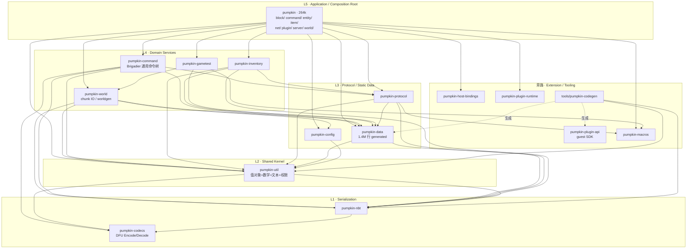

> **附录 · Opus 子 agent 源码深读报告（原文，未经删改）**
>
> 本文件由本设计任务中的一个 Opus 子 agent 在只读克隆上生成，作为 `01-research-pumpkin.md` / `02-research-pingora.md` 的证据附录。所有 `path:line` 指向研究基线 commit（Pumpkin `e413623`、Pingora `4487f7b`）。主文档与本附录冲突时，以本附录的源码行号为准。

# Pumpkin-MC/Pumpkin 架构研究报告

> 研究对象：`Pumpkin-MC/Pumpkin`，commit `e413623`（2026-09-20），浅克隆位于 `/tmp/rs-template-research/Pumpkin`。
> 研究目的：为「多 crate Rust 网络服务骨架」的 cargo-generate 模板提取可复用的组织经验。
> 阅读方式：所有结论均给出 `path:LINE` 证据。Minecraft 业务细节只在说明架构手法时出现。

---

## 0. 结论速览

| 维度            | Pumpkin 的做法                                                                        | 一句话评价                                 |
| --------------- | ------------------------------------------------------------------------------------- | ------------------------------------------ |
| Workspace 拆分  | 20 个 member，按 **技术能力层** 而非业务模块拆；业务全部塞进 `pumpkin` 单体 app crate | 分层清晰，但 app crate 264k 行已明显过肥   |
| Domain 类型位置 | 共享值对象在 `pumpkin-util`；静态数据表在 `pumpkin-data`（生成）；行为在 app crate    | 「数据下沉、行为上浮」，是可迁移的核心模式 |
| 依赖方向        | 严格 DAG，无环；下层不知上层，靠 Trait 注入反转                                       | `WorldPortalExt` 是教科书式的依赖倒置      |
| 依赖治理        | `[workspace.dependencies]` 全量 pin + 全量 `default-features = false`                 | 强烈建议照抄                               |
| 模块间通信      | `Arc<Server>` 上帝对象 + 事件总线 + `tokio::mpsc` + `rayon` 桥                        | 事件总线可抄，上帝对象要改造               |
| 错误处理        | 零 `anyhow`；每个 crate 一套 `thiserror` enum；app 层用 `Box<dyn PumpkinError>` 汇聚  | 分层错误的一个完整样板                     |

关键数字（`find ... | xargs wc -l`）：

```
crates/pumpkin-data        1,435,340 行   (99% 为 codegen 产物，已 check-in)
crates/pumpkin               264,000 行   (app crate，单体)
crates/pumpkin-world          79,000 行
crates/pumpkin-protocol       38,000 行
crates/pumpkin-plugin-api     24,070 行   (给插件作者的 SDK，服务端本身不依赖)
crates/pumpkin-util           15,484 行
crates/pumpkin-command        14,098 行
crates/pumpkin-inventory      10,995 行
tools/pumpkin-codegen         32,163 行
```

---

## 1. Workspace 拓扑与分层

### 1.1 实测依赖边

对 `crates/*/Cargo.toml` + `tools/*/Cargo.toml` 逐个 grep 内部依赖，得到完整 DAG（无环）：

```
leaf:  codecs · macros · api-macros(死代码) · auth · host-bindings · plugin-api(guest SDK) · plugin-runtime
nbt        -> codecs                 util       -> nbt, codecs
config     -> util                   data       -> util, nbt
protocol   -> nbt, data, macros, util
command    -> util, protocol, data, nbt, codecs      inventory -> protocol, data, util, nbt
world      -> nbt, util, config, data                gametest  -> data, macros, nbt, util, world
plugin-utils -> plugin-api           tools/codegen -> util, nbt
pumpkin(app) -> util auth nbt config command inventory world data protocol macros
                plugin-runtime gametest host-bindings
```

注意两处值得记下的事实：

1. **app crate 不依赖 `pumpkin-plugin-api`**。`pumpkin-plugin-api` 是编译进 WASM 插件的 *guest* 侧 SDK，宿主侧走 `pumpkin-host-bindings`。这是把「对外 API 契约」与「内部实现」彻底拆成两个 crate 的做法。
2. **`pumpkin-api-macros` 是死代码**。它只出现在 `Cargo.toml:5`（member）和 `Cargo.toml:181`（workspace dep 声明），无任何 crate 在 `[dependencies]` 里引用它，也无任何 `.rs` 提到 `pumpkin_api_macros`。它是旧 dylib 插件路径的遗留。

### 1.2 分层图



### 1.3 拆分规则的反向推导

从 20 个 crate 的职责边界可以归纳出 Pumpkin **实际遵循的** 四条拆分理由（而非 README 上写的）：

| 拆分理由                                  | 代表 crate                                         | 判据                                                                                                                                            |
| ----------------------------------------- | -------------------------------------------------- | ----------------------------------------------------------------------------------------------------------------------------------------------- |
| **编译期隔离**：proc-macro 必须单独 crate | `pumpkin-macros`, `pumpkin-api-macros`             | Rust 语言强制                                                                                                                                   |
| **Lint 隔离**：生成代码无法满足严格 lint  | `pumpkin-data`                                     | `crates/pumpkin-data/src/lib.rs:1-12` 整 crate `#![allow(clippy::all, pedantic, nursery, cargo, unwrap_used, expect_used, panic)]`              |
| **复用性 / 领域无关**：可独立发布的通用库 | `pumpkin-codecs`, `pumpkin-nbt`, `pumpkin-command` | `pumpkin-codecs` 只依赖 `serde_json` + `tracing`；`pumpkin-command` 对 `S: CommandSource` 泛型化（`crates/pumpkin-command/src/node/mod.rs:33`） |
| **对外契约面**：给第三方用的 API 表面     | `pumpkin-plugin-api`, `pumpkin-plugin-wit`         | guest 侧编译进 WASM，`Cargo.toml` 里连 `tokio` 都没有                                                                                           |

**反过来说**：Pumpkin 没有按「业务模块」拆 crate。`block/` `entity/` `item/` `world/` `command/` `net/` `plugin/` 全部是 app crate 内部的 `pub mod`（`crates/pumpkin/src/lib.rs:52-65`），加起来 264k 行。这不是疏忽——把互相引用密集的游戏逻辑放同一个 crate，避免了大量为打破循环依赖而设的 Trait。但代价是 app crate 的增量编译成本。

---

## 2. A · Bootstrap 与生命周期

### 2.1 启动序列伪代码

```
#[tokio::main]                                    // main.rs:48 — 默认 multi-thread runtime
async fn main():
    MAIN_THREAD.set(current_thread_id)            // main.rs:50  记录主线程，供 panic hook 判定
    rustls::crypto::ring::install_default()       // main.rs:54  crypto provider 必须先于任何 client
    rayon::ThreadPoolBuilder::new()               // main.rs:57-59
        .thread_name(|i| "Rayon-Worker-{i}")
        .build_global()                           //            全局 Rayon 池，线程命名便于 profiling
    std::panic::set_hook(handle_panic)            // main.rs:62  panic -> CrashReport
    #[cfg(feature="console-subscriber")] init()   // main.rs:64-65 tokio-console 可选

    t0 = Instant::now()                           // main.rs:66
    exec_dir = current_dir().unwrap_or(".")       // main.rs:68  配置根 = 进程 CWD
    config   = PumpkinConfig::load(&exec_dir)     // main.rs:70  绝不失败，见 §3
    vanilla  = VanillaData::load()                // main.rs:72  JSON 运行时数据（ops/whitelist/...）
    init_logger(&config.advanced)                 // main.rs:74  ← 日志在 config 之后初始化

    print banner / build info / support links     // main.rs:76-115
    tokio::spawn(setup_sighandler())              // main.rs:117-121 SIGINT/SIGHUP/SIGTERM

    pumpkin_server = PumpkinServer::new(          // main.rs:123-129
        config.basic, config.advanced, config.telemetry, vanilla).await
      └─ Server::new(...) -> Arc<Server>          // server/mod.rs:160  组合根，见 2.2
      └─ adjust_file_descriptor_limit()           // lib.rs:264 + 852-905  unix setrlimit(RLIMIT_NOFILE)
      └─ 可选子系统按 config 逐个 spawn_task: RCON(:268-276) query(:309-315) LAN(:317-325)
      └─ TcpListener::bind(java.address)          // lib.rs:281  失败按 ErrorKind 分类报错后 exit(1)
      └─ thread::Builder::new().name("Server-Ticker").spawn(      // lib.rs:335-344
             || Ticker::run(&server))             //   ← tick 循环跑在独立 OS 线程，不是 tokio task
      └─ bind bedrock status UDP + NetherNet      // lib.rs:346-350

    plugin_wait = pumpkin_server.init_plugins()   // main.rs:130 / lib.rs:419-442
      └─ plugin_manager.load_plugins(&server)
      └─ if hot_reload: plugin_manager.start_watcher()
    log "Started server; took {t0.elapsed() - plugin_wait}ms"     // main.rs:132-139

    pumpkin_server.start().await                  // main.rs:179 / lib.rs:452
      └─ setup_console(rl) | setup_stdin_console() // lib.rs:453-466
      └─ tasks = Arc<TaskTracker>                  // lib.rs:468
      └─ fire ServerLoadEvent(Startup)             // lib.rs:472-475
      └─ server.start_telemetry()                  // lib.rs:477
      └─ while !SHOULD_STOP:                       // lib.rs:479-486
             unified_listener_task(...)            //   单个 select! 多路复用，见 2.3
      └─ ===== graceful shutdown（顺序即优先级）=====
         SERVER_IS_STOPPING.store(true)                           // lib.rs:488
         if CRASH_REPORT.get(): print + save, exit_code = 1       // lib.rs:490-502
         持久化: save_all_players / save_all_advancements         // lib.rs:506-521
         for player: player.kick(Shutdown)                        // lib.rs:523-526
         tasks.close(); tasks.wait().await         // lib.rs:530-531  等所有连接任务收尾
         unload_plugins().await                                   // lib.rs:533
         server.shutdown().await                                  // lib.rs:537
           └─ tasks.close()+wait() → 各 world.shutdown() → write_world_info()
              // server/mod.rs:748-765
    exit(SERVER_EXIT_CODE.load(Acquire))                          // main.rs:188
```

### 2.2 停机信号：三个全局原子 + 一个 CancellationToken

`crates/pumpkin/src/lib.rs:208-225`：

```rust
pub static SHOULD_STOP:        AtomicBool = AtomicBool::new(false);
pub static STOP_INTERRUPT:     LazyLock<CancellationToken> = LazyLock::new(CancellationToken::new);
pub static SERVER_IS_STOPPING: AtomicBool = AtomicBool::new(false);
pub static CRASH_REPORT:       OnceLock<CrashReport> = OnceLock::new();
pub static SERVER_EXIT_CODE:   AtomicI32 = AtomicI32::new(0);

pub fn stop_server() { SHOULD_STOP.store(true, Relaxed); STOP_INTERRUPT.cancel(); }
pub fn stop_or_exit_server() {                                  // lib.rs:219-225
    if SERVER_IS_STOPPING.load(Acquire) { exit(...); }          // 二次 Ctrl-C = 强杀
    stop_server();
}
```

设计要点：`SHOULD_STOP` 供同步循环轮询（`Ticker`、stdin 读取线程），`STOP_INTERRUPT` 供异步 `select!` 分支立即唤醒（`lib.rs:693-695`、`ticker.rs:89-92`）。两者配对使用，覆盖同步与异步两个世界。`SERVER_IS_STOPPING` 单独存在，用于区分「第一次停机请求」与「停机过程中再次请求」。

### 2.3 Tick 循环（独立线程 + runtime.enter()）

`crates/pumpkin/src/server/ticker.rs:20-107`。这是 Pumpkin 最特别的一处结构：**游戏逻辑主循环不是 tokio task，而是一个专用 OS 线程**，通过 `server.runtime.enter()`（`ticker.rs:21`）获得 tokio 上下文，需要 await 时用 `runtime.block_on()`（`ticker.rs:33/54/64/88`）。

```
Ticker::run(server):
    _guard = server.runtime.enter()          // :21  让该线程内可 spawn / block_on
    loop 'ticker:
        tick_rate_manager.tick()                                      // :29
        if plugin_manager.has_handlers::<ServerTickStartEvent>():     // :32 ← 先探测再进 runtime
            runtime.block_on(fire(ServerTickStartEvent))              // :33-37
        server.tick()                                                 // :44/50
        if has_handlers::<ServerTickEndEvent>(): block_on(fire(..))   // :63-68
        server.update_tick_times(elapsed_nanos)                       // :70
        next_tick += nanoseconds_per_tick()                           // :72-78
        if STOP_INTERRUPT.is_cancelled(): break 'ticker               // :80-82
        if next_tick > now:
            block_on(select!{ sleep(dt) | STOP_INTERRUPT.cancelled() })   // :88-93
        if now > next_tick: next_tick = now   // :103-106  death-spiral 钳制（不补跑）
```

`has_handlers::<E>()` 前置判断（`plugin/mod.rs:1200-1205`）是值得学习的微优化：没有订阅者时完全不进入 tokio runtime，省掉每 tick 两次 `block_on`。`Server::tick` 把一个 tick 分成两半（`server/mod.rs:1101-1154`）：`tick_players_and_network()` 永远执行（网络/keepalive），`tick_worlds()` 受 freeze 控制；两者都用 `rayon` 的 `par_iter()` 并在闭包内 `handle.enter()` 重挂 tokio 上下文（`:1122-1125`、`:1147-1150`）。

### 2.4 `crash.rs` 与 `telemetry.rs`

**`crash.rs`（363 行）** —— 把 panic 变成可归档的崩溃报告。

- `CrashReport { utc_time, payload, thread, panic_location, full_backtrace, captured_backtrace }`（`crash.rs:70-77`）。注释（`crash.rs:64-69`）说明：刻意脱离 `PanicHookInfo<'_>` 的生命周期，才能存进 `static OnceLock`。`FullBacktrace::{Captured, ForceCaptured}`（`:35-38`）在 `RUST_BACKTRACE` 未开时主动 `force_capture`。两个出口：`print_to_console()`（`:106`）、`save_and_log()`（`:323`）。
- 分流逻辑在 `main.rs:233-305`：主线程 panic → 生成报告 + `exit(1)`；工作线程首次 panic → 记录报告并 `stop_server()` 走正常停机路径；后续 panic → 只打日志。`try_set_crash_report`（`main.rs:315-321`）用 `OnceLock::set` 的返回值天然实现「只记录第一次」。

**`telemetry.rs`（860 行）** —— 匿名心跳上报，是一个自包含的可选后台子系统的完整范例。

- 载荷 `HeartbeatPayload`（`telemetry.rs:44-76`）：version / online_players / os / arch / cpu_cores / ram / 插件清单。**Ed25519 签名**：`compute_signed_data` = `timestamp || '.' || body`（`:96-102`），`sign_telemetry_payload` 返回 `(pubkey_hex, sig_hex)`（`:106-116`）。
- `start_telemetry_with_config`（`:451`）：`enabled == false` 直接 return（`:452-455`）；`interval_secs.max(60)` 强制下限（`:482`）；循环体是 `select! { interval.tick() | STOP_INTERRUPT.cancelled() }`（`:489-494`）；退出循环后补发一条 `send_shutdown`（`:516-521`）。整体挂在 `server.spawn_task(...)`（`:486`）上，停机时被 `TaskTracker` 统一等待。自带 `#[cfg(test)]`，用 `axum` 起本地 HTTP server 验签（`:525-530`、`:858`）。

### 2.5 Tokio runtime 配置

没有手搓 `Builder`，用 `#[tokio::main]` 默认值（`main.rs:48`）。真正的配置在 feature 选择上：`tokio = { workspace = true, features = ["macros","net","rt-multi-thread","sync","io-std","signal","fs","io-util","time"] }`（`crates/pumpkin/Cargo.toml:41-51`）。`Server` 保存 `runtime: tokio::runtime::Handle`（`server/mod.rs:150`，来自 `:317` 的 `Handle::current()`），供非异步上下文（Ticker 线程、`fire_blocking`）回到 runtime。

---

## 3. B · 配置

### 3.1 结构组合：flatten + 三段式

```rust
// crates/pumpkin-config/src/lib.rs:74-87
#[derive(Deserialize, Serialize, Default)]
#[serde(default)]
pub struct PumpkinConfig {
    #[serde(flatten)] pub basic:    BasicConfiguration,      // 18 个标量，顶层裸键
    #[serde(flatten)] pub advanced: AdvancedConfiguration,   // 13 个子 section
    #[serde(default)] pub telemetry: TelemetryConfig,        // 独立 [telemetry] 表
}
```

`AdvancedConfiguration`（`lib.rs:144-179`）聚合 13 个子 section（`logging`/`networking`/`commands`/`chat`/`pvp`/`plugins`/...），`NetworkingConfig`（`networking/mod.rs:31-50`）再聚合 `query`/`rcon`/`proxy`/`lan_broadcast`/`java`/`bedrock`。层级靠 **struct 组合** 而非扁平键名表达。crate 顶部 `#![deny(missing_docs)]`（`lib.rs:2`），所以每个 `pub` 字段都有文档注释 —— 这对配置 crate 特别合适。

### 3.2 `LoadConfiguration` Trait：三个默认实现 + 两个必填

`crates/pumpkin-config/src/lib.rs:271-436`：

| 方法                                                                                            | 行         | 性质     |
| ----------------------------------------------------------------------------------------------- | ---------- | -------- |
| `fn load(config_dir: &Path) -> Self where Self: Sized + Default + Serialize + DeserializeOwned` | `:283-374` | 默认实现 |
| `fn merge_with_default_toml(toml::Value) -> (Self, bool)`                                       | `:380-395` | 默认实现 |
| `fn merge_toml_values(base, overlay) -> (toml::Value, bool)`                                    | `:401-429` | 默认实现 |
| `fn get_path() -> &'static Path`                                                                | `:432`     | **必填** |
| `fn validate(&self)`                                                                            | `:435`     | **必填** |

注意 `Self: Sized + ...` 约束挂在 **方法** 上而非 trait 上 —— 实现者只在用到 `load` 时才付出这些约束。文件名用 `get_path()` 方法而非关联常量（`PumpkinConfig` 实现为 `Path::new("pumpkin.toml")`，`lib.rs:90-92`）。

### 3.3 加载流程：**infallible**，永远返回可用配置

```
load(config_dir):
    if !config_dir.exists(): let _ = fs::create_dir(config_dir)      // lib.rs:287-290 (错误被吞)
    path = config_dir.join(Self::get_path())
    if path.exists():
        content = read_to_string(path)  else { error!; return default }   // lib.rs:296-303
        value   = toml::from_str::<toml::Value>(content)
                  else { error!("Couldn't parse TOML ... Using default"); return default }  // :306-315
        (cfg, changed) = merge_with_default_toml(value)   // 用 default 补齐缺失键
        if changed:
            println!(...)                 // :282 `#[expect(clippy::print_stdout)]`，因为 logger 还没起
            write merged toml back        // :327-344 (失败仅 warn!)
    else:
        cfg = Self::default(); write it   // :348-370
    cfg.validate(); cfg                   // :372-373
```

三个值得注意的取舍：

1. **`load` 不返回 `Result`**。解析失败只 `error!` 然后退回 default，**并且直接 `return`，跳过 `validate()`**（`lib.rs:306-315`）。这让服务器"永远能起来"，但坏配置会被静默降级——对游戏服务器尚可，对生产服务是危险的。
2. **自愈式 schema 演进**。`merge_toml_values`（`lib.rs:401-429`）递归合并 default(base) 与用户文件(overlay)，缺失键从 default 补齐并 **回写文件**。升级新增字段会自动出现在用户的 `pumpkin.toml` 里。没有 version 字段，没有迁移框架（grep `version|migrat` 在该 crate 只命中 `resource_pack.rs:47` 的 pack 元数据）。
3. **重命名靠 `#[serde(alias)]` 永久兼容**：`lib.rs:220`、`networking/java.rs:25-29`、`chat.rs:34-42`、`networking/packet_limiter.rs:11-17`、`networking/auth.rs:15-25`，每条都配有 round-trip 测试（`lib.rs:451-457`、`networking/java.rs:75-100`）。

### 3.4 默认值、校验、分发

**默认值三种写法**：`#[derive(Default)]`（字段全为类型默认值，如 `PumpkinConfig` `lib.rs:75`）；**手写 `impl Default`**（主流，如 `BasicConfiguration` `lib.rs:228-251`、`JavaConfig` `networking/java.rs:41-63`）；`#[serde(default = "fn")]` —— **全 crate 仅 1 处**，`world.rs:16` 的 `autosave_ticks`。第三种只用一次的原因很有教育意义：`0` 是 **有意义的值**（关闭自动保存），不能与「字段缺失」混同，`world.rs:39-60` 三个测试专门钉住它。因为 `deny(clippy::unwrap_used)`，默认值写成 `"0.0.0.0:25565".parse().unwrap_or_else(|_| SocketAddr::from(([0,0,0,0],25565)))` / `NonZero::new(16).unwrap_or(NonZero::<u8>::MIN)`（`networking/java.rs:43-47`）。

**校验用 `assert!` 而非 clamp**：`PumpkinConfig::validate`（`lib.rs:94-141`）做跨字段一致性检查 —— `keep_alive_time > 0`（`:107-110`）、`2 <= view_distance <= 64`（`:111-118`、`:127-134`）、`online_mode ⇒ encryption`（`:119-124`）、`allow_chat_reports ⇒ java.online_mode`（`:135-140`）。子 validator 全是空 stub（`lib.rs:261`、`:264-269`）。

**分发：没有全局单例。** grep `LazyLock|OnceLock|static ` 在该 crate 只命中两处 `&'static Path` 签名。路径纯显式：

```
main.rs:70  config = PumpkinConfig::load(&exec_dir)      // 配置根 = 进程 CWD
main.rs:74  init_logger(&config.advanced)
main.rs:123 PumpkinServer::new(config.basic, config.advanced, config.telemetry, vanilla)
  → server/mod.rs:160-165 Server::new(...) -> Arc<Self>
  → server/mod.rs:71-73   pub basic_config / advanced_config / telemetry_config（按值持有）
```

因为 `Server` 永远在 `Arc` 里，共享靠 `Arc<Server>` 而非 `Arc<Config>`；`AdvancedConfiguration`/`BasicConfiguration` **刻意不 derive `Clone`**（`lib.rs:150`、`:184`），只有叶子配置 `Clone`（`JavaConfig` `networking/java.rs:7`，在 `crates/pumpkin/src/lib.rs:266` 被 clone）。下层 crate 不看根配置，只收切片：`Level::new(..., level_config: &LevelConfig, ...)`（`pumpkin-world/src/level.rs:152`）。

**环境变量**：配置 crate 内 **零** `env::var`。唯一覆写是日志级别 `RUST_LOG`（`crates/pumpkin/src/lib.rs:85-88`，env 优先于文件）。

**考古发现**：`pumpkin-world/src/chunk/format/anvil.rs:838` 仍引用 `pumpkin_config::{advanced_config, override_config_for_testing}`，但整个 `mod tests` 被 `anvil.rs:834` 的 `/*` 注释掉了 —— 这些符号已不存在。这是早期「全局访问器 + 测试覆写钩子」被显式传参替换后的化石。

**姊妹机制**：app crate 有一套结构几乎相同但基于 JSON、**可写可 reload** 的加载器（`crates/pumpkin/src/data/mod.rs`）：`LoadJSONConfiguration`（`:40-93`，根目录 `DATA_FOLDER = "data/"` `:6`，**无 merge 步骤**）与 `SaveJSONConfiguration`（`:95-125`，多一个 `save()`）。`VanillaData` 把每项包在 `RwLock` 里（`:19-25`）支持运行时重载（`command/commands/whitelist.rs:156`）。「静态启动配置（TOML，只读）／运行时数据（JSON，可写可热更）」的二分是一个清晰的边界。

---

## 4. C · 错误处理

### 4.1 全局事实：零 `anyhow`

`grep -rn anyhow --include=Cargo.toml` 在整个 workspace **无任何命中**。每个 crate 定义自己的 `thiserror` enum：

| crate                                                                              | `#[derive(..Error..)]` 数量 |
| ---------------------------------------------------------------------------------- | --------------------------: |
| `pumpkin` (app)                                                                    |                          15 |
| `pumpkin-world`                                                                    |                           9 |
| `pumpkin-protocol`                                                                 |                           6 |
| `pumpkin-plugin-utils`                                                             |                           3 |
| `pumpkin-util` / `-nbt` / `-inventory` / `-gametest` / `-auth` / `-plugin-runtime` |                        各 1 |

`Box<dyn std::error::Error>` 只出现在两类地方：日志文件轮转的内部辅助（`crates/pumpkin/src/logging.rs:159/200/249`）和 **测试函数签名**（`pumpkin-protocol/src/query.rs:272+`、`java/packet_decoder.rs:228+`）。生产路径不用。

### 4.2 分层：`PumpkinError` Trait 做汇聚层

`crates/pumpkin/src/error.rs:9-19` 是整个错误体系的关键：

```rust
pub trait PumpkinError: Send + std::error::Error + Display {
    fn is_kick(&self) -> bool;                          // 该错误是否应断开客户端
    fn log(&self) { log_at_level!(self.severity(), "{self}"); }   // 唯一的默认实现
    fn severity(&self) -> Level;                        // tracing::Level
    fn client_kick_reason(&self) -> Option<String>;     // 给用户看的文案
}

impl<E: PumpkinError + 'static> From<E> for Box<dyn PumpkinError> {   // error.rs:21-25
    fn from(error: E) -> Self { Box::new(error) }
}
```

这个 Trait 回答的不是「错误是什么」（那是各 crate 的 `thiserror` enum 的事），而是 **「应用层该拿它怎么办」**：日志级别是多少、要不要踢人、给对方看什么。

具体错误类型由 app crate 接入，逐 variant 给出策略：`impl PumpkinError for InventoryError`（`error.rs:26-56`，`InvalidSlot|ClosedContainerInteract|InvalidPacket|PermissionError` 踢人且 ERROR，`OutOfOrderDragging` 是 INFO 不踢，`MultiplePlayersDragging` 是 WARN 不踢）、`for ReadingError`（`:58-70`，协议解析失败一律踢人 + ERROR）、`for PlayerDataError`（`:72-87`，不踢人 WARN，但给面向用户的 `client_kick_reason`）。

使用处：`pub fn handle_play_packet(...) -> Result<(), Box<dyn PumpkinError>>`（`net/java/mod.rs:879-884`）。即 **下层 crate 用具体 enum，app 层用 `Box<dyn PumpkinError>` 做统一的策略载体**。这是 `anyhow` 的一个「有语义」的替代品 —— `anyhow` 丢掉了类型，这个 Trait 保留了「怎么处理」的信息。

### 4.3 错误组合靠 `#[from]`

跨 crate 的错误包装是标准 `thiserror` 嵌套，如 `ManagerError { PluginNotFound(String), LoaderError(#[from] LoaderError), IoError(#[from] std::io::Error), ... }`（`plugin/mod.rs:217-224`）。少数 enum 甚至不写 `#[error]` 而手写 `Display` 转发 `Debug`（`pumpkin-world/src/world.rs:43-53` 的 `GetBlockError`）—— 用于枚举名本身自解释的场景。

### 4.4 「不许 panic」是编译期强制的

`Cargo.toml:60-65` 一次性 deny 了 `todo` / `unreachable` / `unimplemented` / `unwrap_used` / `expect_used` / `panic`。逃生口局部且显式：`crates/pumpkin/src/lib.rs:2` 与 `main.rs:2` 的 `#![cfg_attr(test, allow(...))]`（只在 test 放开）；`tools/pumpkin-fuzzer/Cargo.toml:14-19`、`tools/pumpkin-codegen/Cargo.toml:29-35` 整包放开；bench 与 build script 用文件级 `#![allow]`。

这条纪律的代价在代码里清晰可见：大量 `unwrap_or_else(std::sync::PoisonError::into_inner)`（`server/mod.rs:743`、`:795`、`entity/mod.rs:267` 等），即 **锁中毒不 panic 而是继续用**。

---

## 5. D · 日志与可观测性

### 5.1 `tracing` 栈的组装

`crates/pumpkin/src/lib.rs:80-206` 的 `init_logger`：

```
init_logger(advanced_config):                                           // lib.rs:80-206
    level      = RUST_LOG env → config.logging.level → INFO             // :85-91
    env_filter = EnvFilter::try_from_default_env() 或由 level 构造        // :93-103
    file_layer = Option<GzipRollingLogger>  if logging.file != ""       // :105-115
    writer     = TTY ? ConsoleWriter(rustyline external_printer) : ConsoleWriter(None)  // :120-146
                 //   ← external_printer 让日志能穿过 readline 提示符
    fmt_layer  = fmt::layer().with_writer(Mutex::new(writer))
                   .with_ansi/.with_target/.with_thread_names/.with_thread_ids  // :148-154
    registry().with(env_filter).with(fmt_layer)[.with(file_layer)].init()       // :171-188
    LOGGER_IMPL.set(Some((ReadlineLogWrapper(rl), level, LoggingConfig{..})))    // :202-205
```

全部配置项可从 config 驱动：`color` / `threads` / `thread_ids` / `target` / `timestamp` / `timestamp_format` / `file`（`crates/pumpkin-config/src/logging.rs:29-42`）。时间戳格式用 `time::format_description::parse` 动态解析，失败退回 `[hour]:[minute]:[second]`（`lib.rs:166-168`）。

### 5.2 三个细节

- **`LOGGER_IMPL: LazyLock<Arc<OnceLock<LoggerOption>>>`**（`lib.rs:76-77`）在 logger 与 console REPL 之间 **交接** `rustyline::Editor` 的所有权（`take_readline`/`return_readline`，`lib.rs:456`、`:813`）—— `Editor` 不是 `Send`，只能借还不能共享。
- **`log_at_level!` 宏**（`logging.rs:26`）—— `tracing::Level` 不能作为运行时值传给 `info!/warn!`，需要一个宏做 `match`。`PumpkinError::log` 的默认实现依赖它（`error.rs:12-14`）。
- **`GzipRollingLogger`**（`logging.rs:150-249`）—— 自实现的按日 gzip 轮转 Layer。

### 5.3 metrics：几乎没有

无 `prometheus`/`metrics`/`opentelemetry` 依赖。可观测性靠三样：① tick 时间环形缓冲 `tick_times_nanos: Mutex<[i64;100]>` + `aggregated_tick_times_nanos: AtomicI64`（`server/mod.rs:134-136`），滚动均值增量更新（`:1157-1170`）；② `DebugProfiler`（`server/debug_profiler.rs:52-56`），`Mutex<Option<Session>>` + `/debug start|stop` 驱动，错误是 `StartDebugProfileError::AlreadyRunning` / `StopDebugProfileError::NotRunning`（`:42-50`）；③ `tokio-console`，optional feature（`crates/pumpkin/Cargo.toml:113/139`，`main.rs:64-65`）。

---

## 6. E · Domain 建模

### 6.1 三段式：静态数据 / 共享值对象 / 行为

这是本报告对模板设计最重要的一条发现。Pumpkin 把「一个领域概念」拆成三块，放在三个不同的层：

```
L5 app crate   crates/pumpkin/src/block/
   行为        trait BlockBehaviour + 275 个实现 + BlockRegistry
                              ▼ 引用
L2 shared      pumpkin-util
   值对象      BlockPos / Vector3 / BoundingBox / Identifier / ResourceKey
               GameMode / Difficulty / Seed / YOffset / TextComponent
                              ▼ 引用
L3 static      pumpkin-data  (1.4M 行 codegen, check-in)
   数据表      Block / BlockState / BlockId / Item / EntityType / Biome
               纯 const：id、默认 state、硬度、标签。无任何行为。
               generated/block.rs 单文件 620,034 行
```

`BlockId` 这个「身份」在 `pumpkin-data`，`BlockPos` 这个「坐标」在 `pumpkin-util`，`AnvilBlock::on_place()` 这个「行为」在 app crate。三者靠 `#[pumpkin_block("minecraft:anvil")]` 宏缝合（见 §6.4）。

### 6.2 不是 ECS，是「基 struct + Trait 继承链 + trait object」

`crates/pumpkin/src/entity/mod.rs:143` 的 `EntityBase` 是实体层的根：

```rust
pub trait EntityBase: Send + Sync + std::any::Any {
    // 「向下转型」访问器（模拟 Java 的 instanceof / super）
    fn get_entity(&self) -> &Entity;
    fn get_living_entity(&self) -> Option<&LivingEntity>;
    fn get_player(&self) -> Option<&Player>;
    fn get_mob(&self) -> Option<&dyn mob::Mob> { None }              // :248-250
    // 数十个全部带默认实现的行为钩子，全部 &self：
    fn tick(&self, caller: &dyn EntityBase, server: &Server) { ... } // :170-176
    fn write_nbt(&self, nbt: &mut NbtCompound) { ... }               // :144-150
    fn write_custom_nbt(&self, _nbt: &mut NbtCompound) {}            // :152  ← 子类扩展点
    fn get_eye_pos(&self) -> Vector3<f64> { ... }                    // :201-203
    fn is_pushed_by_fluids(&self) -> bool { true }                   // :235-237
    fn get_gravity(&self) -> f64 { 0.0 }                             // :244-246
    fn considers_entity_as_ally(&self, other: &dyn EntityBase) -> bool { ... }  // :297+
}
```

四个结构性要点：

1. **全部 `&self`，没有 `&mut self`**。可变状态由字段的内部可变性承担：`Entity`（`entity/mod.rs:827-882+`）里几乎每个字段都是 `AtomicCell<T>` / `AtomicBool` / `ArcSwap<World>`。于是实体可以放进 `Arc<dyn EntityBase>` 并从多个 rayon 线程并发 tick，无需外层锁。
2. **默认实现承担「继承」**。`EntityBase::tick` 的默认体先试 `get_living_entity()`，有就调 `LivingEntity::tick`，否则调 `Entity::tick`（`:170-176`）—— 用 Option 访问器模拟 Java 的 super 调用链。
3. **组合而非继承**：`LivingEntity { pub entity: Entity, health: AtomicCell<f32>, ... }`（`entity/living.rs:76-88`），`Player` 再包 `LivingEntity`；共 40 处 `impl EntityBase for ...`。
4. **子 Trait 做能力标记**：`Mob: EntityBase`（`entity/mob/mod.rs:769`）、`PathAwareEntity: Mob`（`:1614`）、`Animal: Mob`、`TamableAnimal: Animal`、`Raider: PatrollingMonster`。

小技巧：`impl dyn EntityBase + '_ { pub fn is_allied_to(&self, other: &dyn EntityBase) -> bool }`（`entity/mod.rs:133-141`）—— 在 **trait object 上** 而非 trait 里写方法，双方都能是 `&dyn EntityBase`，绕过 `Self: Sized`。

### 6.3 五个最重要的 Trait

| Trait                              | 位置                                             | 形态                                                                                              | 关键设计                                                                                                         |
| ---------------------------------- | ------------------------------------------------ | ------------------------------------------------------------------------------------------------- | ---------------------------------------------------------------------------------------------------------------- |
| `EntityBase`                       | `crates/pumpkin/src/entity/mod.rs:143`           | `Send + Sync + Any`，全 `&self`，同步                                                             | 默认实现模拟继承；`Arc<dyn EntityBase>` 存于 `World.entities`（`world/mod.rs:259`）                              |
| `BlockBehaviour`                   | `crates/pumpkin/src/block/mod.rs:74`             | `Send + Sync`，全 `&self`，同步，**全部方法有默认实现**                                           | 每个方法收一个 `XxxArgs<'_>` 结构体而非长参数列表                                                                |
| `ItemBehaviour`                    | `crates/pumpkin/src/item/mod.rs:23`              | 同上，但仍用长参数（`use_on_block` 带 `#[expect(clippy::too_many_arguments)]`，`item/mod.rs:35`） | 与 `BlockBehaviour` 形成对照：Args 结构体是后来演进出来的                                                        |
| `CommandExecutor<S = DummySource>` | `crates/pumpkin-command/src/node/mod.rs:33`      | `Sync + Send`，单方法 `execute(&self, &CommandContext<S>) -> CommandExecutorResult`               | 对 source 泛型；`impl<F: Fn(&CommandContext<S>) -> R> CommandExecutor<S> for F`（`:38-45`）让闭包直接当 executor |
| `Payload`（事件）                  | `crates/pumpkin/src/plugin/api/events/mod.rs:19` | `Send + Sync`；`get_name_static() -> &'static str` + `as_any`/`as_any_mut`                        | **用字符串而非 `TypeId` 做类型标识**，以跨编译边界（见 §7.3）                                                    |

**`BlockBehaviour` 的 Args 模式** 值得单独说。`block/mod.rs:219-441` 定义了 27 个 `XxxArgs<'a>` 结构体，如 `OnPlaceArgs<'a> { server, world, block, position, direction, player, replacing, use_item_on }`（`:302-311`，全部是 `&'a` 引用或 `Copy` 标量）。好处：给 Trait 加一个上下文字段 **不会破坏 275 个实现的签名**；`Copy` 的 Args（`BonemealArgs` 在 `registry.rs:543` 被复用两次）还能零成本重复传递。这是把「参数列表」变成「可演进的数据结构」。

### 6.4 Registry 模式：`Vec<Arc<dyn Trait>>` + id 索引表

```rust
// crates/pumpkin/src/block/registry.rs:496-503
const NO_BEHAVIOUR: u16 = u16::MAX;
pub struct BlockRegistry {
    block_indices: [u16; pumpkin_data::BlockId::COUNT as usize],   // id -> 槽位，定长数组
    behaviours:    Vec<Arc<dyn BlockBehaviour>>,                   // 槽位 -> 行为
    fluids:        FxHashMap<u16, Arc<dyn FluidBehaviour>>,
}
pub fn register<T: BlockBehaviour + BlockMetadata + 'static>(&mut self, block: T) {  // :827-837
    let ids = T::ids();                       // ← 由 #[pumpkin_block(...)] 宏生成
    let idx = u16::try_from(self.behaviours.len()) ... ;
    self.behaviours.push(Arc::new(block));
    for i in ids { self.block_indices[i.as_u16() as usize] = idx; }
}
```

查询是 `O(1)` 数组索引（`get_pumpkin_block`，`:1368`）而非 HashMap；一个行为实例可被多个 id 共享。注册是一个 **手写巨型函数** `default_registry()`（`:239-...`，带 `#[expect(clippy::too_many_lines)]`），逐行 `manager.register(AnvilBlock);`。没有 `inventory`/`linkme`/`ctor` 这类自动注册 crate —— 显式、可审计、无链接器魔法。`T::ids()` 由两个宏提供：`#[pumpkin_block("minecraft:anvil")]` 在编译期经 `heck` 把字面量转成 `BlockId::ANVIL` 常量路径（`pumpkin-macros/src/lib.rs:351-378`、`:315-341`）；`#[pumpkin_block_from_tag("minecraft:logs")]` 在运行时从 tag 表展开整类 id（`:385-411`）。`ItemRegistry` 同构（`item/items/mod.rs:112`）。

### 6.5 依赖倒置：`WorldPortalExt`

`pumpkin-world` 生成地形时需要「这个方块能否放在这里」这类 **行为** 判断，但行为在 app crate，而 `pumpkin-world` 不能依赖 app。解法：下层定义 Trait、上层在运行时注入。

```rust
// pumpkin-world/src/world.rs:55-82  —— 下层定义端口
pub trait WorldPortalExt: Send + Sync {
    fn can_place_at(&self, block, state, accessor: &dyn BlockAccessor, pos) -> bool;
    fn mirror(&self, block, state_id, mirror) -> &'static BlockState;
    fn rotate(&self, block, state_id, rotation) -> &'static BlockState;
    fn spawn_mobs_for_chunk_generation(&self, cache: &mut dyn GenerationCache, biome, cx, cz);
    fn spawn_structure_entities(&self, _entities: Vec<NbtCompound>) {}
}
// pumpkin-world/src/level.rs:80  —— 下层持有空槽（初始 None, :273）
pub world_portal: ArcSwap<Option<Arc<dyn WorldPortalExt>>>,
// crates/pumpkin/src/server/mod.rs:404-405  —— 上层在组合根注入
let portal: Arc<dyn WorldPortalExt> = Arc::new(WorldPortal(world.clone()));
level.world_portal.store(Arc::new(Some(portal)));
```

消费点 `pumpkin-world/src/chunk_system/worker_logic.rs:263` 的 `level.world_portal.load_full()`。同一 Trait 另有两个轻量实现用于 bench 与命令（`pumpkin-world/benches/chunk_gen.rs:20`、`command/commands/place.rs:82`）。

**这是整个仓库里最值得直接搬进模板的结构**：用 `ArcSwap<Option<Arc<dyn Port>>>` 表达「下层定义端口、上层在 wiring 阶段注入适配器，且可热替换」。

### 6.6 `Level` vs `World`：基础设施与领域的分界

|      | `pumpkin_world::level::Level`                                                                          | `pumpkin::world::World`                                                                                                                                                            |
| ---- | ------------------------------------------------------------------------------------------------------ | ---------------------------------------------------------------------------------------------------------------------------------------------------------------------------------- |
| 位置 | `crates/pumpkin-world/src/level.rs:78-123`                                                             | `crates/pumpkin/src/world/mod.rs:249-300`                                                                                                                                          |
| 职责 | chunk 加载/保存/生成、光照、region 文件、自动存盘                                                      | 玩家列表、实体列表、计分板、世界边界、天气、爆炸、raid、方块实体                                                                                                                   |
| 持有 | `DashMap<Vector2<i32>, SyncChunk>`、`ChunkSaver`、`WorldGenerator`、`TaskTracker`、`CancellationToken` | `level: Arc<Level>`（**组合**）、`players: ArcSwap<Vec<Arc<Player>>>`、`entities: ArcSwap<Vec<Arc<dyn EntityBase>>>`、`block_registry: Arc<BlockRegistry>`、`server: Weak<Server>` |
| 类比 | Repository / Storage                                                                                   | Aggregate Root                                                                                                                                                                     |

`World.server: Weak<Server>`（`world/mod.rs:274`）是打破 `Arc` 环的标准做法；消费处用 `world.server.upgrade()`（`block/registry.rs:547`）。

---

## 7. F · 扩展点：插件与事件系统

### 7.1 双 Loader：dylib + WASM Component Model

```rust
// crates/pumpkin/src/plugin/mod.rs:241-244
loaders: RwLock::new(vec![
    Arc::new(NativePluginLoader),
    Arc::new(WasmPluginLoader::new(verify_plugin_signatures)),
]),
```

`trait PluginLoader: Send + Sync`（`plugin/loader/mod.rs:23-34`）有四个方法：`load()` / `can_load()` / `unload()` / `can_unload()`。`load` 返回 `(Arc<dyn Plugin>, PluginMetadata, Box<dyn Any + Send + Sync>)`（`loader/mod.rs:8-18`）—— 第三项是 **loader 私有的不透明状态**（`libloading::Library` 句柄或 WASM store），宿主不需要知道它是什么。这是一个干净的「插件宿主不感知加载机制」接口。

- **Native**：`dlopen` 后解析三个符号 —— `PUMPKIN_API_VERSION: *const u32`（`loader/native.rs:29`，与 `PLUGIN_API_VERSION = 2`（`plugin/mod.rs:37`）比对）、`METADATA`（`:48`）、`plugin: fn() -> Box<dyn Plugin>`（`:57`）。`can_unload()` 返回 `!cfg!(windows)`（`:92-93`）。
- **WASM**：wasmtime Component Model。47 个 `.wit` 在 `crates/pumpkin-plugin-wit/v0.1/`，world 定义于 `plugin.wit:4-6`；宿主 import 33 个 interface（`:17-79`），guest export `init-plugin`/`on-load`/`on-unload`/`handle-event`/`handle-command`/`handle-task`/`handle-ipc-message`（`:85-120`）。`pumpkin-host-bindings` 整个 crate 就是一次 `wasmtime::component::bindgen!`（`crates/pumpkin-host-bindings/src/lib.rs:3-70`），guest 侧镜像是 `wit_bindgen::generate!`（`pumpkin-plugin-api/src/lib.rs:203-212`）。

`load_plugins()`（`plugin/mod.rs:675`）的流程值得记的几步：`.deactivated` 后缀跳过（`:700-705`）、未签名 WASM 拒绝（`:725-743`）、**按 `metadata.dependencies` 拓扑排序**（`:766-772`，算法 `:412-461`，检测环与缺失依赖，带单测 `:1304-1330`）、逐插件交互式权限确认（`:795-798`）。热重载 watcher（`:288`）只监听 `.wasm`（`:325-327`），100ms 去抖（`:330`）。

### 7.2 事件模型

```rust
// crates/pumpkin/src/plugin/api/events/mod.rs:19-49
pub trait Payload: Send + Sync {
    fn get_name_static() -> &'static str where Self: Sized;   // ← 字符串做类型标识
    fn get_name(&self) -> &'static str;
    fn as_any(&self) -> &dyn Any;
    fn as_any_mut(&mut self) -> &mut dyn Any;
}
pub trait Cancellable: Send + Sync {                          // :115-127
    fn cancelled(&self) -> bool;
    fn set_cancelled(&mut self, cancelled: bool);
}
pub enum EventPriority { Highest, High, Normal, Low, Lowest } // :132-148

// crates/pumpkin/src/plugin/mod.rs:173
pub type HandlerMap = HashMap<&'static str, Vec<Arc<dyn DynEventHandler>>>;
```

Handler 侧是经典的「泛型 Trait + 类型擦除适配器」：

```rust
pub type BoxFuture<'a, T> = Pin<Box<dyn Future<Output = T> + Send + 'a>>;   // plugin/mod.rs:33

pub trait EventHandler<E: Payload>: Send + Sync {               // :86-106 使用者实现这个
    fn handle<'a>(&'a self, s: &'a Arc<Server>, e: &'a E) -> BoxFuture<'a, ()> { Box::pin(async {}) }
    fn handle_blocking<'a>(&'a self, s: &'a Arc<Server>, e: &'a mut E) -> BoxFuture<'a, ()> { ... }
}
pub struct TypedEventHandler<E, H> {                            // :111-121 类型擦除适配器
    handler: Arc<H>, priority: EventPriority, blocking: bool,
    source: Option<String>, _phantom: PhantomData<E> }
impl<E, H> DynEventHandler for TypedEventHandler<E, H> { ... }  // :123-169
```

`BoxFuture` 而非 `async fn in trait`，是为了保持 trait object 安全（`dyn DynEventHandler`）。

**字符串类型标识**（`get_name_static() -> &'static str`，由 `#[derive(Event)]` 展开成 `stringify!(#name)`，`crates/pumpkin-macros/src/lib.rs:22-40`）。`events/mod.rs:53-56` 的注释说明了原因：跨编译单元（dylib）时 `TypeId` 不稳定。代价是 `downcast_mut`（`events/mod.rs:86-93`）在字符串相等后直接 `unsafe` transmute —— 两个同名结构体会互相误转。

### 7.3 Dispatch 伪代码

```
// 调用侧（宏糖）crates/pumpkin-macros/src/lib.rs:104-184
send_cancellable! {{
    server;
    PlayerChatEvent::new(...);
    'after:     { /* 未被取消时执行 */ }
    'cancelled: { /* 被取消时执行 */ }
}}
  ⇩ 展开为（lib.rs:165-181）
{
    let mut event = PlayerChatEvent::new(...);        // 按值持有，宏会剥掉 &mut
    let server_ref: &Arc<Server> = (server).borrow();
    server_ref.plugin_manager.fire(server_ref, &mut event).await;
    let is_cancelled = event.cancelled();             // ← fire 之后才读
    if !is_cancelled { 'after } else { 'cancelled }
}

// 分发核心  crates/pumpkin/src/plugin/mod.rs:1208-1239
async fn fire<E: Payload>(&self, server: &Arc<Server>, event: &mut E):
    handlers_map = self.handlers.load()               // :1213  ArcSwap，无锁读
    if handlers_map.is_empty(): return                // :1214  三级 early-out
    handlers = handlers_map.get(E::get_name_static()) else return    // :1218
    if handlers.is_empty(): return                    // :1222

    for h in handlers where h.is_blocking():          // :1227-1231  第一趟
        h.handle_blocking_dyn(server, event).await    //   拿到 &mut E，可改可取消
    for h in handlers where !h.is_blocking():         // :1234-1238  第二趟
        h.handle_dyn(server, event).await             //   只拿 &E，返回值丢弃

// 同步桥  plugin/mod.rs:1243-1268
fn fire_blocking<E>(&self, server, event):
    ...same early-outs...
    if in tokio runtime: block_in_place(|| server.runtime.block_on(self.fire(...)))   // :1261-1264
    else:                server.runtime.block_on(self.fire(...))                      // :1266
```

注册（`plugin/mod.rs:1176-1197` 宿主侧 / `plugin/api/context.rs:319-343` 插件侧）用 **RCU**：

```rust
self.handlers.rcu(|handlers| {
    let mut new = (**handlers).clone();
    new.entry(E::get_name_static()).or_default().push(typed_handler.clone());
    Arc::new(new)
});
```

插件侧多设 `source: Some(plugin_name)`（`context.rs:331`），卸载时 `unregister_handlers(name)`（`mod.rs:1124-1133`）按来源摘除。

### 7.4 三个必须记录的缺陷

作为模板参考，这套设计有三处「声明了但没实现」，抄的时候要补上：

1. **`EventPriority` 完全未生效**。`get_priority()` 在整个仓库只有两处：声明（`plugin/mod.rs:75`）与实现（`:162-164`），**没有任何调用点**。`fire()`（`:1226-1238`）只按 blocking/non-blocking 分两趟，趟内按注册顺序执行。而 priority 却贯穿了插件 API（`context.rs:322`）、WIT enum（`event.wit:27-33`）和 guest SDK —— 插件作者会合理地以为它有用。
2. **取消不短路**。`fire()` 从不检查 `cancelled()`；所有 handler 都会跑完，`cancelled` 只在 `fire()` 返回后由宏读取（`pumpkin-macros/src/lib.rs:174-177`）。配合缺陷 1，「A 取消、B 反取消」的结果取决于加载顺序。
3. **`is_blocking` 名不副实**。两趟都是 inline `.await`，没有 `spawn`。差别只是拿 `&mut E` 还是 `&E`、返回值要不要写回。

另外：WASM handler trap 时 **fail-open**（`wasm_host/wit/v0_1/events/mod.rs:324-326` 只打 error 并保持 event 不变），即崩溃的插件无法通过崩溃来取消事件。以及所有 guest root call 被一个全局 `Semaphore::new(1)`（`crates/pumpkin-plugin-runtime/src/chain.rs:40`）串行化，一个慢插件会阻塞所有插件。

**规模**：`crates/pumpkin/src/plugin/` 下 348 个 `.rs`，约 279 个具体事件类型（252 个带 `#[cancellable]`），分类见 `plugin/api/events/mod.rs:4-14`（`entity` 77、`player` 76、`block` 45、`inventory` 22、`world` 21、`server` 15…）。样板由两个宏消除：`#[derive(Event)]`（`pumpkin-macros/src/lib.rs:16-42`）生成 `Payload`；`#[cancellable]`（`:50-91`）**往 struct 注入 `pub cancelled: bool`**（`:66-69`，已存在则 `abort`）并实现 `Cancellable`。

---

## 8. G · 异步架构与模块间通信

### 8.1 Task 追踪：`TaskTracker` 分层

Pumpkin 不用裸 `tokio::spawn` 管理业务任务，而是在三个层级各挂一个 `tokio_util::task::TaskTracker`：

| 层级           | 字段                                                         | 生成方法                                             | 等待点                                       |
| -------------- | ------------------------------------------------------------ | ---------------------------------------------------- | -------------------------------------------- |
| Server         | `tasks: TaskTracker`（`server/mod.rs:149`）                  | `spawn_task()`（`server/mod.rs:444-450`，38 处调用） | `Server::shutdown()` `server/mod.rs:748-750` |
| 连接监听       | 局部 `Arc<TaskTracker>`（`lib.rs:468`）                      | `tasks.spawn(...)`（`lib.rs:575`、`:676`、`:702`）   | `lib.rs:530-531`                             |
| Level / Client | `tasks: TaskTracker`（`level.rs:106`、`net/java/mod.rs:97`） | `Level::spawn_task`（`level.rs:348-354`）            | `world.shutdown()`                           |

`spawn_task` 的文档注释明确了契约（`server/mod.rs:442-443`）：*"All tasks spawned with this method are awaited when the server stops. This means tasks should complete in a reasonable (no looping) amount of time."* 需要永久循环的任务（telemetry、console reader）则在循环里 `select!` `STOP_INTERRUPT` 保证可被唤醒退出。裸 `tokio::spawn` 仍有 27 处，集中在 signal handler（`main.rs:117`）、query/rcon 监听（`net/query.rs:31`、`net/rcon/mod.rs:77`）、NetherNet 内部 —— 即「与 server 生命周期无关或自带 cancel token」的场景。

### 8.2 Channel 用法

| 用法                             | 位置                                   | 类型                                                           |
| -------------------------------- | -------------------------------------- | -------------------------------------------------------------- |
| 出站包队列（双优先级）/ 完成通知 | `net/java/mod.rs:102-108`、`:852-856`  | `UnboundedSender<OutgoingPacket>` ×2 + `oneshot`               |
| chunk 流式返回                   | `pumpkin-world/src/chunk/io/mod.rs:67` | `mpsc::Sender<LoadedData<..>>` 作为 **trait 方法参数**         |
| chunk 背压                       | `chunk/io/file_manager.rs:291`         | `mpsc::channel(1)`，注释说明「bounded 1 提供背压且不无限缓冲」 |
| console 行输入                   | `lib.rs:733`、`:773-774`               | `mpsc::channel(1)` + 一条回执 channel 做同步                   |
| 插件热重载事件                   | `plugin/mod.rs:293-299`                | `mpsc` cap 100，`notify` 回调侧 `blocking_send`                |
| chunk worker 唤醒                | `chunk_system/channel.rs:14-17`        | **`Mutex + Condvar` 手写通道**（跨 OS 线程，非 async）         |

没有 `broadcast`，没有 `watch`。广播语义用 `ArcSwap<Vec<Arc<Player>>>` + 遍历实现（`server/mod.rs:776-780`）。

`FileIO::fetch_chunks` 把 `Sender` 当参数传（`chunk/io/mod.rs:63-68`）而不是返回 `Stream`，是为了让 trait 方法保持 `impl Future + Send + 'a` 而非 `Box<dyn Stream>`。

### 8.3 Tokio / Rayon 边界

`CONTRIBUTING.md:63-64` 是仓库里唯一一条成文的架构规则：

> **Working with Tokio and Rayon:** When dealing with CPU-intensive tasks, it's recommended to utilize Rayon's thread pool (`rayon::spawn`), parallel iterators, or similar mechanisms instead of the Tokio runtime. However, it's crucial to avoid blocking the Tokio runtime on Rayon calls. Instead, use asynchronous methods like `tokio::sync::mpsc` to transfer data between the two runtimes.

`main.rs:44-46` 把同样的话写成了代码注释。规范实现在 `crates/pumpkin-world/src/chunk/format/anvil.rs:792-831`：

```rust
async fn get_chunks(&self, chunks: Vec<Vector2<i32>>, stream: mpsc::Sender<LoadedData<..>>) {
    let chunk_items: Vec<_> = /* 先在 async 侧收集只读输入 */;            // :797-806
    let (tx, mut rx) = tokio::sync::mpsc::channel(chunk_items.len().max(1)); // :808

    rayon::spawn(move || {                                                  // :810  ← 跳到 rayon 池
        use rayon::prelude::*;
        chunk_items.into_par_iter().for_each(|(chunk, data)| {
            let result = /* CPU 密集：解压 + 反序列化 */;
            let _ = tx.blocking_send(result);                               // :822  ← 同步侧用 blocking_send
        });
    });

    while let Some(item) = rx.recv().await {                                // :826  ← async 侧照常 await
        if stream.send(item).await.is_err() { return; }
    }
}
```

**模式：`rayon::spawn` + `tx.blocking_send` → `rx.recv().await`**。全仓库 15 处 `rayon::spawn`（bedrock 加密握手、`net/java/mod.rs:421` 的压缩、`entity/mod.rs:2417`、`server/mod.rs:1062/1086`、`data/player_server.rs:90`、`level.rs:327`、三个 chunk 格式实现）。反方向（tokio 里调 rayon 并行迭代）只出现在 **Ticker 线程** 上：`server/mod.rs:1122-1125`、`:1147-1150` 的 `par_iter().for_each(|x| { let _guard = handle.enter(); x.tick(self); })` —— Ticker 本身不是 tokio task，这里阻塞不会饿死 executor。

### 8.4 共享状态原语的分布

全仓库 grep 计数：

| 原语                         | 命中数 | 典型用途                                                                                |
| ---------------------------- | -----: | --------------------------------------------------------------------------------------- |
| `AtomicCell<T>`（crossbeam） |    270 | 实体坐标/朝向/速度等小 `Copy` 状态（`entity/mod.rs:838-882`）                           |
| `std::sync::Mutex`           |    255 | 短临界区，**永远配 `unwrap_or_else(PoisonError::into_inner)`**                          |
| `LazyLock`                   |     82 | 全局常量表、`STOP_INTERRUPT`                                                            |
| `ArcSwap`                    |     81 | 读多写极少的整体替换：`worlds`、`players`、`entities`、`command_dispatcher`、`handlers` |
| `DashMap`                    |     45 | 分片并发 map：`loaded_chunks`、`block_entities`                                         |
| `std::sync::RwLock`          |     34 | 少数读写比高的同步结构                                                                  |
| `tokio::sync::Mutex`         |     21 | **仅** 跨 await 持有的场景                                                              |
| `TaskTracker`                |     18 | 见 8.1                                                                                  |
| `CancellationToken`          |     16 | 停机 / 连接关闭                                                                         |
| `OnceCell`(tokio)            |     12 | 延迟初始化的 `key_store`、`bedrock_oidc_keys`                                           |
| `tokio::sync::RwLock`        |      6 | 插件管理器内部                                                                          |
| `parking_lot`                |  **0** | 未使用                                                                                  |

清晰的纪律：**默认 `std::sync::Mutex`，只在需要跨 `.await` 时才升级到 `tokio::sync::Mutex`**。`Server` 里混用两者，字段类型就是文档（`server/mod.rs:89` 的 `listing: std::sync::Mutex<CachedStatus>` vs `plugin/mod.rs:186` 的 tokio `RwLock`）。`ArcSwap` 的用法也高度一致：**「整体替换 + 无锁读」** —— `worlds: ArcSwap<Vec<Arc<World>>>`（`server/mod.rs:99`）、`command_dispatcher: ArcSwap<CommandDispatcher>`（`:93`），插件注册新命令时整体换掉 dispatcher，读路径 `command_dispatcher.load()`（`lib.rs:763`）零开销。

### 8.5 模块间通信总图

```
                    ┌───────────────────────────────────────┐
                    │  Arc<Server>  (组合根 / 上帝对象, 40+ 字段)│
                    └───────────────┬───────────────────────┘
                 传 &Arc<Server>    │
       ┌────────────────────────────┼────────────────────────────┐
       ▼                            ▼                            ▼
 ┌────────────┐             ┌──────────────┐            ┌─────────────────┐
 │ net/ 连接   │             │ Ticker 线程   │            │  PluginManager   │
 │ (tokio 任务)│             │ (OS 线程)     │            │  (事件总线)       │
 └─────┬──────┘             └──────┬───────┘            └────────▲────────┘
       │ handle_play_packet        │ server.tick()               │ fire /
       │ (同步 match + 分发)         │   └─ rayon par_iter         │ fire_blocking
       ▼                           ▼                             │
 ┌─────────────────────────────────────────────────────────────┴───────┐
 │ 领域层: World / Player / EntityBase / BlockRegistry / ItemRegistry    │
 │   —— 同 crate 内互相直接方法调用，无消息传递                              │
 └──────────────────────┬──────────────────────────────────────────────┘
                        │ Weak<Server> 反向引用（打破 Arc 环）
                        ▼
 ┌─────────────────────────────────────────────────────────────────────┐
 │ pumpkin-world::Level (chunk 存储/生成)                                │
 │   ↑ ArcSwap<Option<Arc<dyn WorldPortalExt>>> 回调上层行为               │
 │   ↔ mpsc + rayon::spawn 与 CPU 密集工作交互                             │
 └─────────────────────────────────────────────────────────────────────┘
```

结论：**同一 crate 内是直接方法调用；跨层向下是 `Arc` 持有；跨层向上是 Trait 注入（`WorldPortalExt`）或 `Weak`；跨进程边界（插件）是事件总线**。没有内部的 command bus / actor 框架。唯一的 actor 模型在 WASM 执行器里（`pumpkin-plugin-runtime/src/executor.rs:985` 的 driver loop，`Store<T>` 独占 + bounded mpsc + oneshot 回复）。

---

## 9. H · 网络层

### 9.1 单 `select!` 多路监听

`crates/pumpkin/src/lib.rs:549-698` 的 `unified_listener_task` 是一个返回 `bool` 的函数，被 `while !SHOULD_STOP` 循环调用（`lib.rs:479-486`）：

```rust
select! {
    tcp_result = resolve_some(self.tcp_listener.as_ref(), TcpListener::accept) => { ... }  // :557
    status_result = resolve_some(self.bedrock_status.as_ref(), |s| s.receive(&self.server)) => { ... }  // :648
    nethernet_result = resolve_some(self.nethernet_listener.as_ref(), NetherNetListener::accept) => { ... } // :658
    () = STOP_INTERRUPT.cancelled() => { return false; }                                   // :693-695
}
true
```

`resolve_some`（`lib.rs:227-236`）是个精巧的小工具：把 `Option<D>` 变成 `Either<Future, Pending>`，让「未启用的监听器」在 `select!` 里表现为永远 pending 的分支，无需 `#[cfg]` 或运行时分支就能统一写法。错误也分级：`EMFILE`（fd 耗尽）sleep 500ms 后继续（`lib.rs:632-640`），其他错误 sleep 50ms（`:642`）。

### 9.2 连接生命周期伪代码

```
accept(TcpStream) →                                       // lib.rs:557-575
    connection.set_nodelay(true); client_id = counter++    // :560, :564-565
    log with scrub_address() if config.scrub_ips           // :567-571 (IP 脱敏, :846-850)
    tasks.spawn(async move {                               // :575  ← 每连接一个 task
        limiter = PacketRateLimiter::from_config(...)      // :576-578
        pending = PendingConnection::new(conn, addr, id, limiter)     // :579-584

        // ===== 阶段一：握手/状态/登录/配置（状态机）=====
        result = pending.handle_login_sequence(&server)    // :585 / pending.rs:205-243
          └─ while let Some(pkt) = self.get_packet().await:
                if !limiter.check_packet(): kick; return Stop        // pending.rs:207-224
                match self.handle_packet(server, &pkt).await:        // pending.rs:245-259
                    ConnectionState::HandShake => handle_handshake_packet   // 按状态分派
                    ConnectionState::Status    => handle_status_packet
                    Login | Transfer           => handle_login_packet
                    Config                     => handle_config_packet
                    Play                       => Ok(None)
                    Err(e) => kick("Error while reading incoming packet")   // pending.rs:232-239

        match result:
          Stop => pending.close()                          // :588-590
          ReadyToPlay(profile, config) =>                  // :591
            java_client = JavaClient::from_pending(pending, profile, config)   // :592
            java_client.start_outgoing_packet_task()       // :593  ← 出站独立 task
            (player, world) = server.add_player(...)       // :595-597
            world.spawn_java_player(...).await             // :602-604

            // ===== 阶段二：Play 循环 =====
            client.progress_player_packets(&player, &server).await    // :607

            // ===== 阶段三：清理（顺序固定）=====
            client.close(); client.await_tasks().await     // :610-611
            player.remove().await; server.remove_player(&player)      // :613-614
            player_data_storage.handle_player_leave(&player)          // :615-620
            advancement_manager.save_player(&player).await            // :621-625
    })
```

### 9.3 Play 阶段的包分派

`crates/pumpkin/src/net/java/mod.rs:878-...` 的 `handle_play_packet` 是一个 **同步** 函数（不是 async），签名 `-> Result<(), Box<dyn PumpkinError>>`：

```rust
let version = self.version.load();                                  // :885
let mut event = PacketReceivedEvent::new(player, packet.id, packet.payload.clone());
server.plugin_manager.fire_blocking(server, &mut event);            // :892  ← 插件可改包
if event.cancelled { return Ok(()); }                               // :893-895
let mut payload = &event.payload[..];
match event.packet_id {                                             // :898
    id if id == SConfirmTeleport::to_id(version) =>                 // :899-904  同步 handler
        self.handle_confirm_teleport(player, &SConfirmTeleport::read(&mut payload, &version)?),
    id if id == SChatCommand::to_id(version) => {                   // :915  需 await → 逃逸
        let cmd = SChatCommand::read(&mut payload, &version)?.command.to_string();
        server.spawn_task(async move { ... handle_chat_command(...).await });   // :921-928
    }
    ...  // 数十个 arm
}
```

两个设计要点：

1. **版本化 packet id**：`to_id(version)` 是运行时函数而非常量，由 `#[java_packet]` 宏生成 `impl MultiVersionJavaPacket`（`pumpkin-macros/src/lib.rs:295-313`）。同一个包结构体支持多个协议版本，`match` arm 用 `id if id == X::to_id(version)` 的 guard 形式。
2. **同步默认，按需异步**。大多数 handler 是同步的、直接在 tick/读循环里跑完；需要 await 的（聊天命令、聊天签名验证）显式 `server.spawn_task(...)` 逃逸到后台。这让「快路径」不必付 async 开销。

### 9.4 协议 / 业务边界

`pumpkin-protocol` 里只有四个核心 Trait（`crates/pumpkin-protocol/src/lib.rs:252-286`）：

```rust
pub trait ClientPacket: MultiVersionJavaPacket {                    // :252  出站
    fn write_packet_data(&self, write: impl Write, version: &JavaMinecraftVersion) -> Result<(), WritingError>;
    fn write_packet(&self, version, write) -> Result<(), WritingError> { ...默认... }   // :259-265
    fn serialize_packet(&self, version) -> Result<Bytes, WritingError> { ...默认... }   // :267-269
}
pub trait ServerPacket<'a>: MultiVersionJavaPacket + Sized {        // :272  入站
    fn read(read: &mut &'a [u8], version: &JavaMinecraftVersion) -> Result<Self, ReadingError>;
}
pub trait BClientPacket: Packet { ... }                             // :276  Bedrock 出站
pub trait BServerPacket: Packet + Sized { ... }                     // :284  Bedrock 入站
```

边界非常干净：**`pumpkin-protocol` 只做「字节 ↔ 结构体」，不碰任何游戏状态**。依赖只有 `nbt / data / macros / util`，没有 `world`、没有 `config`。字段读写由三个 derive 宏生成（`PacketWrite` `pumpkin-macros/src/lib.rs:566`、`PacketRead` `:636`、`PacketReadSlice` `:698`），`#[serial(...)]` 控制大端/无长度前缀；`PacketReadSlice` 是零拷贝借用版且 **拒绝大端字段**（`:709-711`）。`RawPacket { id: i32, payload: Bytes }`（`lib.rs:247-250`）是 codec 层与业务层之间唯一的数据结构。

出站路径在 `JavaClient`（`net/java/mod.rs:79-135`）：两条 `UnboundedSender<OutgoingPacket>`（normal + high priority），一个专用 task 批量取出、`write_frame` 并 flush（`:742` 的 `start_outgoing_packet_task`），带 `pending_bytes: Arc<AtomicUsize>` 做积压统计（`:110`）。该结构体的字段注释本身就是并发策略文档（`:82-95`）：`GameProfile` 是「Direct field (lock-free)」，`config`/`brand`/`player` 是「Lock-free `ArcSwap`」，`network_writer`/`network_reader` 是 `std::sync::Mutex<Option<..>>`。

---

## 10. I · 共享工具与 proc-macro

### 10.1 `pumpkin-util` 其实是 Shared Kernel，不是 util

`lib.rs:17-36` 的 19 个 `pub mod` 分类如下：

| 分类                | 模块                                                                                                                                                    | 是否真「工具」 |
| ------------------- | ------------------------------------------------------------------------------------------------------------------------------------------------------- | -------------- |
| **领域值对象**      | `difficulty`(`:17`)、`gamemode`(`:19`)、`world_seed`、`y_offset`、`version`、`identifier`、`resource`、`text`                                           | ❌ 是 Domain   |
| **领域规则**        | `biome`（气温/降雨计算 `biome.rs:122-145`）、`loot_table`（掉落条件 `loot_table.rs:3-24`）、`math/experience`（经验曲线 `experience.rs:31-36`）         | ❌ 是业务逻辑  |
| **运行时服务**      | `permission`（`PermissionRegistry` + `PermissionManager`，DashMap 支撑，`permission.rs:167/225`）                                                       | ❌ 是 Service  |
| **数学/值对象混合** | `math`（`Vector3` `math/vector3.rs`、`BlockPos` `math/position.rs`、`BoundingBox`；同时也有 `sin/cos` LUT `math/mod.rs:22-33`、`fast_inv_sqrt` `:135`） | ⚠️ 一半一半    |
| **真工具**          | `noise`、`random`、`serde_enum_as_integer`、`registry`（serde helper）、`uuid`（Java 兼容解析）、`MutableSplitSlice`(`lib.rs:180-253`)                  | ✅             |

扇入 11 个 crate。**结论：这不是垃圾桶，而是有意为之的「共享内核」** —— 所有 crate 都要说的那套词汇（坐标、标识符、文本组件、游戏模式）放这里。但它确实混进了不该在这层的东西（经验曲线、降雨规则、权限服务）。

一个漂亮的技巧：`crates/pumpkin-util/Cargo.toml:31-33` 有 `codegen = ["dep:syn", "dep:quote", "dep:proc-macro2"]` feature，用于给这些领域类型加 `ToTokens` impl（`math/experience.rs:15-24`），好让 `tools/pumpkin-codegen` 把它们作为 token 发射出去（`tools/pumpkin-codegen/Cargo.toml:26` 启用）。**「被生成的类型定义」与「生成器」共享同一份类型，生成器无需重新描述一遍。**

### 10.2 `pumpkin-codecs` / `pumpkin-nbt`

- **`pumpkin-codecs`（3,213 行，叶子，只依赖 `serde_json` + `tracing`）** 是 Mojang DataFixerUpper 的 Rust 移植。没有 `trait Codec`；核心是 `trait Encode`（`codec/mod.rs:13-23`）、`trait Decode`（`:81-91`）和 `trait DynamicOps`（`dynamic_ops.rs:44-45`，文档说明它描述「一种格式」）。配套 `DataResult`、`Lifecycle`、`MapLike`、`ListBuilder`、`Either`、`Number`。**它不含 varint/byte-order 工具**——那些在 `pumpkin-protocol` 和 `pumpkin-nbt`。
- **`pumpkin-nbt`（3,035 行）刻意不用 serde**。grep `serde` 在 `crates/pumpkin-nbt/src/*.rs` 零命中。`serializer.rs:30-33` 自定义 `trait NbtWriteHelper`，有 Java（大端）与 Bedrock（小端）两个实现，由 `define_write_number_be!/le!` 宏批量生成（`:9-27`）。与 codecs 的桥是 `impl DynamicOps for NbtOps { type Value = NbtTag; }`（`nbt_ops.rs:17-29`）——**同一份 `Decode` 定义可以同时解 NBT 和 JSON**，这是引入 DFU 抽象的全部理由。

### 10.3 两个 proc-macro crate 的分工

**`pumpkin-macros`（974 行单文件）—— 内部引擎工具箱**，13 个导出：

| 宏                                   | 类型      |                   行 | 作用                                                            |
| ------------------------------------ | --------- | -------------------: | --------------------------------------------------------------- |
| `Event`                              | derive    |                `:16` | 生成 `Payload`，名字 = `stringify!(#name)`                      |
| `cancellable`                        | attribute |                `:50` | **注入 `pub cancelled: bool` 字段** + `impl Cancellable`        |
| `send_cancellable` / `..._blocking`  | fn-like   |        `:104`/`:186` | 事件发送 DSL（`server; event; 'after:{} 'cancelled:{}`）        |
| `packet` / `java_packet`             | attribute |        `:273`/`:295` | 绑定 packet id；后者生成 **版本 → id 的函数**                   |
| `pumpkin_block` / `..._from_tag`     | attribute |        `:351`/`:385` | 生成 `BlockMetadata::ids()`，编译期解析方块常量                 |
| `PacketWrite` / `Read` / `ReadSlice` | derive    | `:566`/`:636`/`:698` | 按字段顺序生成 wire 编解码；`#[serial(be, no_prefix)]` 控制细节 |
| `translate_cross` / `translate_java` | fn-like   |        `:865`/`:945` | **编译期校验 i18n 占位符数量**，不匹配直接 `syn::Error`         |

它生成的代码引用 `crate::plugin::Payload`、`crate::block::BlockMetadata`、`pumpkin_data::BlockId` —— 只能在服务端内部编译，所以只有 `pumpkin`/`pumpkin-protocol`/`pumpkin-gametest` 依赖它。

**`pumpkin-api-macros`（152 行）—— 外部插件 SDK（已废弃）**：`#[plugin_method]`（`:19`）、`#[plugin_impl]`（`:57`）、`#[with_runtime]`（`:117`），生成 dylib 所需的 `#[unsafe(no_mangle)]` 符号 `METADATA`/`PUMPKIN_API_VERSION`/`plugin()`，全用绝对路径 `pumpkin::plugin::*`。**反面教材**：`#[plugin_method]` 不返回任何代码，而是把方法文本塞进 `static PLUGIN_METHODS: LazyLock<Mutex<HashMap<String,String>>>`（`:13-14`、写入 `:45-48`），由 `#[plugin_impl]` 稍后读出重新解析（`:64-77`）—— 依赖 proc-macro 展开顺序，并行/增量展开下会坏。**模板不要学。**

### 10.4 代码生成的两种策略并存

|            | `pumpkin-data`                                                                                                                  | `pumpkin-world`                                     |
| ---------- | ------------------------------------------------------------------------------------------------------------------------------- | --------------------------------------------------- |
| 机制       | 独立二进制 `tools/pumpkin-codegen`，手动运行                                                                                    | `crates/pumpkin-world/build.rs`（488 行）           |
| 输出位置   | `tools/pumpkin-codegen/src/main.rs:93`：`OUT_DIR = "../../crates/pumpkin-data/src/generated"` —— **硬编码相对路径，写进源码树** | `build.rs:179-182`：真正的 `env::var_os("OUT_DIR")` |
| 是否入 git | **是**，64 个 tracked 文件，1.4M 行                                                                                             | 否                                                  |
| 标记       | 每个文件头 `/* This file is generated. Do not edit manually. */`（`main.rs:204`）                                               | —                                                   |
| 幂等       | `write_generated_file` 内容相同则跳过写入（`main.rs:238-249`）                                                                  | `cargo:rerun-if-changed`                            |
| 输入       | `assets/` 下的 JSON dump、vanilla datapack 目录树、Bedrock NBT 二进制                                                           | `assets/datapacks/26_3`、`assets/tests/datapacks`   |

`pumpkin-codegen` 另有三个输出根：`WIT_OUT_DIR`（`wit/mod.rs:27`）、`MAPPING_OUT_DIR`（app crate 内的 WASM 绑定，`:28`）、`SDK_OUT_DIR = "../../crates/pumpkin-plugin-api/src/generated"`（`sdk/mod.rs:7`）。63 个 `(build_fn, "file.rs")` 对用 rayon 并行跑（`main.rs:105-176`、`:199`），每份输出过一遍 `rustfmt`（`:264-288`）；CLI 参数作为文件名过滤器（`:180-197`），`cargo run -- block` 只重生成 block。

**取舍很清楚**：1.4M 行数据表 check-in，使 `cargo build` 不必每次跑生成器，且版本升级的 diff 可 review；datapack 嵌入走 `OUT_DIR`，因为它只是 `include_bytes!` 胶水、无需 review。**缺口**：CI 从不验证 check-in 产物与生成器一致。

---

## 11. J · 测试

### 11.1 测试组织：99% 内联

- `#[cfg(test)]` 模块 288 处；`#[test]` 924 个；`#[tokio::test]` 60 个。分布：`pumpkin` 95、`pumpkin-world` 67、`pumpkin-protocol` 49、`pumpkin-command` 18、`pumpkin-util` 16、其余各 ≤10。
- **整个 workspace 只有一个 `tests/` 集成测试文件**：`crates/pumpkin-plugin-utils/tests/licensing_test.rs`（120 行）。
- 没有 `insta`/`proptest`/`quickcheck`/`rstest`/`mockall`，唯一 dev-dep 辅助是 `tempfile`（`Cargo.toml:150`）。Golden 文件手写对比，放在 **顶层** `assets/tests/`（36 个 `.chunk`/`.json`）而非各 crate 内。
- 因为全局 `deny(unwrap_used/expect_used/panic)`，测试代码靠 crate 级 `#![cfg_attr(test, allow(...))]`（`crates/pumpkin/src/lib.rs:2`、`main.rs:2`、`pumpkin-world/src/lib.rs:2`）或文件级 `#![allow(...)]`（bench、集成测试）放开。

**Bench**：Criterion 唯一（`Cargo.toml:161`），10 个 `[[bench]]` 全 `harness = false` —— `pumpkin-world` 7 个（`crates/pumpkin-world/Cargo.toml:63-89`）、`pumpkin-data`/`pumpkin-nbt`/`pumpkin-util` 各 1。**CI 从不跑 bench。**

### 11.3 `pumpkin-gametest` 不是 Rust 测试框架

这是最容易误解的一点：它是 **Minecraft 原版 GameTest 框架的运行时重实现**，不是 in-process 集成测试 harness。

- 无 `#[gametest]` proc-macro，无 `inventory`/`linkme`/`ctor` 注册表，crate 内 `#[cfg(test)]` 为 0，无 dev-dependencies（`crates/pumpkin-gametest/Cargo.toml:1-21`）。
- 「一个测试」是一份 datapack JSON，反序列化成 `GameTestDefinition`（`pumpkin-gametest/src/model.rs:5-11`）。发现方式两条：编译期由 `pumpkin-world/build.rs:283-288` 扫描 `data/<ns>/test_instance/` 嵌入，运行时由 `crates/pumpkin/src/data/datapack/test_loader.rs:39-51` 扫描目录。
- 执行方式是 **启动服务器后在游戏内敲 `/test run`**（`command/commands/test.rs`，341 行，注册于 `command/commands/mod.rs:144`）。Runner 作为状态机在 tick 循环里驱动：`server/ticker.rs:23` 创建 `GameTestRunner`，`:53-58` 每 tick `drain_game_test_queue` + `runner.tick()`；状态机 `Queued/SettingUp/Running/Passed/Failed` 在 `pumpkin-gametest/src/runner/mod.rs:112-126`。队列是全局静态 `GAME_TEST_QUEUE: LazyLock<Mutex<Vec<..>>>`（`server/server_test_manager.rs:29-31`）。**CI 不跑它。**

### 11.4 Fuzzing

`tools/pumpkin-fuzzer`（385 行）**不是 cargo-fuzz**，是基于 `clap` 的黑盒 TCP 压测/畸形包客户端（`FuzzMode::{All, Raw, Framed, Stateful, CorruptVarint}`，`main.rs:18-25`）。真正的 cargo-fuzz target 在两个 **被排除出 workspace**（各带 `[workspace]` stanza）的子 crate 里：`crates/pumpkin-nbt/fuzz`（3 个 target）与 `crates/pumpkin-protocol/fuzz`（6 个）。后者 `Cargo.toml:7-8` 留了运维提示 `# IMPORTANT: disable lto when running`。**CI 不跑 fuzz。**

### 11.5 CI

7 个 workflow。核心是 `.github/workflows/rust.yml`（418 行），最值得学的是它的 **affected-package planner**。

全局：`RUSTFLAGS: "-Dwarnings"`（`rust.yml:23`）—— 所有 job 一律拒绝 warning。

| Job                                    |         行 | 内容                                                                                                    |
| -------------------------------------- | ---------: | ------------------------------------------------------------------------------------------------------- |
| `prepare`                              |   `:26-53` | 跑 `ci_packages.py plan`，输出 `affected_packages` / `run_full` / `test_matrix`                         |
| `format` / `machete`                   |   `:55-78` | `cargo fmt --check`；`bnjbvr/cargo-machete@main` 检测未使用依赖                                         |
| `clippy`                               |  `:80-102` | `--all-targets --all-features`，**只对受影响 package**；`rust-cache@v2` `shared-key: debug-<os>-<arch>` |
| `clippy_release` / `check_wit`         | `:104-128` | 非 PR 的全量 release clippy；`wit-bindgen rust` 验证 WIT 可生成                                         |
| `test`                                 | `:130-165` | `cargo nextest run --no-tests=pass` + 单独一趟 `cargo test --doc`                                       |
| `test_android`                         | `:167-207` | NDK r27c + API-35 模拟器 + `cargo ndk-test`                                                             |
| `build_pull_request` / `build_release` | `:209-349` | 5 OS 矩阵（Linux x64/ARM64、Win x64/ARM64、macOS）；release 另出 musl                                   |
| `draft_release`                        | `:383-418` | master push 时移动 `nightly` tag 并起草 prerelease                                                      |

`.github/scripts/ci_packages.py`（326 行）的做法：`cargo metadata` → 变更路径映射到 owning package → 取 **反向依赖闭包**（`:169`、`:211-213`）→ 缩小测试矩阵。`FULL_REBUILD_PATHS`（`:36-43`）列出触发全量的文件（`Cargo.lock`、`Cargo.toml`、`rust-toolchain.toml`、workflow 自身）。保守兜底在 `:205-207`：*"Unknown repository-level inputs may be consumed by build scripts or `include_*` macros, so fall back to the complete workspace."*

---

## 12. K · 仓库卫生与工具链

| 文件                                    | 内容                                                                                                                                                                                     | 备注                                                                                     |
| --------------------------------------- | ---------------------------------------------------------------------------------------------------------------------------------------------------------------------------------------- | ---------------------------------------------------------------------------------------- |
| `rust-toolchain.toml`                   | `channel = "stable"`；`components = ["rust-analyzer", "rust-src"]`                                                                                                                       | **浮动 stable，不 pin 版本**；CI 用 `CI_RUST_TOOLCHAIN_VER` 覆盖                         |
| `rustfmt.toml`                          | 仅 `edition = "2024"`                                                                                                                                                                    | 纯默认，因此 `cargo fmt --check` 在 stable 可用                                          |
| `typos.toml`                            | 排除 `assets/` 与 `crates/pumpkin-data/src/generated`；7 个 `extend-words` 白名单（含 vanilla 的故意拼错 `undescore`/`convertable`/`replaceables`）                                      | 由独立 workflow `typos.yml` 跑 `crate-ci/typos@v1.50.1`                                  |
| `Cargo.toml` `[workspace.lints.clippy]` | `all`/`nursery`/`pedantic`/`cargo` 全 deny（`:31-34`）+ 30 条精选 deny + 24 条 allow                                                                                                     | **这才是真正的架构规范文档**，CONTRIBUTING.md 明确把规则让渡给它（`CONTRIBUTING.md:42`） |
| `Cargo.toml` `[workspace.dependencies]` | `:132-246`，115 个依赖 **全部 pin 版本 + 全部 `default-features = false`**；内部 crate 也在这里声明 path                                                                                 | 少数 `=` 精确 pin（`hmac`、`rsa`、`sha1`、`sha2`）                                       |
| profiles                                | `release`(lto/strip=debuginfo/codegen-units=1) `:116-119`；`bench`(debug=true) `:121-122`；`profiling`(inherits release + debug + strip=false) `:124-127`；`dev`(debug=false) `:129-130` | `dev` 关 debuginfo 换编译速度；`profiling` 是单独 profile 而非改 release                 |
| `Dockerfile`                            | **单阶段** `FROM alpine:3.24`（`:1`），`curl` 下载 CI 产出的 musl 二进制（`:12-13`），非 root uid/gid 2613（`:17-19`），`HEALTHCHECK nc -z 127.0.0.1 25565`（`:29-30`）                  | 镜像里 **没有 Rust 工具链**；构建与分发彻底分离                                          |
| `docker-compose.yml`                    | `no-new-privileges`、`cap_drop: [ALL]`、`read_only: true`、`stdin_open`+`tty`（控制台）                                                                                                  | 21 行，安全基线完整                                                                      |
| `flake.nix`                             | flake-parts；`packages.default` = `buildRustPackage --package pumpkin`，`doCheck=false`，`LTO=thin`/`codegen-units=16`；`devShells.default`                                              | 配 `default.nix`/`shell.nix` flake-compat shim 与 `.envrc`（`use flake`）                |
| `.github/dependabot.yml`                | `devcontainers` / `github-actions` / `docker`，均 weekly                                                                                                                                 | **没有 `cargo` ecosystem** —— Rust 依赖不自动升级                                        |
| `.github/workflows/reviewers.yml`       | 内联路径→GitHub handle 映射表（`:25-52`），last-match-wins，自动 @ 提醒                                                                                                                  | **CODEOWNERS 的替代品**（仓库无 CODEOWNERS）                                             |
| `sync-wit.yml` / `release.yml`          | `git subtree push --prefix=crates/pumpkin-plugin-wit` 推镜像仓库；release 5 OS + musl，**Windows 产物经 SignPath 签名**（`:80-106`）                                                     | WIT 契约对外独立发布                                                                     |
| `CONTRIBUTING.md`                       | 70 行，**唯一的架构规则是 Tokio/Rayon 边界**（`:63-64`）；另有 `PULL_REQUEST_TEMPLATE.md`                                                                                                | 无 crate 边界指引，无「功能该放哪个 crate」的说明                                        |

`build.rs` 全仓库只有两个：`crates/pumpkin/build.rs`（30 行，注入 `GIT_HASH` / `GIT_HASH_FULL`）与 `crates/pumpkin-world/build.rs`（488 行，datapack 嵌入）。

---

## 13. 对多 crate 服务模板的启示

### 13.1 直接采纳（Adopt）

| 模式                                                                                                                                                      | 证据                                                                                                                             | 映射到通用服务模板                                                                                                                                     |
| --------------------------------------------------------------------------------------------------------------------------------------------------------- | -------------------------------------------------------------------------------------------------------------------------------- | ------------------------------------------------------------------------------------------------------------------------------------------------------ |
| `[workspace.dependencies]` 全量 pin + 全量 `default-features = false`，内部 crate 也在此声明 path                                                         | `Cargo.toml:132-246`                                                                                                             | 模板根 `Cargo.toml` 预置该段；所有 member 只写 `xxx.workspace = true`。杜绝 feature 在依赖图里意外启用                                                 |
| `[workspace.lints]` 作为唯一的「架构规范文档」，member 只写 `[lints] workspace = true`                                                                    | `Cargo.toml:29-108`；`crates/pumpkin/Cargo.toml:141-142`                                                                         | 模板预置 `unwrap_used/expect_used/panic/todo/print_stdout = deny` + `#![cfg_attr(test, allow(...))]` 的逃生口                                          |
| 四段 profile：`release`(lto+strip+cgu1) / `dev`(debug=false) / `profiling`(inherits release+debug) / `bench`(debug=true)                                  | `Cargo.toml:116-130`                                                                                                             | 直接抄。`profiling` 单独成 profile 而非临时改 `release` 是关键                                                                                         |
| 生成代码独占一个 crate，crate 级 `#![allow(clippy::all, pedantic, nursery, ...)]` + `#[rustfmt::skip]` + `#[path="generated/x.rs"]` + 细粒度 feature gate | `crates/pumpkin-data/src/lib.rs:1-59`；`Cargo.toml:8-116`（~55 个 feature）                                                      | 模板放一个 `<name>-schema` / `<name>-proto` crate 承载 OpenAPI/protobuf/sqlx 产物，lint 单独放松，按模块 feature 切分                                  |
| 生成产物 check-in + 文件头 `/* This file is generated. Do not edit manually. */` + 幂等写入（内容相同则跳过）                                             | `tools/pumpkin-codegen/src/main.rs:204`、`:238-249`                                                                              | 同上。另外 **要补 CI 校验**（Pumpkin 缺了这一环）                                                                                                      |
| 依赖倒置端口：下层定义 `trait Port`，持有 `ArcSwap<Option<Arc<dyn Port>>>`，上层在组合根注入                                                              | `pumpkin-world/src/world.rs:55-82`、`level.rs:80/273`、`pumpkin/src/server/mod.rs:404-405`                                       | 模板的 `-core` 层定义 `trait UserRepository` / `trait Clock`，`-app` 层注入实现。`ArcSwap` 版本额外支持热替换                                          |
| 三级 `TaskTracker` + 文档化的 task 契约（「不要写死循环」）                                                                                               | `server/mod.rs:149/442-450/748-750`；`lib.rs:468/530-531`                                                                        | 模板提供 `AppContext::spawn_task()` 包装 `TaskTracker`，shutdown 时 `close()+wait()`。比裸 `tokio::spawn` 可控得多                                     |
| `AtomicBool`(轮询) + `CancellationToken`(唤醒) 双通道停机信号 + 「二次 Ctrl-C 强杀」                                                                      | `lib.rs:208-225`；消费于 `ticker.rs:80/89-92`、`lib.rs:693-695`                                                                  | 同步循环与 async `select!` 都能及时退出；停机卡住时用户有逃生口。模板提供 `Shutdown` 结构体封装                                                        |
| Panic hook → 结构化崩溃报告 → 落盘 + 触发优雅停机                                                                                                         | `crash.rs:70-77`；`main.rs:233-321`                                                                                              | 模板提供简化版：hook 收集 backtrace/线程/位置 → `OnceLock` → 停机时统一落盘                                                                            |
| 分层错误：各 crate `thiserror` enum；app 层定义 `trait AppError { severity(); is_fatal(); user_message(); }` + 空白 `From<E> for Box<dyn AppError>`       | `error.rs:9-25` 及三个 `impl`（`:26/58/72`）                                                                                     | **零 `anyhow`**。这个 Trait 承载的是「策略」而非「类型」，比 `anyhow` 更有结构。模板照抄形状，方法换成 `http_status()` / `retryable()` / `log_level()` |
| Tokio/Rayon 桥：`rayon::spawn` + `tx.blocking_send` → `rx.recv().await`                                                                                   | `anvil.rs:808-830`；规则写在 `CONTRIBUTING.md:63-64` 与 `main.rs:44-46`                                                          | 模板给一个 `cpu_bound(f) -> impl Stream` 辅助函数 + 在 CONTRIBUTING 写死这条规则                                                                       |
| `std::sync::Mutex` 为默认，仅跨 `.await` 才用 `tokio::sync::Mutex`；`ArcSwap` 表达「读多写极少的整体替换」                                                | 255 : 21 的使用比（`server/mod.rs:89` vs `plugin/mod.rs:186`）；`server/mod.rs:93/99`、`plugin/mod.rs:187` + RCU（`:1189-1196`） | 在 CONTRIBUTING 写明并由示例代码体现。路由表、配置快照、handler 注册表都适用 `ArcSwap`                                                                 |
| CI affected-package planner：`cargo metadata` → 反向依赖闭包 → 缩小矩阵，未知文件则全量                                                                   | `.github/scripts/ci_packages.py:169/205-207/211-213`                                                                             | **多 crate 模板最值钱的 CI 资产**。模板可提供一个精简版脚本                                                                                            |
| `cargo-machete` 作为 CI 门禁                                                                                                                              | `.github/workflows/rust.yml:68-78`，逃生口 `[package.metadata.cargo-machete] ignored`                                            | 多 crate 仓库最容易积累幽灵依赖                                                                                                                        |
| `cargo nextest run` + 独立一趟 `cargo test --doc`；`RUSTFLAGS: "-Dwarnings"` 在 workflow env 层与 `[workspace.lints]` 双保险                              | `rust.yml:23/154-165`；`release.yml:17`                                                                                          | nextest 跑不了 doctest，必须分两趟                                                                                                                     |
| 单阶段 Dockerfile 只消费 CI 产出的静态二进制 + 非 root + HEALTHCHECK                                                                                      | `Dockerfile:1/12-13/17-19/29-30`                                                                                                 | 构建与分发分离；镜像无工具链，体积与攻击面都最小                                                                                                       |
| `#[serde(alias = "...")]` 做配置键永久重命名兼容，且每条配 round-trip 测试                                                                                | `pumpkin-config/src/lib.rs:220`；`networking/java.rs:25-29/75-100`                                                               | 比写迁移脚本轻得多                                                                                                                                     |
| 配置 crate `#![deny(missing_docs)]`                                                                                                                       | `pumpkin-config/src/lib.rs:2`                                                                                                    | 配置项必须自带文档，强制生效                                                                                                                           |

### 13.2 改造后采纳（Adapt）

| 模式                                                                                                                               | 必须改什么 & 为什么                                                                                                                                                                                                                                                                                                                   |
| ---------------------------------------------------------------------------------------------------------------------------------- | ------------------------------------------------------------------------------------------------------------------------------------------------------------------------------------------------------------------------------------------------------------------------------------------------------------------------------------- |
| **`PumpkinConfig::load()` 永不失败**（`pumpkin-config/src/lib.rs:283-374`，解析失败退回 default 且 **跳过 validate**，`:306-315`） | 服务模板必须改成 `fn load() -> Result<Config, ConfigError>`，启动失败就退出。游戏服务器「尽量能起来」的取向对生产服务是灾难——坏配置静默降级会带来难以定位的故障。**保留**其中的 merge-with-default + 回写机制，但把错误路径改成 fail-fast                                                                                             |
| **`validate()` 用 `assert!`**（`lib.rs:107-140`）                                                                                  | 改成返回 `Result<(), Vec<ConfigError>>` 一次报出所有问题。`assert!` 在 `deny(clippy::panic)` 的仓库里是自相矛盾的                                                                                                                                                                                                                     |
| **配置目录 = 进程 CWD**（`main.rs:68`）                                                                                            | 服务模板需要 CLI 参数（`clap`）+ 环境变量 + XDG 的三段优先级。Pumpkin 全仓库没有任何 `clap`，只有一个 `RUST_LOG` 覆写（`lib.rs:85-88`）。模板应提供 `--config`、`APP_CONFIG_PATH`、`APP__SERVER__PORT` 风格的嵌套 env 覆写                                                                                                            |
| **`Arc<Server>` 上帝对象**（`server/mod.rs:70-155`，40+ 字段，到处传 `&Arc<Server>`）                                              | 这是「组合根 + 服务定位器」的合体。模板应拆成 `AppContext { config: Arc<Config>, db: Arc<Pool>, metrics: Arc<Metrics>, shutdown: Shutdown }` 这种 **只含基础设施句柄** 的窄结构，领域服务通过构造函数注入而非从 context 上取。否则测试时必须构造整个世界                                                                              |
| **事件总线**（`plugin/mod.rs:1208-1239`）                                                                                          | 结构可抄（`ArcSwap<HashMap<Key, Vec<Arc<dyn DynHandler>>>>` + RCU 注册 + `BoxFuture`），但 **必须补三个洞**：① 注册或分发时按 `priority` 排序（Pumpkin 的 `get_priority` 从无调用点）；② 取消后短路（`cancelled()` 应在循环内检查）；③ 把 `is_blocking` 改名为语义准确的东西，或真正实现 fire-and-forget（`spawn` 而非 inline await） |
| **`Payload` 用字符串做类型标识 + `unsafe` transmute**（`events/mod.rs:19-93`）                                                     | 只有在跨 dylib/ABI 边界时才需要。模板若只做进程内事件，直接用 `TypeId` + `Any::downcast_ref`（安全）。若确实要跨边界，字符串必须换成 **带命名空间的全限定名**（Pumpkin 用裸 `stringify!(#name)`，同名结构体会互相误转，`pumpkin-macros/src/lib.rs:25`）                                                                               |
| **Tick 循环跑在专用 OS 线程 + `runtime.block_on`**（`ticker.rs:20-107`）                                                           | 游戏需要严格 20Hz 节拍才这么做。通用服务的周期任务用 `tokio::time::interval` + `select!` 即可。**但保留**两个细节：`has_handlers::<E>()` 前置探测（`plugin/mod.rs:1200-1205`）避免无谓开销；死亡螺旋钳制（`ticker.rs:103-106`，落后时把 `next_tick` 拉到 `now` 而非补跑）                                                             |
| **`pumpkin-util` 作为 Shared Kernel**                                                                                              | 概念要抄（一个所有 crate 共享领域词汇的 crate），但 **名字不要叫 util**，叫 `-core` / `-domain` / `-kernel`。并且要守住边界：Pumpkin 把经验曲线（`math/experience.rs:31-36`）、降雨规则（`biome.rs:122-145`）、`PermissionManager` 服务（`permission.rs:225`）都塞了进去，这些应该在上层                                              |
| **手写 `default_registry()` 巨型函数**（`block/registry.rs:239-...`，275 次 `register`）                                           | 显式注册的方向是对的（可审计、无链接器魔法），但 275 行手写调用不可维护。模板可用 build script 或一个 `register_all!` 宏从模块列表生成，仍保持「注册点唯一且可读」                                                                                                                                                                    |
| **`Args` 结构体代替长参数列表**（`block/mod.rs:219-441`，27 个 `XxxArgs<'a>`）                                                     | 思路极好（给 trait 加上下文字段不破坏实现），但 27 个结构体的样板过重。模板可用单个 `Ctx<'a>` + 泛型 payload，或用 derive 宏生成                                                                                                                                                                                                      |
| **`pumpkin-data` 1.4M 行 check-in**                                                                                                | 策略正确（编译快、diff 可 review），但规模上限要注意。模板应提供 CI job 校验「重跑生成器后 `git diff --exit-code` 为空」—— Pumpkin **缺失** 这一检查                                                                                                                                                                                  |
| **`pumpkin-plugin-api` 与 app crate 完全解耦**（app 不依赖它）                                                                     | 「对外 API 契约独立成 crate」值得抄，用于 SDK/client crate。但 Pumpkin 是靠 WIT 双向生成维持一致性；模板若无 IDL，应改为 **app 依赖 api crate**（api 在下层），而不是两份独立定义                                                                                                                                                     |
| **`pumpkin-command` 对 `S: CommandSource` 泛型化**（`node/mod.rs:33`）                                                             | 这是把框架与业务解耦的好例子（`impl<F: Fn(&Ctx<S>) -> R> CommandExecutor<S> for F` 让闭包直接可用，`:38-45`）。模板的 handler/middleware 层可照此对 `S: AppState` 泛型化。但注意 `crates/pumpkin-command/src/lib.rs:1` 整 crate `#![allow(clippy::unwrap_used, expect_used, panic)]` —— 这是纪律的破口，不要抄                        |

### 13.3 不采纳（Avoid）

| 模式                                                                                                                                                                  | 不适合的理由                                                                                                                                                                                                                                                                                    |
| --------------------------------------------------------------------------------------------------------------------------------------------------------------------- | ----------------------------------------------------------------------------------------------------------------------------------------------------------------------------------------------------------------------------------------------------------------------------------------------- |
| **app crate 单体 264k 行**（`crates/pumpkin/src/` 下 10 个业务 `pub mod`，`lib.rs:52-65`）                                                                            | 增量编译代价巨大，且无法用 crate 边界表达模块依赖。游戏逻辑互相引用极密集才被迫如此；网络服务的业务模块通常可以按 bounded context 拆 crate                                                                                                                                                      |
| **`pumpkin-api-macros` 的跨宏全局状态**（`static PLUGIN_METHODS: LazyLock<Mutex<HashMap<String,String>>>`，`crates/pumpkin-api-macros/src/lib.rs:13-14/45-48/64-77`） | `#[plugin_method]` 返回空 TokenStream、把方法文本塞进全局 map 等 `#[plugin_impl]` 读回来。依赖 proc-macro 展开顺序，并行/增量展开下会坏。且该 crate 现已是死代码（全仓库无引用）                                                                                                                |
| **WASM/WIT 插件运行时**（`wasmtime` + 47 个 `.wit` + `pumpkin-host-bindings` + `pumpkin-plugin-runtime`）                                                             | 为「不可信第三方代码沙箱」付出的成本极高：guest root call 被全局 `Semaphore::new(1)` 串行化（`pumpkin-plugin-runtime/src/chain.rs:40`），一个慢插件阻塞所有插件；还要处理 re-entrancy（`policy.rs:17-19` 的 `LegacySyncReentry`）。通用服务模板应先用进程内 trait object 扩展点，需要沙箱时再上 |
| **`unwrap_or_else(PoisonError::into_inner)` 遍布全仓**（`server/mod.rs:743/795`、`entity/mod.rs:267` 等）                                                             | 这是 `deny(clippy::unwrap_used)` 的副作用：锁中毒被静默忽略。对游戏状态尚可（大不了一帧错乱），对有事务/一致性要求的服务是掩盖 bug。模板应显式处理或选择不会中毒的锁                                                                                                                            |
| **`pumpkin-gametest`**（datapack JSON + 游戏内 `/test` 命令 + tick 状态机）                                                                                           | 是 Minecraft GameTest 的重实现，只在「需要在真实世界里摆积木跑场景」时有意义。服务模板用 `tests/` + testcontainers + `cargo nextest` 即可                                                                                                                                                       |
| **`tools/pumpkin-fuzzer`**（黑盒 TCP 压测客户端，`clap` + 5 种畸形模式）                                                                                              | 与 cargo-fuzz 无关的运维工具，且 CI 不跑。模板若要 fuzz，直接用 `cargo-fuzz` + `arbitrary`（Pumpkin 真正的 fuzz target 反而藏在被排除出 workspace 的 `crates/*/fuzz/` 里）                                                                                                                      |
| **`rust-toolchain.toml` 用浮动 `stable`**（无版本号）                                                                                                                 | 与 `rust-version = "1.96"` 的 MSRV 声明脱节，且 CI 无 MSRV 验证 job。模板应 pin 具体版本并加 MSRV check                                                                                                                                                                                         |
| **dependabot 不含 `cargo` ecosystem**（`.github/dependabot.yml` 只有 devcontainers/actions/docker）                                                                   | 依赖全 pin 却不自动升级 = 长期漂移。模板应开 `cargo` + 加 `cargo-deny` / `cargo audit`                                                                                                                                                                                                          |
| **无 CODEOWNERS，靠 workflow 内联映射表 @ 人**（`.github/workflows/reviewers.yml:25-52`）                                                                             | 一个 `pull_request_target` 的 JS 脚本维护路径→人的映射，不如原生 CODEOWNERS（能强制 review）                                                                                                                                                                                                    |
| **`EventPriority` / `is_blocking` 的「声明但未实现」**                                                                                                                | 见 §7.4。抄了会把同样的坑带进模板，且插件/使用者会合理地以为它生效                                                                                                                                                                                                                              |
| **`Level` 内部手写 `Mutex + Condvar` 通道**（`chunk_system/channel.rs:14-17`）                                                                                        | 为了在非 async 的 chunk worker OS 线程间传信号。模板里应统一用 `crossbeam::channel` 或 `tokio::sync`，不要再手搓                                                                                                                                                                                |

---

## 14. 五个问题的回答

### Q1. 一个大型 Rust Application 应该如何拆？

Pumpkin 的实际规则是 **按「技术能力层」而非「业务模块」拆**，且只有四种理由才配拥有独立 crate：编译期强制（proc-macro）、lint 隔离（生成代码，`crates/pumpkin-data/src/lib.rs:1-12`）、领域无关的可复用库（`pumpkin-codecs` 只依赖 `serde_json`+`tracing`；`pumpkin-command` 对 `S: CommandSource` 泛型化，`node/mod.rs:33`）、对外契约面（`pumpkin-plugin-api` 编译进 guest）。所有互相引用密集的业务逻辑一律留在 app crate 内做 `pub mod`（`crates/pumpkin/src/lib.rs:52-65`，264k 行）。这个取舍换来了「不必为打破循环依赖发明 Trait」，代价是 app crate 的增量编译成本——**对服务模板我建议把门槛放低一档**：bounded context 之间通常不像游戏对象那样密集互引，可以按上下文拆 crate。

### Q2. 一个 Domain 应该放在哪里？

三段分离：**身份与静态数据**下沉到最底层（`pumpkin-data`，生成的 const 表，1.4M 行）；**跨 crate 共享的值对象**放 Shared Kernel（`pumpkin-util` 的 `BlockPos` / `Identifier` / `TextComponent` / `GameMode`，扇入 11 个 crate）；**行为**上浮到 app crate（`trait BlockBehaviour` + 275 个实现 + `BlockRegistry`，`crates/pumpkin/src/block/`）。判据很简单：**被多少个 crate 需要，就放到能被那些 crate 看见的最低层**。当下层需要上层行为时（worldgen 要判断「这个方块能放这吗」），用依赖倒置——下层定义 `trait WorldPortalExt`（`pumpkin-world/src/world.rs:55-82`）、持有 `ArcSwap<Option<Arc<dyn ...>>>`（`level.rs:80`）、上层在组合根注入（`server/mod.rs:404-405`）。Pumpkin 在这条规则上有明显破窗：经验曲线（`math/experience.rs:31-36`）和降雨规则（`biome.rs:122-145`）这类业务逻辑被塞进了 util 层。

### Q3. 一个功能应该属于哪个 Crate？

规则是 **「它依赖什么」而不是「它属于哪个业务」**。`pumpkin-protocol` 只做字节↔结构体，绝不 import `world`/`config`；一旦某功能需要读游戏状态，它就必须上浮到 app crate。判定流程：先问「这个功能需要哪些类型」→ 找到这些类型所在的最高层 → 功能放在那一层或更高。加一条反向约束：**若把它放进某 crate 会引入反向依赖，那它一定不属于那里**，此时要么上浮，要么在下层定义端口 Trait 由上层实现。Pumpkin 没有把这条写进 `CONTRIBUTING.md`（该文件 70 行，唯一的架构规则是 Tokio/Rayon 边界，`:63-64`），规则只存在于 `Cargo.toml` 的依赖边里——**模板应该把它写成文字**。

### Q4. Crate 之间应该如何控制依赖？

三条机制协同。**结构上**：一个严格无环的 DAG，6 层（codecs → nbt → util → {config, data} → {protocol} → {command, inventory, world} → app），下层绝不 import 上层，上层需要下层回调时用 Trait 注入。**治理上**：`[workspace.dependencies]`（`Cargo.toml:132-246`）把 115 个依赖全部 pin 版本 + 全部 `default-features = false`，内部 crate 也在这里声明 path，member 的 `Cargo.toml` 只写 `xxx.workspace = true`——这样 feature 不会在依赖图里意外被别人打开，需要时在 member 显式 opt-in（如 `crates/pumpkin/Cargo.toml:31` 的 `pumpkin-data = { workspace = true, features = ["default"] }`）。**执行上**：`[workspace.lints]`（`Cargo.toml:29-108`）四大 group 全 deny + 30 条精选 deny，CI 再加 `RUSTFLAGS: -Dwarnings`（`rust.yml:23`）与 `cargo-machete`（`rust.yml:68-78`）清理幽灵依赖。缺的一环是：**没有工具强制检查分层方向**（无 `cargo-deny` 的 ban 规则、无架构测试），DAG 靠人工维持。

### Q5. 业务模块之间应该如何通信？

分四种距离用四种手段。**同 crate 内**：直接方法调用，不做任何抽象——这是把业务集中在 app crate 换来的最大红利。**跨层向下**：持有 `Arc<T>`（`World.level: Arc<Level>`）；**跨层向上**：`Weak<Server>` 反向引用打破 Arc 环（`world/mod.rs:274`，消费处 `.upgrade()`）或 Trait 端口注入。**跨执行模型**（async ↔ CPU 密集）：`rayon::spawn` + `tx.blocking_send` → `rx.recv().await`（`anvil.rs:808-830`），这是 `CONTRIBUTING.md:63-64` 唯一成文的架构规则。**跨信任边界**（宿主 ↔ 插件）：事件总线，`ArcSwap<HashMap<&'static str, Vec<Arc<dyn DynEventHandler>>>>`（`plugin/mod.rs:173/187`）+ RCU 注册 + `fire(&mut E)`（`:1208-1239`），配 `send_cancellable!` 宏糖（`pumpkin-macros/src/lib.rs:104-184`）。值得注意的是 **没有内部 command bus、没有 actor 框架**（唯一的 actor 在 WASM 执行器里，`pumpkin-plugin-runtime/src/executor.rs:985`）——消息传递的成本只在真正需要解耦或跨边界时才付。
