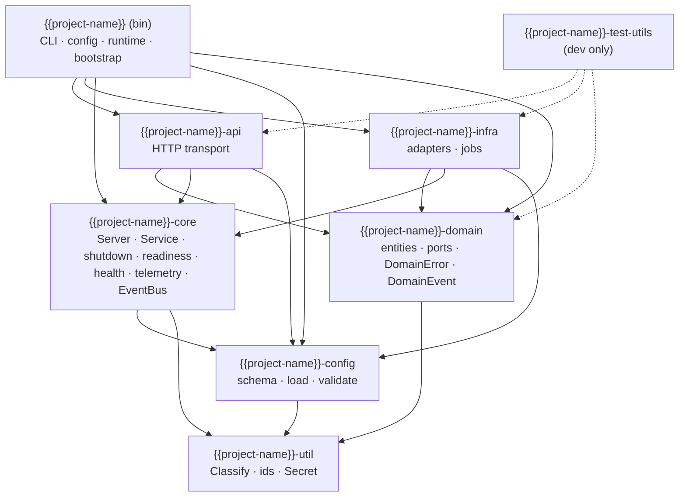
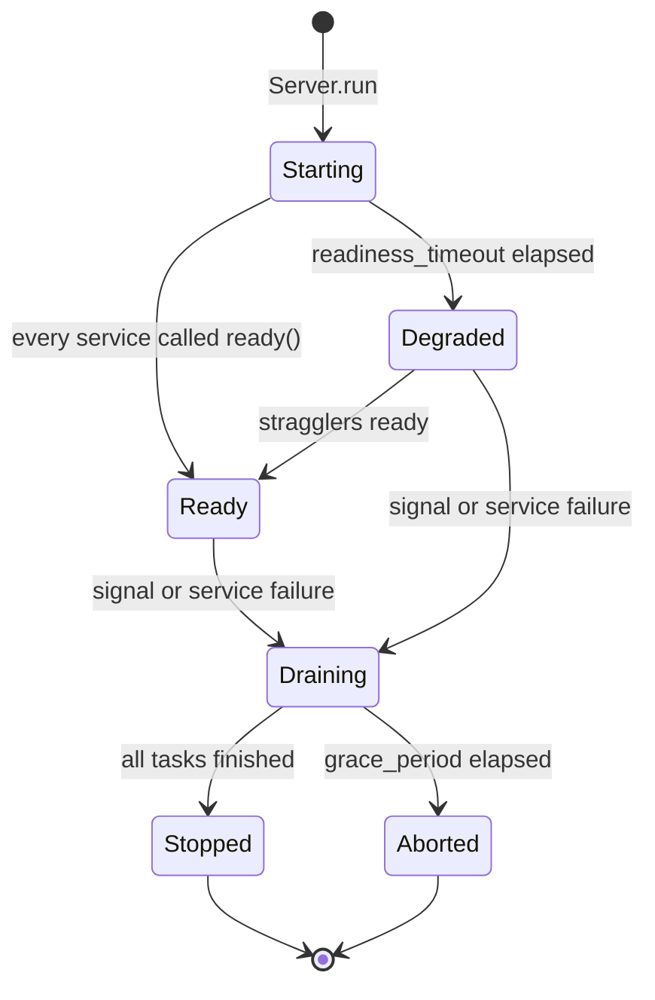

# Architecture

## Crates and the direction of dependencies



| Rule | Meaning |
|---|---|
| Arrows only point down | A crate depends on lower layers only. `tests/layering.rs` enforces the exact allowed edges. |
| `api` and `infra` never see each other | They meet only in `bootstrap.rs`. |
| `domain` has no I/O | No Tokio, no HTTP, no drivers. It defines ports (traits); `infra` implements them. |
| `core` knows no business type | It offers traits (`Service`, `HealthCheck`) and generic facilities (`EventBus<E>`). |
| One place for versions and lints | `[workspace.dependencies]` and `[workspace.lints]` in the root `Cargo.toml`. |

## What runs

```text
process
└── tokio runtime (worker_threads from config)
    ├── Server::run                      lifecycle coordinator
    │     ├── signal listener            SIGTERM / SIGINT → cancel root token; 2nd signal → exit 130
    │     ├── TaskTracker                every Service is a tracked task with a child token
    │     └── grace timer                server.grace_period, then abandon and exit non-zero
    ├── [Service] http                   axum::serve with graceful shutdown
    ├── [Service] event-logger           subscribes to the EventBus
    ├── [Service] cleanup-job            periodic; purges completed todos
    └── [Service] runtime-metrics        samples tokio gauges, exporter upkeep
```

## Lifecycle



`/healthz` answers 200 from the start (the process is alive). `/readyz` answers 200 only in
`Ready`/`Degraded` **and** when every registered `HealthCheck` passes; it answers 503 while
`Draining`, so load balancers stop sending traffic before the listener closes.

## Startup order

1. `install_panic_hook()` — before anything can panic.
2. Parse CLI. `probe` and `--check-config` return early.
3. `Config::load` — files, env, CLI overrides; fail-fast with every problem listed.
4. Build the Tokio runtime **from** the configuration.
5. Inside the runtime: telemetry, then `bootstrap::wire`, then `Server::run`.

## Errors

```text
DomainError ─┐                                   ┌─ HTTP status (kind.http_status())
InfraError  ─┼─ impl Classify { kind, source, retryable } ─┼─ log level   (kind.severity())
ServiceError ┘                                   └─ problem+json (api::ApiError)
```

Client errors carry their message as `detail`; internal errors never do. Add a variant to
`ErrorKind` and the compiler shows every table that must decide what it means.

## Adding a feature

Walk-through for `POST /api/v1/todos`, which already exists:

| Step | File | What |
|---|---|---|
| 1 | `domain/src/todo/model.rs` | entity + value objects with invariants |
| 2 | `domain/src/todo/repository.rs` | the port (`trait TodoRepository`) |
| 3 | `domain/src/todo/service.rs` | the use case; publishes `DomainEvent` |
| 4 | `domain/src/{error,event}.rs` | new variants |
| 5 | `infra/src/memory/todo_repository.rs` | the adapter (+ `HealthCheck`) |
| 6 | `api/src/dto/todo.rs`, `api/src/routes/todos.rs` | DTOs and handlers |
| 7 | `{{project-name}}/src/bootstrap.rs` | wire adapter → service → `AppState` |
| 8 | `{{project-name}}/tests/http_smoke.rs` | end-to-end assertion |

`core` did not change. If it has to, ask whether the thing you are adding is really
business-agnostic.

## When to split a crate

| Trigger | New crate |
|---|---|
| a second, independent bounded context | `{{project-name}}-domain-<name>` |
| an adapter with a heavy driver (database, message broker) | `{{project-name}}-infra-<driver>` |
| a second transport (gRPC, CLI) | `{{project-name}}-<transport>` next to `api` |
| a proc-macro | `{{project-name}}-macros` |

## Decisions

See [`adr/`](adr/).
